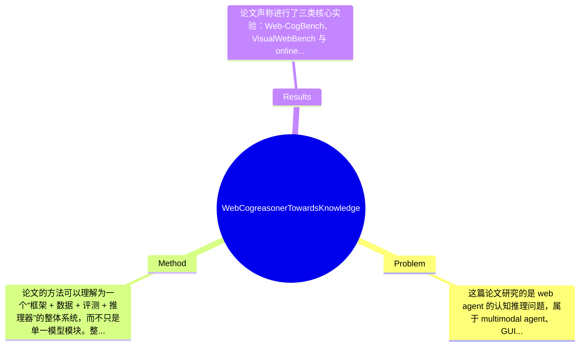

## Summary
该论文针对现有 web agent 在真实网页环境中缺乏系统性知识支撑、泛化到未见任务时推理脆弱的问题，提出了一个以 Bloom’s Taxonomy 为启发的 Web-CogKnowledge 框架，并结合 Web-CogDataset、Web-CogBench 与 knowledge-driven Chain-of-Thought 构建出 Web-CogReasoner；作者声称该方法在 Web-CogBench、VisualWebBench 和在线 web 任务上均显著优于现有基线，尤其在未见任务泛化上表现更强，但摘要与所给文本中未提供完整的核心数值，具体提升幅度需以原论文实验表为准。

## Problem & Motivation
这篇论文研究的是 web agent 的认知推理问题，属于 multimodal agent、GUI/web automation 与 embodied reasoning 的交叉方向。具体来说，任务不是单纯“看懂网页”或“执行点击”，而是让 agent 在真实网页中理解元素、把握页面结构、推断用户意图并完成多步操作。这个问题重要，是因为网页是企业系统、办公平台、电商、信息检索和在线服务的核心接口，若 agent 能稳定完成 web 操作，就能直接落地于自动化客服、数字办公助手、跨站信息收集和测试自动化等场景。现实意义非常明确：比起在封闭 benchmark 中答题，web agent 真正有机会成为可部署的软件代理。

作者对现有方法的批评有一定针对性。第一，许多 web agent 方法过度依赖 instruction tuning 或 trajectory imitation，把任务视为“观察-动作映射”，却缺乏对网页知识本身的系统建模，因此在页面布局变化、元素表达差异或任务稍作改写时容易失败。第二，现有评测往往偏重 end-to-end success rate，却没有细分 agent 究竟是败在 factual knowledge 缺失、conceptual understanding 不足，还是 procedural reasoning 断裂，这导致研究者难以定位模型能力短板。第三，不少方法在特定网站或固定模板上有效，但跨网站、跨任务泛化弱，本质上是在记忆操作轨迹，而非形成可迁移的网页认知能力。

论文的动机是：web agent 在“会推理”之前，必须先“有知识”，并且知识并非单一类型，而应分成 factual、conceptual 与 procedural 三层。这一动机总体合理，尤其适合解释为什么很多强大的 VLM 在网页任务上仍不稳定：它们视觉和语言能力很强，但缺乏网页领域的结构化先验。论文的关键洞察是把 Bloom’s Taxonomy 映射到 web agent 学习过程，将能力分解为 Memorizing、Understanding、Exploring 三阶段，并据此设计数据、训练和评测闭环。这个思路的价值不只是提出一个新模型，而是试图把 web agent 从“动作模仿器”转向“知识支撑的认知系统”。

## Method
论文的方法可以理解为一个“框架 + 数据 + 评测 + 推理器”的整体系统，而不只是单一模型模块。整体架构上，作者先提出 Web-CogKnowledge Framework，对 web agent 所需知识进行分层；再基于 14 个真实网站构建 Web-CogDataset，用于让模型学习 factual、conceptual、procedural 三类知识；随后设计 Web-CogBench 对 memorizing、understanding、exploring 三类能力进行细粒度评估；最后在模型层面提出 Web-CogReasoner，通过 knowledge-driven CoT 推动 agent 在网页场景中进行更稳定的多步决策。这个方法的核心不在于发明一种全新的 backbone，而在于把“知识获取”和“推理执行”串成训练闭环。

1. Web-CogKnowledge 分层知识框架
该组件的作用是定义 web agent 到底需要学什么。作者把知识分成 Factual、Conceptual、Procedural 三类，分别对应网页元素事实、页面结构与语义理解、以及任务执行流程与策略。设计动机是避免把网页操作粗暴地视为 token prediction，而是明确知识层级依赖关系。与很多现有方法不同，这里不是直接收集 demonstrations 做 imitation，而是先建立能力 taxonomy，再决定数据构造与训练目标。这种设计的优点是可解释性强，也便于后续做分阶段训练与分析。

2. Web-CogDataset 作为知识注入载体
该组件负责把抽象知识框架转化为可训练数据。根据给定内容，数据来自 14 个真实网站，并覆盖 factual web knowledge、understanding web knowledge 与 procedural web knowledge 等任务类型，如 element attribute recognition、next page prediction、user intention prediction、popup close、single-step/noisy multi-step web task 等。设计动机是让模型不仅见过“操作结果”，还学到页面元素、功能语义和常见交互模式。相比传统 trajectory-only 数据，这种数据更像课程化 curriculum：先学名词，再学理解，最后学动作。区别在于它强调结构化监督，而非只做行为克隆。论文还提到 annotation reliability 和 data balance，但从提供文本看，具体标注协议与质量统计细节仍需看附录表格。

3. Web-CogBench 细粒度评测体系
该组件作用是测能力而不只测成败。作者把 benchmark 划分为 Memorizing、Understanding、Exploring 三大类，并进一步细化为元素识别、页面理解、caption & QA、用户意图预测、多步任务等。设计动机是当前 web agent 评测常把失败混为一谈，无法区分知识盲点和推理缺陷。与 VisualWebBench 或传统 online success rate 相比，Web-CogBench 更强调诊断性而非单一 leaderboard 分数。这一点是本文比较有价值的地方，因为它给后续研究提供了“失败归因工具”。

4. Web-CogReasoner 与 knowledge-driven CoT
这是模型层面的核心组件。根据文中描述，作者引入了 Knowledge-driven CoT Reasoning，目标是在网页操作前显式激活相关知识，再进行推理与动作选择。其作用是把 learned knowledge 转化为推理过程中的中间表征，而不是把知识隐含埋在参数里等待偶然调用。设计动机很清楚：web agent 常常不是看不见，而是“知道得不够”或“不会调出所知”。因此作者通过 KCoT 让模型先组织页面中的关键实体、属性、目标和可能步骤，再做行动判断。与普通 CoT 的区别在于，它不是泛化的语言推理链，而是受网页知识结构驱动的 reasoning activation。论文还专门做了“Reasoning Activation via KCoT”的消融，说明作者认为这一点不是附属技巧，而是关键设计。

5. Curriculum learning 与分阶段能力演化
从附录标题可看出，作者采用了阶段式训练策略：Base Model → + Factual Knowledge → + Conceptual Knowledge → + Procedural Knowledge。该组件作用是让能力逐层建立，避免直接在复杂 web task 上端到端训练造成学习不稳定。设计动机来自 Bloom’s Taxonomy 的层次依赖：没有记忆就难以理解，没有理解就难以探索。与一次性混合训练相比，课程式训练更符合论文理论主张。是否必须这样设计？未必，替代方案包括 multi-task joint training、Mixture-of-Experts 或 retrieval augmentation；但如果作者实验证明 cumulative impact 明显，则说明该选择至少在本文设置下有效。

从技术简洁性看，这篇工作更像“系统性工程整合”而非极简算法创新。优点是框架完整、逻辑闭环强；缺点是方法收益究竟来自 taxonomy、本体数据、课程训练还是 CoT 激活，容易相互耦合。如果没有充分消融，就会显得偏工程化。就目前文字看，作者意识到了这一点，因此安排了 hierarchical dependency、curriculum impact 和 KCoT activation 三类消融，这有助于证明方法不是简单堆料。

## Key Results
论文声称进行了三类核心实验：Web-CogBench、VisualWebBench 与 online web tasks，并额外报告了 average steps，试图同时衡量知识能力、离线泛化与真实交互效率。遗憾的是，用户提供的正文摘录与摘要没有包含实验表中的具体数值，因此无法在不捏造信息的前提下写出准确分数、提升百分点或每个 baseline 的绝对值。可以明确的是，作者在摘要中宣称 Web-CogReasoner 对现有模型表现出“significant superiority”，且这种优势在 unseen tasks generalization 上尤其明显；这说明结果不只是局限于训练域内模板拟合，而是面向跨任务迁移。

从 benchmark 维度看，Web-CogBench 是作者新建的诊断型评测集，覆盖 Memorizing、Understanding、Exploring 三类能力；VisualWebBench 则更像外部基准，用于验证方法不是只在自建评测上有效；online web tasks 进一步测试真实交互环境中的任务完成能力，average steps 则反映策略效率与冗余动作控制。这种实验设计本身是合理的：自建 benchmark 检验理论闭环，外部 benchmark 检验外部有效性，在线任务检验实用性。

消融实验方面，文中目录明确列出三项：Cumulative Impact of Curriculum Learning、Hierarchical Dependency of Knowledge、Reasoning Activation via KCoT。由此可推断作者试图回答三个关键问题：第一，分阶段知识学习是否逐步提升性能；第二，factual→conceptual→procedural 是否存在层级依赖；第三，knowledge-driven CoT 是否真的激活了推理，而非只是增加提示词长度。这些消融方向是有说服力的，因为它们直接对应论文的核心主张，而不是无关紧要的细枝末节。

不过，实验也存在潜在不足。第一，若多数数据与 benchmark 都来自作者整理的 14 个网站生态，则可能存在 dataset construction bias，泛化提升部分究竟来自“知识更强”还是“数据分布更贴近测试集”，仍需更严格验证。第二，论文是否报告统计显著性、不同网站拆分、跨模板泛化或失败案例分布，当前文本未体现。第三，需要警惕 cherry-picking：作者展示了 qualitative success cases 和能力演化案例，但是否系统呈现失败场景、长尾页面、弹窗干扰、动态加载等难例，提供文本中看不到。因此，结论方向可信，但量化强度仍需阅读原始表格确认。

## Strengths & Weaknesses
这篇论文的第一大亮点，是把 web agent 的问题从“动作预测”提升到“知识驱动认知”的层面。已知事实是，作者明确提出 factual、conceptual、procedural 三层知识，并对应 memorizing、understanding、exploring 三类能力；这一抽象比许多仅做轨迹学习的工作更有解释力。第二个亮点是框架闭环完整：不仅提出概念，还配套构建了 Web-CogDataset、Web-CogBench 和 Web-CogReasoner，使理论、训练数据、评测协议与模型实现相互支撑。第三个亮点是强调泛化与能力诊断，这对 web agent 领域尤其重要，因为很多方法在固定网站上“看起来能用”，但一换页面样式就崩溃。

局限性也很明显。第一，技术上该方法高度依赖作者定义的知识分类和课程式训练流程；推测如果 taxonomy 设计不完备，或目标网站交互模式超出 14 个站点覆盖范围，模型可能仍会出现知识盲区。第二，适用范围上，这套方法更适合具有相对明确元素、页面结构和操作流程的传统 web 场景；对于高度动态、强个性化、依赖登录状态、富交互前端框架的网站，其知识表示是否足够仍未知。第三，计算与数据成本可能不低：构建结构化网页知识数据、标注 procedural task、做阶段式训练和多基准评估，本身就是高投入工程。论文已知提供了开源代码与数据，但没有在给定文本中明确报告训练成本、标注成本和推理时延。

潜在影响方面，这项工作可能推动 web agent 研究从“更大的 VLM + 更长的 prompt”转向“更清晰的知识建模与认知课程设计”。若这一方向被验证有效，未来可扩展到 desktop agent、mobile agent、enterprise software agent 等更广的人机界面自动化场景。

严格区分信息来源：已知的是，论文提出了 Web-CogKnowledge、Web-CogDataset、Web-CogBench、Web-CogReasoner，并宣称在多个 benchmark 上显著优于现有方法。推测的是，性能提升的一部分可能来自更系统的数据课程设计，而不仅仅来自 KCoT 本身；另外其泛化能力可能与训练网站覆盖度高度相关。不知道的是，具体在哪些 baseline 上提升多少、统计显著性如何、训练资源消耗多大、在真实商业网站上的长期稳定性如何，这些都需要完整论文表格与更多开放实验来确认。

## Mind Map

## Notes
<!-- 其他想法、疑问、启发 -->
