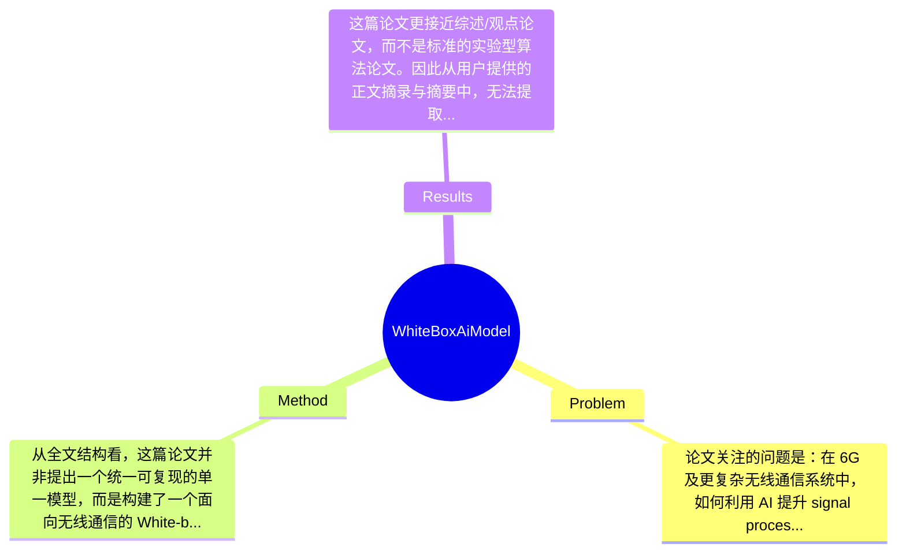

## Summary
这篇论文讨论了无线通信中 black-box AI 缺乏可解释性、理论可验证性和工程可信度的问题，提出以 White-box AI (WAI/XAI) 作为下一代无线智能优化框架，并系统梳理了 Bayesian inference、message passing、information bottleneck、coding rate reduction、deep unfolding、finite-horizon optimization 以及 large AI model 等方法基础及其在 signal processing 和 resource allocation 中的应用。其主要贡献不是提出单一新算法并报告 SOTA 数字结果，而是构建了一套面向 6G 无线通信的白盒 AI 综述与方法论框架，强调 theory-driven causal modeling 与 verifiable optimization path 相比传统 DNN/Transformer black-box 方案的潜在优势。

## Problem & Motivation
论文关注的问题是：在 6G 及更复杂无线通信系统中，如何利用 AI 提升 signal processing、resource allocation、task scheduling、power control 等关键模块的性能，同时避免传统 black-box 模型带来的不可解释、不可验证和工程部署困难。这属于无线通信与机器学习交叉领域，尤其是 AI-native wireless communications 和 model-driven intelligence 的核心议题。该问题重要，是因为未来网络面临超高维状态空间、强时变信道、海量连接和多目标优化，单纯依赖手工建模难以适应，而完全依赖 end-to-end DNN 又难以满足可靠性、时延、鲁棒性和监管可审计性要求。现实上，如果 AI 决策无法解释，就很难用于基站功率控制、频谱调度、边缘任务分配、多用户接入等高风险场景，因为这些任务往往要求性能可证明、约束可满足、故障可定位。论文指出现有方法至少有三类不足：第一，纯 black-box DNN/Transformer 往往只追求经验风险最小化，缺乏与通信理论、优化结构和统计推断机制的一致性，因此泛化到分布外环境时可能失效；第二，大规模神经网络在高维非凸任务上训练和推理成本高，难以满足无线系统在线部署的实时性和能耗约束；第三，模型决策链条不透明，不利于分析 failure case，也难以进行数学验证和工程调试。基于这些痛点，作者提出 WAI 作为替代或补充范式，其动机总体是合理的：无线系统本身具有强先验、强结构、强约束，天然适合把 domain knowledge 与学习框架耦合。论文的关键洞察是，所谓“白盒”并不只是事后解释，而是把概率推断、信息论表示学习、可验证优化路径和模型驱动网络结构直接嵌入 AI 设计过程，使模型从一开始就具备可解释性与理论可审查性。

## Method
从全文结构看，这篇论文并非提出一个统一可复现的单一模型，而是构建了一个面向无线通信的 White-box AI 方法框架：以“可解释统计推断 + 信息论表征 + 模型驱动优化 + 大模型架构”四层基础为核心，再映射到 channel estimation、signal detection、precoding、power control、dynamic resource allocation、task scheduling、multi-user access management 等任务中。整体思想是：不是让神经网络完全自由拟合，而是把无线通信中的概率模型、约束结构、优化迭代和任务目标显式写入模型架构或训练目标中，从而形成可解释、可验证、可部署的 AI 系统。

1. 概率统计与推断模块：Bayesian inference 与 message passing
该组件的作用是把无线系统中的不确定性，如信道衰落、噪声、用户行为、干扰耦合，转化为可解释的概率图模型或后验推断问题。设计动机在于，无线任务天然带有随机性，仅靠 deterministic DNN 输出一个点估计通常无法表达置信度和不确定性传播。与传统 black-box 网络不同，这类方法明确指定先验、似然和后验更新路径，使每一步估计都有统计含义。message passing 的价值尤其在多用户检测、联合估计、图结构资源协调中明显，因为变量节点与因子节点对应实际系统实体与约束，解释性较强。论文将其视为 WAI 的基础之一，强调“推断过程可读”而非仅“结果可用”。

2. 特征提取与表示模块：Information Bottleneck 与 Coding Rate Reduction
该组件关注“为什么提取这些特征、保留了什么信息、丢弃了什么冗余”。Information Bottleneck 的作用是学习既保留任务相关信息又压缩无关扰动的表示，这对噪声环境下的调制识别、信道表征、流量状态抽象很重要。Coding Rate Reduction 则从信息压缩与类间结构角度解释表征学习，使 learned representation 不只是高维 embedding，而是具有分离性和紧致性的可分析对象。设计动机是解决传统深度模型表征不可解释的问题：普通 DNN 难以说明隐藏层到底编码了哪些物理特征，而 WAI 试图用信息论语言解释表示质量。与现有 purely data-driven feature learning 相比，这类设计更强调 task-relevant statistics 和 representation geometry 的理论依据。

3. 模型驱动优化模块：Deep Unfolding
这是论文最接近无线 AI 主流落地的方法之一。其作用是把经典迭代算法，如信号检测、稀疏恢复、功率分配、WMMSE 类优化，展开成有限层网络，每层对应一次可解释迭代。设计动机是兼顾模型先验与学习能力：传统优化算法可解释但慢、对模型偏差敏感；纯 DNN 快但黑盒。deep unfolding 通过学习步长、阈值、更新系数等参数，在保留算法结构的同时增强适应性。与黑盒 MLP/Transformer 不同，unfolding 网络的层间操作有明确物理和数学意义，因此更容易分析收敛行为、复杂度和 failure mode。从白盒角度看，这是“可验证优化路径”的代表技术。

4. 决策与控制模块：Finite-Horizon Optimization
该组件面向资源分配、调度、边缘计算卸载等时序决策任务。其作用是把长期系统目标分解为有限时域内的可滚动优化问题，增强决策路径可解释性，并便于把约束显式并入求解过程。设计动机在于，无线网络中的许多控制任务具有动态性和多步依赖，但完全使用 reinforcement learning 往往训练不稳、样本效率低且难解释。有限时域优化提供了清晰的决策窗口、状态转移和代价结构，适合与学习模块组合。论文将其作为白盒决策工具，强调每个时间步动作都可追溯到目标函数和约束条件。

5. Large AI Model and Architecture
论文还讨论了 large AI model、DNN、Transformer 在 WAI 语境下的角色。其观点不是否定大模型，而是要求其与理论结构融合。也就是说，大模型可作为表示学习和复杂映射逼近器，但若要服务无线通信，需嵌入 causality、 optimization path、 communication prior，而非直接端到端替代整个系统。这里的设计选择具有开放性：哪些模块必须显式建模，哪些部分可以交由神经网络学习，论文更像提出原则而不是给出唯一答案。

从简洁性看，这套方法论总体较有条理，但它更像“框架性综述 + 统一叙事”而不是单个简洁优雅的算法。优点是覆盖面广、逻辑清晰；缺点是概念边界略宽，WAI 几乎囊括了 explainability、model-driven learning、probabilistic inference、optimization-aware AI 等多个传统方向，容易显得定义外延过大，存在一定“框架先行、算法落地不足”的问题。

## Key Results
这篇论文更接近综述/观点论文，而不是标准的实验型算法论文。因此从用户提供的正文摘录与摘要中，无法提取出完整的 benchmark、数据集、统一实验设置以及可核验的核心数值结果。论文明确提到的应用场景包括 signal processing 下的 channel estimation and detection、precoding and power control，以及 resource allocation 下的 dynamic resource allocation、task scheduling and load balancing、multi-user access management，但摘要与给定内容中没有报告诸如 BER、SE、EE、sum-rate、latency、convergence iteration、complexity reduction 等具体数字，因此严格来说“主要实验结果”部分存在信息缺口，论文未提及可供复现的统一指标表。

从结构判断，论文第四部分为 Case Studies，理论上应包含案例分析，但当前提供内容没有展开到案例细节，因此无法确认是否在具体 benchmark 上给出数值对比，也无法确认与哪些 baseline 比较，例如 MMSE、AMP、WMMSE、DNN detector、Transformer scheduler 等。换言之，若按严格学术评估标准，这篇文章并未在已提供文本中展示“某方法在某 benchmark 上提升多少%”这一类硬证据。能确认的只有定性结论：作者认为 WAI 相比 black-box 模型在 interpretability、 mathematical validation、 optimization transparency 上具有优势，并在信号处理与资源分配中显示潜力。

对比分析方面，论文确实从概念层面对 WAI 与 traditional black-box model 做了比较，重点对 optimization objective 和 architecture design 进行讨论，并特别提到 DNNs 与 Transformer networks。但这种对比主要是方法论层面的，而非严格实验对比。消融实验方面，给定内容中未见任何 ablation setting，也未见对 Bayesian inference、IB、deep unfolding 等组件单独贡献的量化分析。实验充分性因此偏弱：若作者希望证明 WAI 是“wireless communications 的 next frontier”，理想上应至少提供跨任务的系统实验，例如在 channel estimation、power control、scheduling 三类任务上分别比较 black-box、model-driven、white-box hybrid 的性能-复杂度-可解释性 trade-off。就目前信息看，论文更像奠基性观点综述，而不是通过全面实验支撑结论的实证论文。至于 cherry-picking，现有文本不足以判断作者是否只展示有利案例；更准确的说法是：论文未提供足够多的量化结果，因而无法进行这一判断。

## Strengths & Weaknesses
这篇论文的亮点首先在于选题切中当前无线 AI 的核心矛盾：性能追求与工程可信之间的张力。已知的是，作者没有把 WAI 简化为“事后可视化”，而是把 Bayesian inference、message passing、information-theoretic representation、deep unfolding、finite-horizon optimization 等统一纳入白盒范式，这一点有助于把 explainability 从附属功能提升为设计原则。第二个亮点是跨层次整合能力较强：从统计推断、特征表示到优化决策，再到 signal processing 和 resource allocation 应用，形成了较完整的方法地图，对刚进入该方向的研究者很有参考价值。第三个亮点是其批判 black-box AI 的角度比较贴合无线场景，特别强调可验证性、约束满足、复杂度和部署可靠性，而不是泛泛讨论解释性。

但局限也很明显。第一，技术局限在于论文更偏框架综述，而非提出单一新算法；因此“White-box AI”更像 umbrella term，边界较宽，容易与 model-driven learning、interpretable ML、physics-informed AI 等概念重叠。已知的是，摘要没有给出统一形式化定义来严格区分这些概念。第二，适用范围上，推测 WAI 更适合先验结构强、约束清晰、可写出优化或概率模型的无线任务；对于高度开放、数据模式复杂且先验难建模的场景，纯白盒设计可能灵活性不足，但这点论文未系统验证。第三，计算成本并非必然更低。虽然作者批评大规模 black-box 成本高，但某些 white-box/hybrid 方法同样需要复杂推断、迭代展开或在线求解；是否真能在大规模网络下取得更优 latency-energy trade-off，论文未提及。第四，数据依赖问题也未被充分展开：白盒方法虽然减少纯数据驱动依赖，但可能更依赖准确系统模型，一旦模型失配，其性能上限未说明。

潜在影响方面，这篇文章对领域的贡献更像“研究议程设定”。已知的是，它为 6G 中可信 AI、可解释资源控制、模型驱动大模型设计提供了统一叙事；推测其可能推动后续工作走向 hybrid intelligence，即把 Transformer/LLM/VLM 风格大模型与通信理论模块结合；不知道的是，这种范式是否会形成统一 benchmark、标准评测协议和工业级部署方案。总的来说，这篇论文有较强的方向性价值，但若作为方法论文阅读，需要结合具体 case study 和后续实证工作一起看，不能把其论断直接视为已被充分实验验证的结论。

## Mind Map

## Notes
<!-- 其他想法、疑问、启发 -->
