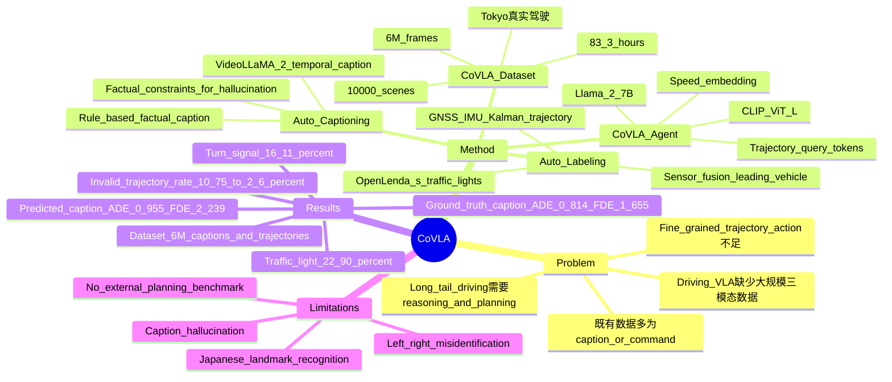

## Summary
CoVLA 提出一个面向 autonomous driving 的 Vision-Language-Action dataset：10,000 个真实驾驶视频片段、frame-level captions 和 future trajectory actions，并用自动标注与自动 captioning pipeline 扩展到 6M frames。作者还训练了 CoVLA-Agent 作为 baseline，显示语言 caption 条件会影响 3 秒轨迹预测，但论文证据主要是自建 CoVLA-Dataset test split，而不是公开 closed-loop leaderboard。

## Problem & Motivation
作者要解决的是 autonomous driving VLA 研究里的数据瓶颈：现有 driving vision-language datasets 往往只有 caption、QA 或 high-level command，缺少能直接训练 end-to-end planning 的 fine-grained future trajectory。论文认为 long-tail driving 场景需要模型同时理解视觉环境、语言描述和行动轨迹，而纯感知数据或 command-level action 不足以支持这种训练。

在 related work 中，BDD-X、BDD-OIA、DRAMA 和 OpenDV-2K 被归为带语言说明或 command 的数据集，但 action 粒度较粗；HAD、Talk2Car、Talk2Car-Trajectory 和 DriveLM 虽然包含 trajectory 信息，但作者认为规模与场景复杂性有限。CoVLA 的动机是用真实车载传感器数据和自动化 pipeline，把 vision、language、action 三类监督放到同一套驾驶数据中。

## Method
**数据采集与采样**：作者使用多辆采集车在 Tokyo 周边收集超过 1,000 小时 raw driving data，包含 front-facing camera、CAN bus、GNSS 和 IMU。采集环境覆盖 urban centers、highway interchanges、narrow residential streets、mountainous winding roads，以及 sunny、cloudy、rainy、heavy rain 和 daytime/evening/nighttime。最终从满足 driving gear、最大速度不超过 100 km/h、GNSS 连续可用的数据中采样 10,000 个 30 秒 scenes，得到 6,000,000 frames / 83.3 hours。

**多样性采样策略**：采样权重与 steering angle、acceleration、turn signal 等 feature 的经验联合分布成反比，并对 steering / acceleration 做 binning；作者使用 additive smoothing，参数 `delta = 50`。这个策略的目标是减少直行、低动态片段的支配，使低速、转向、变道等情况占比更均衡。

**Trajectory labeling**：future trajectory 由 GNSS 和 IMU 通过 Kalman Filter 估计。每个 timestamp 标注后续 3 秒、60 frames 的 trajectory，坐标系以采集车为中心。由于 GNSS 不稳定会导致 trajectory 跳变或方向错误，作者在 supplementary 中用相邻点距离阈值和振动检测做 heuristic filtering。

**Object labeling**：交通灯状态由 OpenLenda-s 检测，包含颜色和箭头方向。前车信息通过 radar 与 front-facing camera 的 sensor fusion 获得，包括 leading vehicle 的 speed、acceleration 和相对位置。

**Auto captioning**：caption pipeline 先用规则生成 frame-level factual captions，覆盖 speed、acceleration、trajectory curvature、leading vehicle、traffic light 等信息；再用 pretrained VideoLLaMA 2 在 60-frame / 3-second window 上处理 8 个代表帧，为每个 30 秒 scene 生成 10 个 video captions。作者把 rule-based captions 作为 factual constraints 交给 VLM，并通过 token probability 查询 weather、road type、risk 等属性，以缓解 VLM hallucination。caption generation 使用 8 张 NVIDIA H100，在一天内完成，产生 100,000 个 VLM-generated captions 和 6,000,000 个 combined captions。

**CoVLA-Agent baseline**：CoVLA-Agent 使用 Llama-2 7B 作为 language model，CLIP ViT-L 作为 vision encoder，并把 ego vehicle speed 通过 MLP 编成 embedding。视觉特征、速度 embedding 和文本 embedding 输入 Llama-2；trajectory query special tokens 的输出再经 MLP 生成 10 个 `(x, y, z)` future trajectory points，对应 3 秒 horizon。训练任务包括 traffic scene description generation 和 trajectory prediction，loss 是 cross entropy 与 mean squared error 的等权组合。

## Key Results
**CoVLA-Dataset scale / dataset comparison**：CoVLA 包含 10,000 个 30 秒真实驾驶 scenes、6M frames、6M captions 和 GPS/IMU-derived trajectories。Table 1 中，BDD-X 为 26.2K frames / 26K manual captions 且无 action，OpenDV-2K 为 65.1M frames / 65.1M auto captions 但 action 是 command，DriveLM-nuScenes 为 4.8K frames / 445K QA 且有 trajectory；CoVLA 的差异是同时提供 real-world vision、caption 和 trajectory action。

**CoVLA-Dataset statistics**：采样后 speed 和 steering angle 分布更均衡；CoVLA 中 active turn signals 占 16.11% frames，traffic lights 占 22.90% frames。训练/验证/测试按 70/15/15 scenes 划分，经过 2Hz frame sampling 和 trajectory 完整性过滤后，得到 302,989 train samples、64,153 validation samples、64,920 test samples。

**CoVLA-Agent on CoVLA-Dataset test split**：在 Table 2 的 trajectory prediction 评估中，`predicted caption` condition 得到 ADE 0.955 / FDE 2.239；`ground truth caption` condition 得到 ADE 0.814 / FDE 1.655。也就是说，在同一 CoVLA-Dataset test split 上，使用 ground-truth captions 时 ADE 约降低 14.8%，FDE 约降低 26.1%，说明 caption quality 会明显影响 action prediction。

**Caption/action error analysis**：Table 3 分析了 caption 中缺失或错误出现的词与 trajectory error 的关系。`deceleration` 对应 mean ADE 2.236 / mean FDE 5.458，`left` 对应 2.037 / 5.009，`acceleration` 对应 1.826 / 4.790，`turning` 对应 1.343 / 3.288；作者据此认为，从 single frame 估计 motion intention 是 predicted caption condition 性能较低的重要原因。

**Trajectory filtering / supplementary**：作者人工检查 400 个 samples，发现 43 个 invalid trajectories，即 10.75%。振动检测 filter 在 test dataset 上 precision 0.64 / recall 0.75，把 invalid trajectory rate 降到 2.6%；论文承认该方法 false-positive rate 较高，但认为对数据集规模而言可以接受。

## Strengths & Weaknesses
**已知亮点**：
- 数据形式对 VLA 很直接：每个 frame 同时有图像、caption、vehicle states 和未来 3 秒 trajectory，避免只用 high-level command 作为 action 监督。
- pipeline 可扩展性强：rule-based factual captions、VideoLLaMA 2 temporal captioning、GNSS/IMU trajectory estimation 和 sensor fusion object labeling 都是自动流程；作者报告 8 张 H100 可在一天内完成 caption generation。
- 与 single-frame captioning 相比，VideoLLaMA 2 的 3 秒窗口更符合 driving 场景的时序性质；同时 rule-based captions 作为 factual anchors，是对 VLM hallucination 的务实约束。
- 论文没有只展示 dataset scale，也报告了 auto-captioning 的失败类型和 trajectory filtering 的 precision/recall，这对判断数据质量比单纯报规模更有信息量。

**已知局限**：
- CoVLA-Agent 的主实验只在 CoVLA-Dataset 自身 test split 上报告 ADE/FDE，没有与传统 planning model、non-VLA baseline 或公开 closed-loop autonomous driving leaderboard 做系统对比。
- caption limitation 明确存在：Figure 3 和 Section 3.2 提到 object hallucination，例如不存在的 wooden fence；也会把左侧物体误描述成右侧物体。
- 本地化视觉知识不足：作者指出 Japanese traffic signs 等日本特有 landmark 和符号会让 captioning 出错，这说明数据和 captioner 对文化/地域知识有依赖。
- trajectory filtering 是 heuristic，precision 0.64 / recall 0.75 并不高；虽然 invalid rate 降到 2.6%，但仍可能残留错误轨迹或过滤掉可用样本。
- `ground truth caption` condition 明显优于 `predicted caption` condition，说明 baseline 的 action prediction 仍强依赖 caption 质量；在部署时如果 caption 有错，trajectory 也会受影响。

**推测**：
- 对 embodied / GUI-agent 研究的启发在于，把 action 监督和自然语言中间表示放在同一数据点里，可能帮助研究 language-action consistency；但 driving trajectory 与 GUI action space 差异很大，不能直接把 CoVLA-Agent 的结论迁移到 GUI agent。
- CoVLA 的自动 captioning pipeline 更像一种 dataset construction recipe，而不只是 autonomous driving 专用模型；其中 rule-based constraints + VLM augmentation 的模式可能适合其他需要 grounded captions 的 embodied datasets。

**不知道**：
- 不知道 CoVLA-Agent 在 nuScenes、Waymo、NAVSIM 或 CARLA closed-loop benchmark 上相对已有 driving planner 的表现如何，论文没有报告。
- 不知道 CoVLA captions 的人工质量评估、human agreement 或 hallucination rate 的总体统计；论文只给出失败类别和若干示例。
- 不知道 10,000 scenes 中 rare long-tail events 的覆盖率是否足以训练安全关键行为；论文报告了 turn signal 和 traffic light 占比，但没有完整 long-tail taxonomy。

## Mind Map

## Notes
- 首页列出的前三位作者 Hidehisa Arai、Keita Miwa、Kento Sasaki 为 equal contribution，全部作者机构为 Turing Inc.
- `date_publish` 按 WACV 2025 的年份记录；论文首页 header 给出 `arXiv:2408.10845v3 [cs.CV] 14 Oct 2025`。
- 论文正文未给 DOI 或 CoVLA-Agent code link；supplementary 给出 CoVLA-Dataset 的 HuggingFace 发布链接，并说明发布版本使用 Dashcam Anonymizer 匿名化人脸和车牌。
