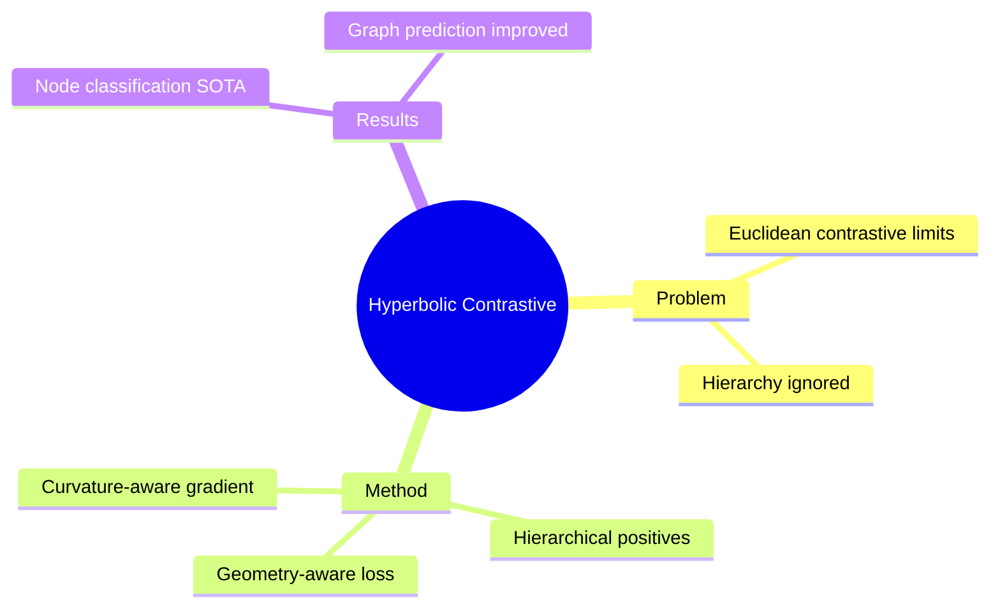

## Summary

在 hyperbolic space 中引入 contrastive learning framework，利用 hierarchical positive sampling 提升 graph representation learning。Node classification 和 graph property prediction 上达到 SOTA。

## Problem & Motivation

Graph contrastive learning 问题：
- Euclidean contrastive learning 忽略 graph hierarchy
- Hierarchical data（知识图谱、社交网络）需要 geometry-aware sampling
- Positive/negative sample 定义需要 respect geometry

## Method

**核心设计**：
1. **Hierarchical Positive Sampling**: 在 hyperbolic space 中按 hierarchy 采样 positives
2. **Geometry-aware Contrastive Loss**: 考虑 hyperbolic distance 的 loss design
3. **Curvature-aware Training**: Hyperbolic space 的 gradient handling

**理论基础**：
- Hyperbolic distance ≈ hierarchy distance
- Contrastive loss in curved space

## Key Results

- Node classification SOTA
- Graph property prediction improved
- Few-shot learning scenarios

## Strengths & Weaknesses

**亮点**：
- Hierarchical sampling 是关键创新
- Contrastive learning × hyperbolic geometry 的首次系统结合

**局限**：
- 具体 benchmark 数字需看全文
- 与 Euclidean contrastive learning 的效率对比

## Mind Map

## Notes

> [基于 WebSearch 结果创建]

Contrastive learning 与 hyperbolic geometry 的结合是重要方向。Hierarchical positive sampling 的设计思路值得研究。