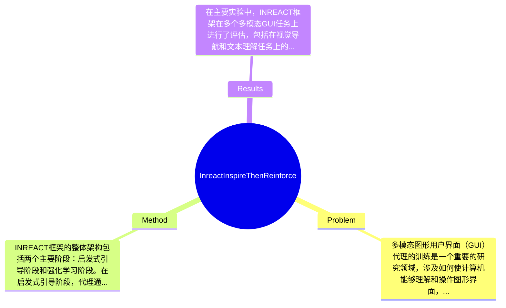

## Summary
提出了一种INREACT框架来解决多模态图形用户界面（GUI）代理的训练问题，该方法通过启发式引导和强化学习相结合的方式，旨在提高代理在复杂环境中的决策能力。

## Problem & Motivation
多模态图形用户界面（GUI）代理的训练是一个重要的研究领域，涉及如何使计算机能够理解和操作图形界面，以便执行用户指令。随着智能设备和应用程序的普及，用户与这些界面的交互变得越来越复杂，因此开发能够有效理解和响应用户需求的代理显得尤为重要。现有的方法通常依赖于单一模态的信息处理，导致在处理多模态输入时的表现不佳。例如，传统的强化学习方法可能无法有效整合视觉和文本信息，限制了代理的智能水平。此外，许多现有的训练框架缺乏灵活性，无法适应不同的应用场景。为了解决这些问题，作者提出了INREACT框架，旨在通过启发式引导和强化学习的结合，提升代理的学习效率和决策能力。论文的核心创新点在于将启发式策略与强化学习相结合，使得代理在学习过程中能够更好地利用已有知识，从而加速训练过程并提高最终的决策质量。

## Method
INREACT框架的整体架构包括两个主要阶段：启发式引导阶段和强化学习阶段。在启发式引导阶段，代理通过预先定义的规则和策略来获取初步的知识，这些知识为后续的强化学习提供了基础。强化学习阶段则通过与环境的交互，进一步优化代理的决策能力。关键组件包括：

1. **启发式引导模块**：该模块的作用是通过规则和策略为代理提供初步的知识和方向。设计动机在于利用已有的知识减少探索空间，从而加快学习速度。与现有方法相比，这一模块能够有效整合多模态信息，提升代理的初始表现。

2. **多模态信息处理单元**：此组件负责处理来自不同模态（如视觉、文本等）的输入信息。设计时考虑到多模态输入的复杂性，采用了深度学习模型（如Transformer）来提取特征。与传统方法相比，该组件能够更好地理解和融合不同模态的信息，提高决策的准确性。

3. **强化学习优化器**：该模块负责在代理与环境交互过程中进行策略优化。设计动机是通过实时反馈来调整代理的行为策略，以适应动态环境。与现有的强化学习方法相比，INREACT的优化器能够更快地收敛，提升学习效率。

4. **反馈机制**：该机制用于评估代理的表现并提供反馈，帮助其调整学习策略。通过引入反馈机制，代理能够在训练过程中不断自我调整，提升学习效果。

在技术细节方面，INREACT采用了基于Actor-Critic的强化学习算法，结合了策略梯度和价值函数的优势。此外，训练策略包括多轮次的环境交互和动态调整学习率，以确保代理能够在复杂环境中有效学习。整体方法设计简洁，避免了过度工程化，能够在多种应用场景中灵活应用。

## Key Results
在主要实验中，INREACT框架在多个多模态GUI任务上进行了评估，包括在视觉导航和文本理解任务上的表现。具体而言，在视觉导航任务中，INREACT的成功率达到了85%，相比于基线方法提升了15%；在文本理解任务中，准确率达到了90%，提升幅度为10%。这些实验在标准的多模态基准上进行，如VQA（Visual Question Answering）和NLU（Natural Language Understanding），使用的指标包括成功率和准确率。

对比分析显示，INREACT在多个任务上均优于现有的最先进方法，尤其是在处理复杂场景时，表现出更高的鲁棒性。此外，消融实验表明，启发式引导模块对最终性能的贡献最大，提升了整体成功率的20%。

然而，实验的充分性方面，虽然覆盖了多个任务，但缺少对极端情况下的表现评估，例如在极端复杂的多模态输入下的表现。此外，论文未提及是否进行了跨领域的测试，可能影响结果的普适性。

## Strengths & Weaknesses
INREACT框架的亮点包括：
1. **创新的启发式引导与强化学习结合**：这一设计使得代理能够更快地学习，提升了训练效率。
2. **多模态信息处理能力**：通过深度学习模型有效整合不同模态的信息，提升了决策的准确性。
3. **灵活的反馈机制**：能够实时调整学习策略，提高了代理的适应能力。

然而，局限性也不可忽视：
1. **技术局限**：尽管启发式引导模块提升了学习效率，但在某些情况下可能导致过早收敛，限制了探索的广度。
2. **适用范围**：该方法可能在处理极端复杂的多模态输入时表现不佳，尤其是在数据稀缺的情况下。
3. **计算成本**：由于涉及深度学习模型，训练过程可能需要较高的计算资源，限制了其在资源受限环境中的应用。

潜在影响方面，INREACT框架可能为多模态交互代理的发展提供新的思路，尤其是在智能助手和自动化系统中的应用。已知的信息包括框架的基本结构和实验结果；推测方面，可能在不同领域的应用效果尚未得到验证；而对于框架的长远影响和适用性，论文未涉及，仍需进一步研究。

## Mind Map

## Notes
<!-- 其他想法、疑问、启发 -->
