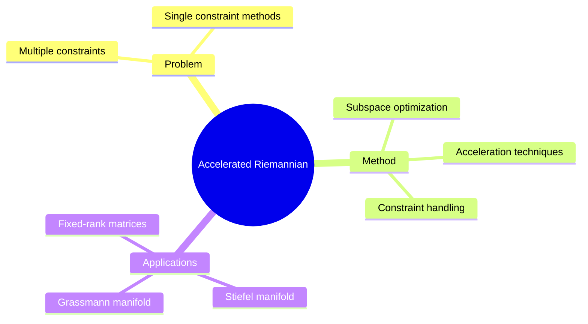

## Summary

Accelerated Riemannian Optimization 处理多个几何约束，通过高效 subspace optimization 实现加速。扩展了传统 Riemannian gradient descent，支持 Stiefel manifold、Grassmann manifold 等多种 constraint types。

## Problem & Motivation

Riemannian optimization 问题：
- 多个几何约束同时存在（orthogonal + low-rank 等）
- 传统方法只处理单一 constraint
- 约束组合的 manifold 结构复杂

## Method

**核心设计**：
1. **Subspace Optimization**: 在 tangent subspace 中高效求解
2. **Multiple Constraints Handling**: 支持多个 manifold constraints 组合
3. **Acceleration Techniques**: Riemannian Nesterov-type acceleration

**应用 Manifolds**:
- Stiefel manifold (orthogonal)
- Grassmann manifold (low-rank)
- Fixed-rank matrices

## Key Results

- 处理多约束效率提升
- Convergence 加速验证

## Strengths & Weaknesses

**亮点**：
- 多约束处理是重要扩展
- Acceleration 技术适配 curved space

**局限**：
- 具体 benchmark 数字需看全文
- Large-scale distributed training 未验证

## Mind Map

## Notes

> [基于 WebSearch 结果创建]

多约束 Riemannian optimization 是有价值的方向，与深度学习中的 orthogonal/low-rank training 相关。