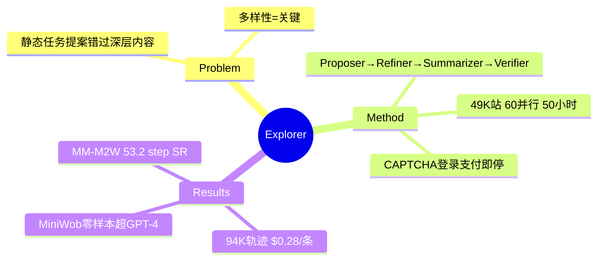

## Summary

Explorer 用四阶段多 agent 流水线（Task Proposer 从首页出抽象任务 → Task Refiner 边探索边细化 → Task Summarizer 事后总结 → Task Verifier LLM 判成败）在 live web 上合成了当时最大的多模态轨迹数据集：**94,949 条成功轨迹 / 49,494 个 URL / 72 万截图 / 3330 万网页元素，$0.28/条**（约为 AgentTrek 的一半成本）。Explorer-7B 在 Multimodal-Mind2Web 上 53.2% step SR，MiniWob++ 零样本 53.26% 超 GPT-4。

## Problem & Motivation

人工标注不可扩展；既有合成方法用静态任务提案，错过"深层页面的丰富内容"。核心主张：**数据多样性是通才 web agent 的关键**，而多样性来自探索——抽象任务在探索中演化成具体细粒度任务（53K 抽象目标 → 94K 最终任务描述，81K 唯一）。

## Method

- **Proposer→Refiner→Summarizer→Verifier 四阶段**：proposer 看首页截图+AXTree 出抽象任务；refiner 在探索中逐步细化任务并预测下一动作（任务跟着轨迹走——与 [[Papers/2410-NNetNav]] 的纯 hindsight 折中：半 instruction-first 半 interaction-first）；summarizer 从完整动作/截图序列生成最终任务描述；verifier LLM-as-judge 判成败（与人工 81% 一致）。
- **来源**：similarweb top-100 + Tranco 49K 站点；Playwright 驱动；60 并行进程 50 小时完成。
- **安全**：遇 CAPTCHA/登录/支付自动终止；过滤暴力/成人站点。
- 数据形态：AXTree + 原始截图 + set-of-marks 标注图 + HTML，830M token，平均 7.7 步/轨迹。

## Key Results

- 成功率 53.1%（175K 总 rollout → 94,949 成功）。
- **Multimodal-Mind2Web**：Explorer-7B 元素精度 56.5% / op F1 90.3% / step SR 53.2%，同 backbone 超 AgentTrek-7B。
- **Mind2Web-Live（83 可达任务）**：Explorer-7B 全任务 SR 19.3%（step SR 45.3%）；Phi-3.5V 从 2.4%→18.1%。
- **MiniWob++ 零样本**：Explorer-7B 53.26% > GPT-4 53.04%。
- 数据 scaling 消融：25%→50%→100% 数据单调涨——支持"数据规模是关键驱动"。

## Strengths & Weaknesses

**Strengths**：把探索式合成推到 49K 站点规模并给出干净的成本数字（$0.28 vs AgentTrek $0.55——任务供给的单位经济学）；refiner 的"任务随探索细化"设计避免了纯 instruction-first 的不可行问题。

**Weaknesses / 边界**：
- verifier 与人 81% 一致 → **19% 标签噪声直接进训练集**（与 [[Papers/2502-InSTA]] judge 82.6% 同款问题）。
- 安全协议（CAPTCHA/登录/支付即停）与 InSTA 相同 → 任务分布同样系统性偏向只读浏览，transactional 能力缺失。
- 主要失败模式：refinement 阶段 grounding 错误会传播到 summarizer + summarizer 幻觉——**流水线误差级联**没有回路修正。
- 依赖闭源 LLM，API 成本主导。

## Mind Map

## Notes

- 任务供给轴的"规模极点"：与 [[Papers/2410-NNetNav]]（hindsight，1 万条）比，Explorer 用半结构化流水线换了一个数量级的规模（9.4 万条）；与 [[Papers/2502-InSTA]]（15 万站但任务更浅）比，Explorer 轨迹更长（7.7 步）更多模态。三者共享同一个天花板：**live 环境无 verifier → LLM judge 噪声（~19%）+ 无状态修改任务**。
- $0.28/条的单位成本 + "数据 scaling 单调涨"给 [[Topics/WebEnvironment-Engine-Survey]] 轴 5 提供了供给侧经济学数据点：任务供给的成本瓶颈已经不在采集而在**可验证性**。
