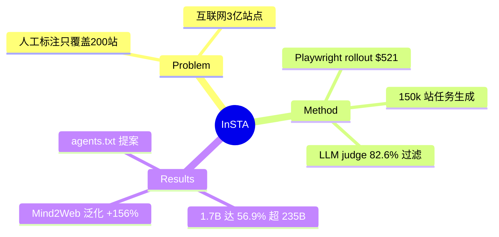

## Summary

InSTA 把**整个 live 互联网当训练环境**：LLM 三阶段流水线（150k 站点任务标注 → Playwright agent rollout → LLM judge 过滤），全程无人工标注，$521 收集 2.2M 截图/动作轨迹，训出的 Qwen3-1.7B 达 56.9% 成功率、超过 235× 大的数据收集 policy。核心论断：human data 是低效资源，LLM 是够用的 task proposer（89% 可验证）/ safety filter（97%）/ judge（82.6%，高置信子集 93.1%）。

## Problem & Motivation

Web agent 训练数据依赖 ~200 个热门网站的人工标注 demonstration，而互联网有 ~3 亿站点：人工标注无法覆盖、成本随能力增长、静态数据集随网站演化过期。语言/视觉模型已证明 internet-scale 数据是必经之路，agent 训练还没有对应的 pipeline。

## Method

三阶段，LLM 全程当 curator：

1. **任务生成**：Common Crawl top-1M 站点（PageRank 排序）→ safety filter 筛到 150k 安全站点（过滤成人内容、需登录站点、API/CDN 端点）；task proposer 两阶段——先从 URL 生成简单探索任务，agent 执行后基于轨迹反馈提出**更难且 grounded** 的任务。
2. **Rollout**：Playwright API 动作空间（JSON function call），HTML DOM → 紧凑 Markdown 观察；150k 任务产出 2.2M 截图 + 2.2M 推理轨迹，1200 V100 GPU 时 / **$521.55**。
3. **Judge 过滤**：LLM 输出 0–1 连续分 + 推理轨迹 + 置信度 conf=2·|r−0.5|；取 judge=1 的轨迹做 SFT。

**负责任爬取协议**：每站仅 1 任务、≤30 动作、~90s 交互；禁止状态修改（不购买/评论/注册）；scrubadub 去 PII。**Appendix D 提出 "agents.txt" 标准**：站长可声明 agent 速率限制、可访问页面、对 agent 隐藏的元素，以及 **"playgrounds"——站点自建的仿真副本**供 agent 训练，把 agent 流量导离生产页面。

## Key Results

- Safety filter：Gemini 1.5 Pro **97%** acc（recall ~1.0）；任务可验证率 89%（人工确认可完成）。
- Judge：GPT-4o **82.6%** acc（vs 人工标注），conf=1 子集 **93.1%**；低流行度站点仍 78%。
- 下游：Qwen3-1.7B zero-shot 11.5% → 训后 **56.9%**（+45.3pp），超过数据收集 policy Qwen3-235B 与 Llama 4 Maverick；zero-shot 迁移 WebVoyager 上 3/4 judge 维度追平 frontier LLM。
- 数据混合（80% human + 20% InSTA）：Mind2Web 泛化 **+156.3%**、WebLINX +149.0%。

## Strengths & Weaknesses

**Strengths**：第一次把任务供给规模推到 150k 站点（此前 ~200）；证明"LLM as curator"三个角色的可靠性都够用且可量化；$521 的成本数字有说服力；agents.txt/playground 提案是环境治理层的早期设计。

**Weaknesses / 边界**：
- **live 环境的天然代价**：无 reset、无重放（网站天天变，静态参考答案立即失效）→ 只能依赖 LLM judge 当 reward，而 judge 82.6% 的错误率会直接进入训练信号（17% 标签噪声）。
- 禁止状态修改 → 任务分布**系统性偏向只读/信息检索**，学不到 transactional 任务（下单、提交表单）——这恰是最难也最有价值的部分。
- 排除需登录站点 → 丢掉大量真实工作流。
- SFT-only，RL 留作未来（judge 直接当 reward 的噪声问题会更尖锐）。

## Mind Map

## Notes

- **对 AFE 的证据价值**：InSTA 是"live web 作为训练环境"的能力上界与代价清单——覆盖面无限但 **init/reset/verify/transactional 全部缺失**，只能用 read-only 任务 + 噪声 judge。它自己在 Appendix D 提出的 playground（站点自建仿真副本）恰恰承认了这个缺口：**规模要从 live 拿，可控性要从副本拿**。这与 [[Papers/2504-REAL]]（副本）、[[Papers/2600-WebHarbor]]（mirror）形成需求-供给呼应。
- agents.txt 与 [[Papers/2512-PermissionManifestsWebAgents]] 的 agent-permissions.json 是治理层的两个平行提案，可在 survey 里合并为"环境对 agent 的声明式接口"。
- 数据混合泛化 +156% 支持 [[Topics/WebAgent-Survey]] 的"OOD 泛化来自任务分布 scaling"结论。
