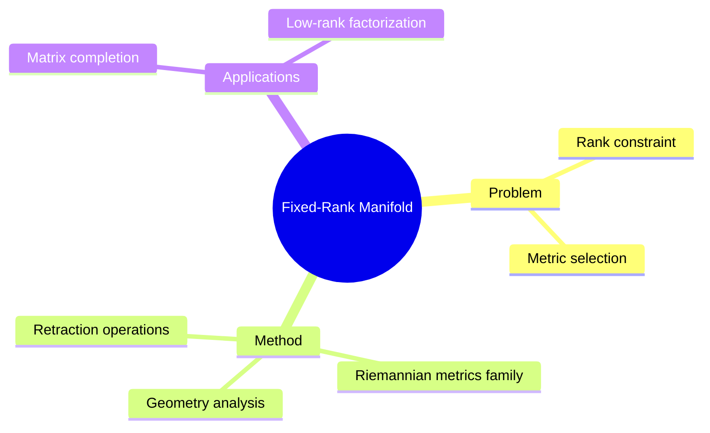

## Summary

研究 fixed-rank matrix manifold 上的 Riemannian optimization，探讨不同 Riemannian metrics 的影响。从几何理论到算法实现，系统分析 low-rank constraint optimization。

## Problem & Motivation

Fixed-rank optimization 问题：
- 矩阵补全、低秩分解等任务需要 rank constraint
- Fixed-rank manifold 的 geometry 与 metric 选择影响算法效率
- 现有方法缺少对 metric 影响的系统分析

## Method

**核心设计**：
1. **Riemannian Metrics Family**: 不同 metric 对 manifold 的不同参数化
2. **Geometry-to-Algorithms Pipeline**: 从几何性质推导优化算法
3. **Retraction Operations**: 不同 metric 的 retraction 实现

**理论基础**：
- Fixed-rank matrices {X: rank(X) = k}
- Grassmann manifold component
- Euclidean component

## Key Results

- 不同 metric 对收敛速度的影响分析
- 算法效率对比

## Strengths & Weaknesses

**亮点**：
- 理论到算法的系统性分析
- Metric 选择的理论指导

**局限**：
- 具体 benchmark 数字需看全文
- Deep learning 应用场景覆盖有限

## Mind Map

## Notes

> [基于 WebSearch 结果创建]

Fixed-rank manifold 是 low-rank learning 的核心几何基础。Metric 选择的理论分析有参考价值。