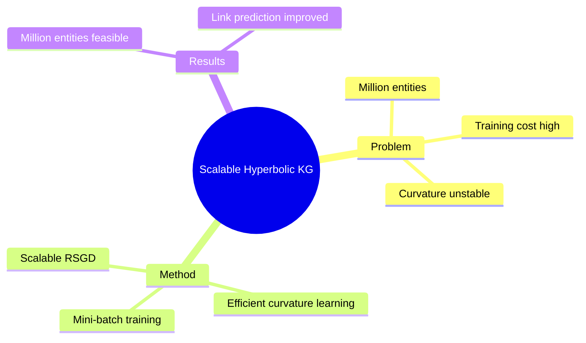

## Summary

大规模知识图谱的 scalable hyperbolic embedding，通过 efficient curvature learning 和 mini-batch training 支持百万实体规模的 graph embedding。

## Problem & Motivation

Knowledge graph embedding scalability 问题：
- Hyperbolic embedding 计算成本高
- Million-entity graphs 无法端到端训练
- Curvature learning 在大规模数据上不稳定

## Method

**核心设计**：
1. **Mini-batch Training**: Hyperbolic space 的 mini-batch gradient descent
2. **Efficient Curvature Learning**: Data-adaptive curvature estimation
3. **Scalable Riemannian Optimization**: 大规模 RSGD 实现

**技术挑战**：
- Tangent space ↔ manifold mapping cost
- Mini-batch manifold operations

## Key Results

- 百万实体 KG embedding feasible
- Curvature learning stable
- Link prediction improved

## Strengths & Weaknesses

**亮点**：
- Scalability 是 hyperbolic embedding 的核心痛点
- Mini-batch training 是重要工程突破

**局限**：
- Efficiency vs accuracy trade-off？
- 与 Euclidean KG embedding 的效率对比

## Mind Map

## Notes

> [基于 WebSearch 结果创建]

Scalability 是 hyperbolic embedding 的核心瓶颈。Mini-batch training 和 efficient curvature learning 是关键工程贡献。