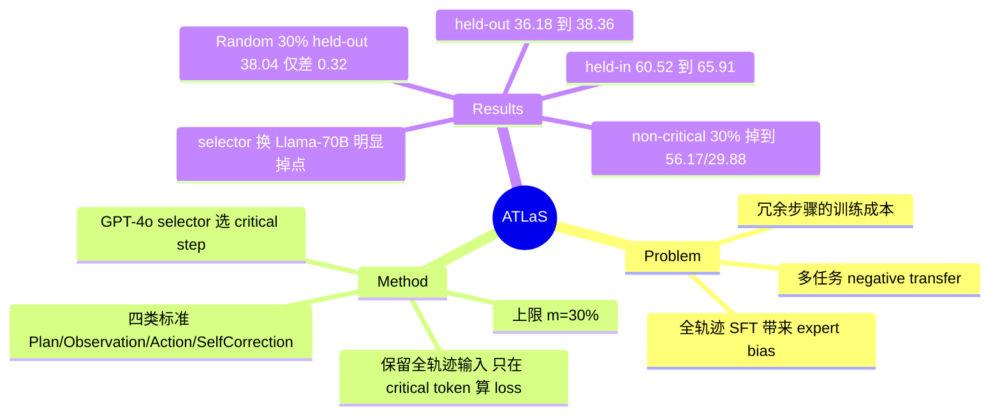

## Summary

用一个 oracle LLM（GPT-4o）在专家轨迹里挑出约 30% 的 critical steps，SFT 时保留完整轨迹作为输入但只在这些步骤的 token 上算 loss，从而在 AgentGym 的十个 held-in 任务上把平均分从 60.52 提到 65.91，同时降低训练成本。

## Problem & Motivation

Agent tuning 的默认做法是对整条专家轨迹做 SFT，这带来三个问题：

- **Expert bias**：模型被迫拟合专家在每一步上的具体行为分布，而不是学会"怎么解决问题"，在未见环境上泛化变差。
- **Negative transfer**：多任务混合训练时，拟合某个任务的全轨迹会因分布差异拖累其他任务。
- **成本浪费**：轨迹里大量步骤是冗余的或可替换的次优动作，base model 本来就能自己生成，为它们做反向传播是纯开销。

作者的核心假设是：轨迹的回报 $G(\tau)$ 主要由少数需要精确决策的步骤决定，其余步骤"可以调整或重排而不影响整条轨迹"，而后者恰恰是 base model 已经会做的部分。这把"整条轨迹 reward=1 时哪些步骤值得学"这个 credit assignment 问题，转成了一个语义层面的步骤选择问题。

## Method

**Critical step 的定义与四类标准。** 作者把 critical step 定义为对 $G(\tau)$ 有实质影响、要求精确决策与无差错执行的步骤，并经验性地划成四类：Plan Creation、Critical Observation、Critical Action、Self Correction。相对地，non-critical step 是可调整、可重排的，且通常对 base model 而言容易生成。

**Selector。** 用 GPT-4o 作为 selector，喂进 critical step identification prompt $\texttt{prompt}_c$。prompt 先给出上述四类定义，再要求 selector 先通读轨迹、总结出一个带 sub-goal 的高层 plan，然后基于 sub-goal 定位 critical step 并归类，最后返回步骤索引。硬约束是**最多选轨迹中 $m$ 比例的步骤**，默认 $m=30\%$。

**Loss masking 而非轨迹裁剪。** 这是方法里最关键的实现选择：训练时**保留完整原始轨迹（含 non-critical steps）作为输入序列**，只是不在它们的 token 上计算 teacher-force loss。所以上下文没有被破坏，被改变的只有梯度归属。

**训练配置。** 数据集为 AgentGym 的 AgentTraj-L（覆盖全部 held-in 任务的专家轨迹），backbone 为 Llama-3.1-8B-Instruct，评测 prompt 沿用 ReAct 格式以与训练数据一致。

## Key Results

**主结果（Llama-3.1-8B-Instruct，Table 1）**。held-in 为 Alfworld / BabyAI / Maze / Movie / Sciworld / Textcraft / Todo / Weather / Webshop / Wordle 十个任务，held-out 为 Academic / Sheet / Jericho / PDDL 四个。

| 训练数据 | held-in AVG | held-out AVG |
|:--|:--|:--|
| AgentTraj-L 全轨迹（100% steps） | 60.52 | 36.18 |
| Perplexity top-30% 选步 | 53.21 | 22.13 |
| Non-critical steps（30%） | 56.17 | 29.88 |
| **ATLaS critical steps（30%）** | **65.91** | **38.36** |

三条对照给出了不同强度的证据：

- **Non-critical 对照最有力**。同样只训 30% 的步骤，选被 selector 排除的那批，held-in 掉到 56.17、held-out 掉到 29.88，都低于全轨迹 baseline。这说明差异不只是"训得少所以不过拟合"，被排除的步骤确实带进了负向偏置。
- **Perplexity 对照给出机制解释**。按 base model 困惑度 top-30% 选步反而是所有变体里最差的（held-out 22.13）。作者的解释是困惑度同时反映"这一步重要"和"专家风格特殊"，用它选步等于强迫模型去模仿专家分布。
- **Random 对照暴露了方法的真实增益边界**（Table 3）。held-out 上 Random 30% 是 38.04，ATLaS 30% 是 38.36，只差 **0.32**；而 held-in 上是 59.90 vs 65.91，差 6.01。也就是说 selector 的语义判断主要在训练分布内兑现，held-out 那 +2.18pp（相对 100% baseline）里绝大部分来自"只训 30% 步骤"这件事本身，而不是"选对了哪 30%"。

**与 rollout 估值的一致性（Table 4）**。作者按 IPR 的做法，对 BabyAI 与 Weather 用 N=5 次 rollout 估计每个专家动作的价值，取相邻步骤价值差超阈值的为 critical step。结果与 ATLaS 基本持平（BabyAI 78.93 vs 78.58，Weather 60.00 vs 60.00）。作者同时坦承 N=5 的估计很粗糙——初始步常估成 0、后段步常估成 1，因此只有很少步骤被判为 critical；他们也给了 rollout 路线不可行的成本账：2000 条平均 25 步的轨迹至少需要 $6.5\times10^5$ 次推理。

**Selector 能力决定数据质量（Table 5）**。把 selector 换成 Llama3.1-70B-Instruct 后三个任务全线下降：Alfworld 83.00→78.50、BabyAI 78.93→67.23、Weather 60.00→55.00。作者的观察是弱 selector 会把大量 non-critical step 混进来。

**Critical step 的直接验证（Table 6）**。让未微调的 Llama-3.1-8B-Instruct 从被标记的 critical step 之后开始执行（100 个任务子集），BabyAI 从 54.8 提到 76.4、Maze 从 18.0 提到 44.0。这支持了"base model 本来就能自己走完 non-critical 步骤"的前提假设。

**换 backbone（附录 C）**。Mistral-7B-Instruct-v0.3：60.83 / 21.07 vs 全轨迹 57.83 / 16.61；Qwen2.5-7B-Instruct：57.72 / 30.86 vs 全轨迹 56.20 / 30.21。趋势一致，但 Qwen2.5 上的 held-out 增益只有 0.65。

## Evidence Ledger

| Claim ID | Claim | Type | Source locator | Evidence excerpt | Status |
|:--|:--|:--|:--|:--|:--|
| C1 | GPT-4o 作 selector，按 Plan Creation / Critical Observation / Critical Action / Self Correction 四类选步，$m=30\%$ | causal-mechanism | Sec 3.1–3.2, Sec 4.2 | "we empirically categorize four types of critical steps: Plan Creation, Critical Observation, Critical Action, and Self Correction" | source-verified |
| C2 | 保留完整轨迹为输入，仅在 critical step token 上算 loss | causal-mechanism | Sec 3.2 | "we keep the whole original trajectory, including the non-critical steps, as the input sequence but do not compute teacher-force loss on their tokens" | source-verified |
| C3 | ATLaS 30% = 65.91 / 38.36；全轨迹 100% = 60.52 / 36.18 | number | Table 1 | ATLaS (30% steps) 65.91 … 38.36；AgentTraj-L (100% steps) 60.52 … 36.18 | source-verified |
| C4 | Random 30% held-out 38.04 vs Critical 30% 38.36（差 0.32）；held-in 59.90 vs 65.91 | number | Table 3 | "Random 30% 59.90 38.04 … Critical 30% 65.91 38.36" | source-verified |
| C5 | Non-critical 30% = 56.17 / 29.88，低于全轨迹 baseline | number | Table 2 | "Non-critical Steps (30%) … 56.17 … 29.88" | source-verified |
| C6 | Perplexity top-30% = 53.21 / 22.13 | number | Table 1 | "Perplexity Selection … 53.21 … 22.13" | source-verified |
| C7 | ATLaS 与 N=5 rollout 估值选步性能相当（BabyAI 78.93 vs 78.58；Weather 60.00 vs 60.00） | comparison | Table 4, Sec 4.5.4 | "our method achieves performance comparable to the estimated value function approach" | source-verified |
| C8 | selector 换成 Llama3.1-70B 后 Alfworld 83.00→78.50、BabyAI 78.93→67.23、Weather 60.00→55.00 | number | Table 5 | "GPT-4o 83.00 / Llama3.1-70B 78.50 … 78.93 / 67.23 … 60.00 / 55.00" | source-verified |
| C9 | 从 critical step 起始执行：BabyAI 54.8→76.4、Maze 18.0→44.0 | number | Table 6, Sec 4.6 | "BabyAI 54.8 76.4 / Maze 18.0 44.0" | source-verified |
| C10 | 作者承认方法重度依赖强闭源 selector，且选择只基于语义 | causal-mechanism | Limitations | "the current approach to selecting critical steps depends heavily on powerful closed-source models" | source-verified |
| C11 | 论文未提供公开代码仓库 | license-code | 全文 | 未检索到 GitHub 链接 | source-verified |
| C12 | Mistral 60.83/21.07（baseline 57.83/16.61）；Qwen2.5 57.72/30.86（baseline 56.20/30.21） | number | Appendix C | 附录表 backbone 分组行 | source-verified |

## Strengths & Weaknesses

**亮点。**

- **Loss masking 而非数据裁剪**是正确的设计。step 选择类方法很容易滑向"把没选中的步骤删掉"，那会破坏轨迹的上下文连续性，让模型在一个训练时不存在的状态分布上被评测。ATLaS 只动梯度归属，输入分布保持不变。
- **Non-critical 对照实验是这篇论文最硬的证据**。"训得少 → 少过拟合"是一个几乎必然成立的混杂解释，把预算固定在同样的 30% 再比，是唯一能把它排除掉的设计。结论也不是温和的：训 non-critical step 比训全轨迹更差。
- **和 rollout 估值对齐**（Table 4）虽然规模小，但它把"语义选步"这个看起来很主观的信号，和 MDP 里可定义的 value gap 挂上了钩，让方法不至于停留在"LLM 说重要就重要"。

**局限。**

- **Held-out 的增益基本不来自 selector。** Random 30% 与 Critical 30% 在 held-out 上只差 0.32，作者在正文里把 Table 3 读成"random 在所有比例上都不如 critical"，但 held-out 那一列并不支持这个强度的表述。方法真正兑现的地方是 held-in（+6.01）。
- **选择器是不可控的黑箱。** 换成 Llama3.1-70B 就掉 11.7pp（BabyAI），意味着 critical step 的标注质量完全绑定在一个闭源模型的判断上，既无法审计也无法复现。作者自己在 Limitation 里承认了这一点。
- **selector 只看语义，看不见 counterfactual。** 一个步骤"读起来像关键决策"和"改掉它会让轨迹失败"是两回事。Table 4 的一致性检查只覆盖 BabyAI 与 Weather 两个短程任务，恰恰是最容易一致的场景；长程、多分支的任务上是否还一致，没有证据。
- **只处理成功轨迹。** 方法预设输入是 dense reward 环境下采到的专家轨迹，对"整条 reward=1 但中间有错步"这个更一般的情形，selector 是否能识别出被后续步骤修正掉的错误动作，论文没有测。四类标准里的 Self Correction 暗示作者意识到了这个情形，但没有单独评估。
- **AgentGym 的十个 held-in 任务大多是短程文本环境**（BabyAI、Maze、Weather、Todo），单条轨迹步数有限，30% 这个比例是否能外推到几十步的 GUI/Web 轨迹是开放的。

## Mind Map

## Notes

- 与 [[Papers/2602-ADMIRE]] 的对照很直接：ADMIRE 也做"成功轨迹里只给部分步骤 reward"的去噪，但它用 milestone 命中来判定，而 ADMIRE 的消融显示去噪那一半并不是增益主来源；ATLaS 的 Table 2 则给出了相反方向的证据——被排除的步骤确实有害。两者的差别可能在于 ADMIRE 的 milestone 判定依赖 agent 自述动作描述（自报可被 hack），而 ATLaS 的 selector 看的是完整轨迹上下文。
- 与 [[Papers/2601-EvoCUA]] 的 step-level 去噪属于同一族（都用 judge model 删/降权冗余步骤），但 EvoCUA 是在 RFT 阶段做，ATLaS 是在 SFT 阶段做 loss mask，且 EvoCUA 是真删步骤、ATLaS 是保留上下文只 mask loss。
- Table 4 里的 value function baseline 来自 IPR（Xiong et al. 2024），是"MC prefix rollout 估值"这一族在 SFT 场景的代表；ATLaS 的成本估算（$6.5\times10^5$ 次推理）是把这条路线在长轨迹上判死刑的具体数字，值得在 survey 里引用。
- 待查：selector prompt 要求"先总结带 sub-goal 的高层 plan 再选步"，这个中间产物本身是否也被用作训练信号？正文只说返回索引，没提 plan 是否进入 $D_c$。
