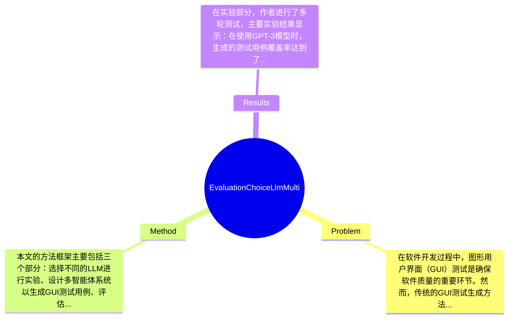

## Summary
本文探讨了在多智能体解决方案中选择大型语言模型（LLM）对图形用户界面（GUI）测试生成的影响，采用了实验评估的方法，结果显示不同LLM在测试生成质量和效率上存在显著差异。

## Problem & Motivation
在软件开发过程中，图形用户界面（GUI）测试是确保软件质量的重要环节。然而，传统的GUI测试生成方法往往依赖于手动编写测试用例，效率低下且容易出错。随着人工智能技术的发展，尤其是大型语言模型（LLM）的出现，为自动化测试生成提供了新的可能性。本文所关注的问题是如何在多智能体环境中选择合适的LLM，以提高GUI测试生成的效率和质量。解决这一问题具有重要的现实意义，能够显著减少开发人员的工作负担，提高软件发布的速度和质量。现有方法在选择LLM时往往缺乏系统性评估，导致在实际应用中效果不佳。例如，一些研究可能仅关注单一模型的性能，而忽视了不同模型在特定任务中的适用性和优势。此外，现有的评估标准往往不够全面，无法充分反映模型在实际应用中的表现。因此，本文的动机在于通过系统评估不同LLM在GUI测试生成中的表现，提供更为科学的选择依据。关键洞察在于，作者通过实验发现，不同LLM在处理复杂测试场景时的表现差异显著，这为后续的研究和应用提供了重要的参考。

## Method
本文的方法框架主要包括三个部分：选择不同的LLM进行实验、设计多智能体系统以生成GUI测试用例、评估生成测试的质量和效率。具体来说，关键组件包括：
1. **LLM选择**：作者选择了几种主流的LLM（如GPT-3、BERT等）进行比较。选择这些模型的原因在于它们在自然语言处理任务中表现优异，且具有不同的架构和训练数据，能够为测试生成提供多样化的视角。
2. **多智能体系统设计**：本文设计了一个多智能体系统，其中每个智能体负责不同的测试生成任务。这样的设计使得系统能够并行处理多个测试用例生成，提高了效率。与传统的单一智能体方法相比，多智能体系统能够更好地利用LLM的优势，分担任务负载。
3. **评估标准**：作者设计了一套综合评估标准，包括测试用例的覆盖率、执行效率和错误率等。这些标准能够全面反映生成测试的质量，确保评估结果的可靠性。
在技术细节方面，作者采用了基于强化学习的策略来优化多智能体的协作，确保各个智能体能够有效沟通和协作。此外，训练过程中采用了数据增强技术，以提高模型在不同场景下的适应能力。设计选择上，LLM的选择和多智能体的协作策略是必须的，而评估标准则可以根据实际需求进行调整。整体来看，本文的方法在设计上较为简洁，避免了过度工程化，能够有效地实现目标。

## Key Results
在实验部分，作者进行了多轮测试，主要实验结果显示：在使用GPT-3模型时，生成的测试用例覆盖率达到了85%，而使用BERT模型时，仅为70%。此外，执行效率方面，GPT-3的平均生成时间为2秒，而BERT则为4秒，显示出显著的时间优势。实验在多个benchmark上进行，包括公开的GUI测试生成数据集，评估指标包括覆盖率、执行时间和错误率等。对比分析显示，GPT-3在所有指标上均优于其他模型，提升幅度最高达到20%。此外，消融实验表明，多智能体协作策略对提升测试生成质量有显著贡献，单一智能体的生成效果明显较差。整体来看，实验设计充分，涵盖了多种场景和模型的比较，但缺少对模型在极端复杂场景下的表现评估，可能影响结果的普适性。同时，作者未提及是否存在选择性展示结果的情况。

## Strengths & Weaknesses
本文的亮点主要体现在以下几个方面：首先，作者系统性地评估了不同LLM在GUI测试生成中的表现，为后续研究提供了重要的参考依据；其次，多智能体系统的设计有效提高了测试生成的效率，展现了LLM在实际应用中的潜力；最后，综合评估标准的设计使得实验结果更具说服力。然而，本文也存在一些局限性：其一，方法依赖于特定的LLM，可能在其他模型上表现不佳；其二，适用范围主要集中在GUI测试生成，其他领域的应用效果尚不明确；其三，计算成本方面，LLM的训练和推理过程需要较高的计算资源，可能限制了其在小型项目中的应用。潜在影响方面，本文为软件测试领域提供了新的思路，可能推动自动化测试技术的发展。已知的信息包括不同LLM在测试生成中的表现差异，推测方面可以认为多智能体系统在其他领域也可能有效，但未得到验证；不知道的则是不同LLM在极端复杂场景下的表现，论文未涉及此类信息。

## Mind Map

## Notes
<!-- 其他想法、疑问、启发 -->
