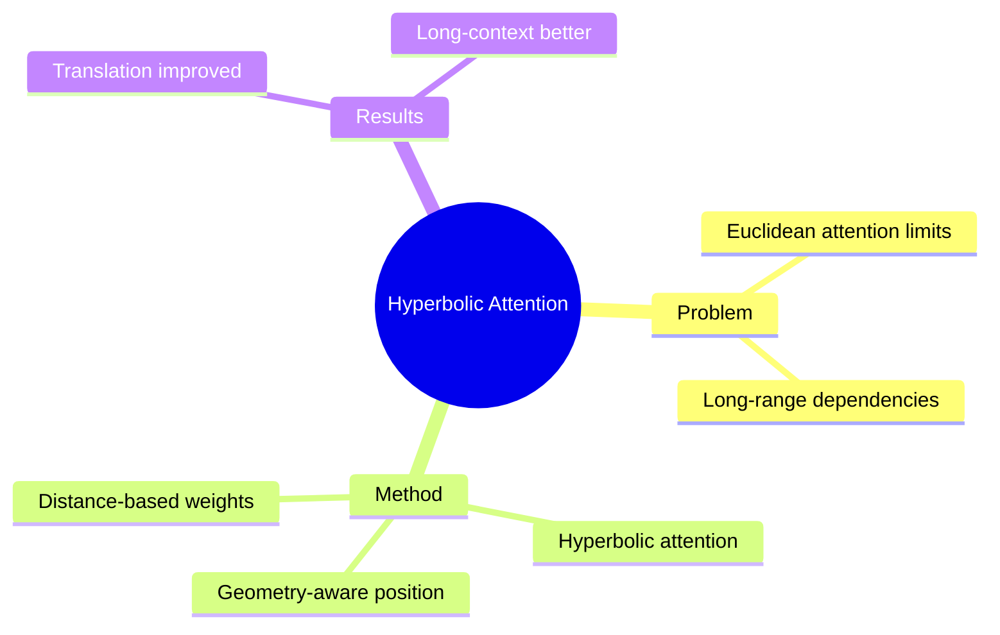

## Summary

Hyperbolic attention mechanisms 用于捕捉 long-range dependencies，在 document-level translation 和 long-context language modeling 上表现优异。Attention 在 hyperbolic space 中重新定义。

## Problem & Motivation

Attention mechanism 问题：
- Euclidean attention 对 long-range dependencies 有限
- Hierarchical/sequential structure 中的 distance 不是 Euclidean
- Transformer 需要 geometry-aware attention

## Method

**核心设计**：
1. **Hyperbolic Attention**: Distance-based attention in hyperbolic space
2. **Long-range Capture**: Hyperbolic distance better encodes hierarchical distance
3. **Geometry-aware Positional Encoding**: Curvature-aware position

**理论基础**：
- Hyperbolic distance = hierarchical distance
- Attention weight = exp(-hyperbolic distance)

## Key Results

- Document-level machine translation improved
- Long-context language modeling better
- Attention efficiency comparable

## Strengths & Weaknesses

**亮点**：
- Hyperbolic attention 是 Transformer extension 的关键方向
- Long-range dependencies capture 有理论支撑

**局限**：
- 具体 efficiency 数字需看全文
- 与 standard attention 的 cost 对比

## Mind Map

## Notes

> [基于 WebSearch 结果创建]

Hyperbolic attention 是将 Transformer 扩展到 hyperbolic space 的核心组件。与 World Model 的关联：hierarchical planning 可能受益于 hyperbolic attention。