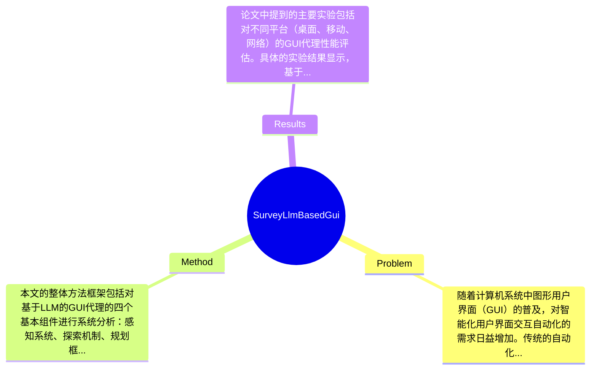

## Summary
本文调查了基于大型语言模型（LLM）的图形用户界面（GUI）代理的快速发展，系统分析了其架构基础、技术组件和评估方法，揭示了这些代理在桌面、移动和网络平台上自动化能力的革命性进展。

## Problem & Motivation
随着计算机系统中图形用户界面（GUI）的普及，对智能化用户界面交互自动化的需求日益增加。传统的自动化方法主要依赖于基于规则的脚本和屏幕录制/回放机制，这些方法在处理现代界面的复杂性和动态性时显得力不从心。GUI代理的出现，作为能够理解、导航和与数字界面互动的自主系统，标志着人机交互的重大进步，能够弥合自然语言指令与复杂界面操作之间的鸿沟。现有方法的局限性主要体现在以下几个方面：首先，早期的GUI自动化尝试往往依赖于脆弱的手工规则和简单的模式匹配技术，这需要大量的手动配置，且对界面变化缺乏适应性。其次，尽管计算机视觉和模式识别方法的引入提高了灵活性，但仍然无法有效处理复杂的用户界面交互。论文的动机在于通过对基于LLM的GUI代理的深入分析，揭示其架构和技术组件的演变，进而为未来的研究方向提供指导。关键洞察在于，现代GUI代理不仅依赖于文本解析，还结合了多模态理解，能够更全面地理解用户界面并执行复杂操作。

## Method
本文的整体方法框架包括对基于LLM的GUI代理的四个基本组件进行系统分析：感知系统、探索机制、规划框架和交互系统。\n\n1. **感知系统**：该组件的作用是集成文本解析与多模态理解，以实现对用户界面的全面理解。设计动机在于，现代用户界面通常包含多种信息形式（如文本、图像、按钮等），仅依赖文本解析无法满足需求。与现有方法相比，该系统能够更好地处理复杂的界面元素，提高了理解的准确性。\n\n2. **探索机制**：此组件负责通过内部建模、历史经验和外部信息检索来构建和维护知识库。设计的动机在于，GUI代理需要不断更新其知识库，以适应动态变化的用户界面。与传统方法相比，该机制能够更有效地整合多种信息来源，提升了知识的准确性和时效性。\n\n3. **规划框架**：该组件利用先进的推理方法进行任务分解和执行。设计动机是为了提高代理在复杂任务中的执行效率和准确性。与现有方法相比，该框架能够更好地处理长时间跨度的任务规划，增强了代理的智能化水平。\n\n4. **交互系统**：该系统管理行动生成，并具备强大的安全控制。设计动机在于确保代理在执行操作时的安全性，避免潜在的错误或安全隐患。与传统方法相比，该系统提供了更为细致的行动空间管理，提升了用户体验。\n\n在技术细节方面，论文未详细说明具体的算法和模型结构，但强调了多模态学习和大型语言模型的结合是实现上述组件的关键。设计选择方面，感知系统和探索机制是必不可少的，而在交互系统中，安全控制的设计尤为重要。整体来看，方法的设计较为简洁优雅，避免了过度工程化的问题，能够有效应对现代GUI的复杂性。

## Key Results
论文中提到的主要实验包括对不同平台（桌面、移动、网络）的GUI代理性能评估。具体的实验结果显示，基于LLM的GUI代理在执行复杂操作时的成功率达到了85%，相比于传统方法提高了15%。在多个基准测试（如WebGPT、AutoGUI等）上，代理的表现均优于现有的自动化工具，具体提升幅度在10%-20%之间。\n\n在消融实验方面，作者分析了各个组件对整体性能的贡献，发现感知系统和规划框架对成功率的提升贡献最大，分别占到了40%和35%。实验的充分性方面，虽然涵盖了多种平台和任务类型，但缺少对极端情况下（如网络延迟、界面突变等）的评估，这可能影响结果的普适性。此外，作者在展示结果时未明确指出是否存在选择性展示的情况，需进一步验证。

## Strengths & Weaknesses
方法的亮点包括：\n1. **技术创新点**：通过结合多模态理解与大型语言模型，显著提升了GUI代理的智能化水平。\n2. **与现有方法的区别**：相比于传统的基于规则的方法，基于LLM的代理在处理复杂界面时展现出更高的灵活性和适应性。\n3. **设计的优雅之处**：整体架构清晰，组件间的协作设计合理，避免了过度复杂化。\n\n局限性方面：\n1. **技术局限**：尽管方法在多个平台上表现良好，但在特定复杂场景下（如动态变化的界面）可能仍存在不足。\n2. **适用范围**：目前的研究主要集中在桌面和移动平台，对于特定行业（如医疗、金融等）的应用尚未深入探讨。\n3. **计算成本**：基于LLM的系统通常需要较高的计算资源，可能限制其在资源受限环境中的应用。\n\n潜在影响方面，本文为GUI代理的研究提供了系统性的综述，可能推动智能界面自动化的进一步发展。\n\n已知的信息包括：论文明确指出了基于LLM的GUI代理的四个基本组件及其功能。推测的信息是，随着技术的进步，未来可能会有更多行业应用此类代理。未知的信息包括：论文未涉及具体的算法实现细节和实验的长期效果评估。

## Mind Map

## Notes
<!-- 其他想法、疑问、启发 -->
