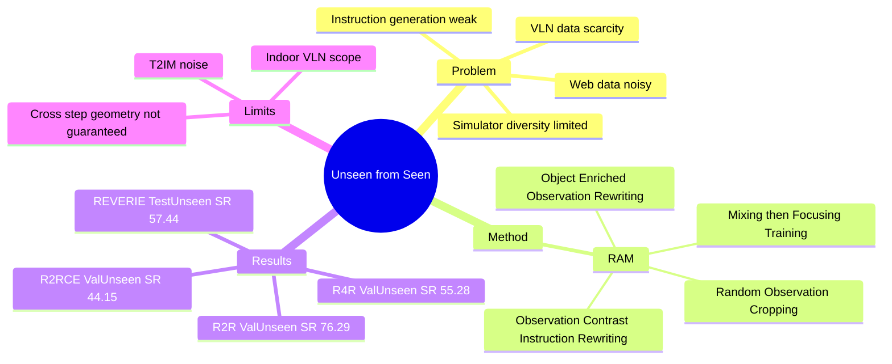

## Summary
RAM 把 VLN data augmentation 从“找更多 simulator / web data”改成“rewrite 已有人类标注的 observation-instruction pairs”：用 VLM、LLM、T2IM 生成新的 panoramic observations 与对齐后的 instructions，再用 mixing-then-focusing training 抑制合成数据噪声。它在 R2R、REVERIE、R4R、R2R-CE 上稳定提升 DUET / HAMT baseline，核心价值是 data-efficient generalization；边界是仍依赖 synthetic panorama 质量，且没有显式保证跨 timestep 的绝对视觉一致性。

## Problem & Motivation
VLN 的核心瓶颈是数据稀缺：高质量 trajectory-instruction pairs 依赖人工标注，训练集覆盖的 houses / spatial layouts / object co-occurrences 有限，导致 agent 在 unseen environments 上泛化差。

已有 augmentation 主要有两条路：simulator-based 方法从 Matterport3D、HM3D、Gibson 等环境采样轨迹，再用 Speaker 生成 instruction；web-based 方法从 Airbnb / YouTube 等来源收集 room images / room-tour videos，再用 template 生成 instruction。作者指出前者仍受特定 simulator environment 约束，后者噪声多且需要人工清洗；同时 Speaker-generated instructions 往往不够 informative，template-based instructions 又缺少表达灵活性。

本文的问题 formulation 比“多采样一些轨迹”更直接：能否不依赖额外 simulator 或 web collection，而是从已有人类标注数据中 rewrite 出 unseen observation-instruction pairs，并让这些合成数据真的提升 unseen generalization？

## Method
RAM（Rewriting-driven AugMentation）包含三块。

1. **Object-Enriched Observation Rewriting**：对每个原始 panoramic observation，先用 Tag2Text 生成 scene description，再用 ChatGPT（gpt-3.5-turbo-1106）基于 object co-occurrence knowledge 生成 object-enriched rewritten scene descriptions，同时显式列出新增 objects。随后用 MultiDiffusion 这类 panoramic T2IM 生成新的 panorama，并用 Equirec2Perspec 将 panorama 离散成 36 个 perspective views，保持与 R2R / Matterport3D VLN setting 一致。

2. **Observation-Contrast Instruction Rewriting**：原始 instruction 与新 observation 不再天然对齐，所以作者先从原始 instruction 中抽取 sequential landmarks，再用 CLIP similarity 将每个 ground-truth action observation 与 landmark 对齐；对新生成 observation 也用 VLM 生成 description。最后让 LLM 对比 original grounded landmarks 与 new observation descriptions，把 instruction 中的 object / scene 替换为新 observation 中出现的 landmark，同时改写 actional descriptions 的表达方式。

3. **Mixing-then-Focusing Training**：Stage 1 混合 original data 与 rewritten data 训练，并对 rewritten panoramas 做 random observation cropping，把不同 panorama patches 组合成新的 panorama 来增加分布多样性、缓解 T2IM repeated-object noise。Stage 2 只用 original high-quality annotated data 继续训练，用来压制合成数据噪声的负面影响。

实验实现上，RAM 插入 DUET baseline：pretraining 使用 MLM / ITM / SAP，finetuning 使用 DAGGER；每个 original trajectory-instruction pair 生成 3 条新 trajectory，每条配 1 条 rewritten instruction。Supplementary 给出的数据规模是 R2R / R4R 各 14,025 条 augmented data、REVERIE 12,450 条；foundation models 均 zero-shot 使用。

## Key Results
**R2R**：在 CLIP ViT-B/16 visual features 下，DUET baseline 的 Val Unseen 为 SR 72.37 / SPL 58.75，RAM 提升到 SR 73.65 / SPL 63.13；Test Unseen 为 SR 71 / SPL 61。在 CLIP ViT-L/14 下，RAM Val Unseen 达到 SR 76.29 / SPL 66.39，Test Unseen 达到 SR 75 / SPL 65。注意 RAM 不是 R2R Test Unseen 的绝对 SOTA：ScaleVLN 为 SR 80 / SPL 70，但它使用远大规模 simulator data；作者的主要 claim 是 data efficiency。

**REVERIE**：CLIP ViT-L/14 下，RAM 在 Val Unseen 从 DUET baseline 的 SR 48.71 / OSR 53.62 / SPL 34.26 / RGS 32.18 / RGSPL 22.64 提升到 SR 51.89 / OSR 58.47 / SPL 35.00 / RGS 34.31 / RGSPL 23.20。Test Unseen 上 RAM 达到 SR 57.44 / OSR 64.26 / SPL 41.41 / RGS 36.05 / RGSPL 25.77，高于 ScaleVLN 的 SR 56.13 / OSR 62.65 / SPL 39.52 / RGS 32.53 / RGSPL 22.78。

**R4R**：Val Unseen 上，DUET baseline 为 NE 5.88 / SR 50.35 / SPL 46.14 / nDTW 40.08 / sDTW 27.91 / CLS 46.31；RAM 为 NE 5.18 / SR 55.28 / SPL 49.59 / nDTW 42.05 / sDTW 29.91 / CLS 47.18。这个结果说明 RAM 对更长 instruction 和 trajectory 的 instruction-following fidelity 也有增益。

**R2R-CE**：从 discrete VLN transfer 到 continuous environment 后，DUET baseline Val Unseen 为 NE 5.14 / OSR 59.65 / SR 37.25，RAM 为 NE 4.95 / OSR 61.45 / SR 44.15；Val Seen 也从 SR 43.32 提升到 SR 46.92。这是该方法对 continuous VLN 有迁移潜力的证据，但仍是在 R2R-CE / Habitat setup 内。

**Ablation**：Observation-instruction rewriting ablation 中，Val Unseen baseline SR 65.94；只加 generated panoramas 为 67.52，只加 rewritten instructions 为 67.43，Pan. + Des. 为 69.69，Pan. + Des. + Ins. 达到 70.29，而 Speaker inst 只有 65.05。Training-phase ablation 中，R2R Val Unseen baseline SR 72.37 / SPL 58.75；finetuning-only 使用 RAM 为 SR 73.61 / SPL 62.46，pretraining+finetuning 为 SR 73.65 / SPL 63.13。Same-scale ScaleVLN subset 比较中，DUET+RAM 的 R2R Val Unseen SR 73.65 / SPL 63.13 高于 DUET+ScaleVLN(subset) 的 SR 73.01 / SPL 62.60。

## Strengths & Weaknesses
**已知 strengths**：RAM 的贡献不是更大的模型，而是一个清楚的数据生成 framing：用 foundation models rewrite 已有人类标注数据，在 simulator-free、labor-saving 的条件下扩展 observation-instruction distribution。方法模块化，Object-Enriched Observation Rewriting、Observation-Contrast Instruction Rewriting、mixing-then-focusing 都有 ablation 支撑；它不仅提升 DUET，也在 supplementary 中提升 HAMT（R2R Val Unseen SPL 56.62 -> 59.27）。

**已知 strengths**：成本披露相对完整。Supplementary 中 observation descriptions 用 VLM 少于 1 小时，T2IM 生成 augmented observations 约 30 小时，两次 LLM querying 各少于 30 分钟且各约 10 dollars；整条 augmentation pipeline 少于约 2 天。这让方法比 ScaleVLN 式大规模 simulator expansion 更轻量。

**已知 weaknesses / boundaries**：合成数据噪声是方法内部承认的问题。作者明确提到 panoramic T2IM 有 repeated object generation，因而需要 random observation cropping 和 Stage 2 original-data focusing；这说明 RAM 不是“合成越多越好”，数据融合机制本身是必要组件。

**已知 weaknesses / boundaries**：cross-step consistency 只有语义层面的弱保证。论文说明每个 timestep 的 panorama 是由 T2IM 分别生成，没有显式约束保证 absolute cross-step observation overlap；Fig. 7 展示的是 potted plant 这类 object category 的 cross-step semantic consistency，而不是几何一致性证明。对于 closed-loop embodied navigation，这可能会影响 agent 学到的 transition dynamics。

**已知 weaknesses / boundaries**：实验主要仍在 indoor VLN benchmark family 内，包括 R2R、REVERIE、R4R、R2R-CE；没有真实机器人、outdoor、dynamic scene 或 GUI / web agent 环境验证。因此它支持的 claim 是“在主流 indoor VLN benchmarks 上提升 supervised VLN agents 的 generalization”，不能直接外推到所有 embodied agents。

**推测**：对 GUI-agent / web-agent 数据增强有可迁移 insight：不要只 paraphrase instruction，而是做 observation-contrast rewriting，让 instruction 中的目标、landmark、动作表达与新 observation 对齐。不同点是 GUI state 的 affordance 和 action validity 更离散、更严格，synthetic observation 一旦错一个 button / state transition，噪声可能比 indoor panorama 更致命。

**不知道**：论文没有系统比较 GPT-4 等更强 LLM、不同 T2IM、或 trainable filtering / verifier 对最终 SR / SPL 的影响；也没有给出人工评估来量化 rewritten instruction factuality、panorama realism、trajectory-level consistency。因此“foundation model choice 是否是瓶颈”仍不清楚。

## Mind Map

## Notes
这篇对我的价值主要在 data-centric embodied AI：它把“扩数据”从 environment acquisition 转成 observation-instruction rewriting，适合连接到 GUI agent 的 synthetic task generation、VLM-based grounding 数据生成、以及 instruction-following 的 counterfactual augmentation。

需要保留的 critical reading：RAM 的 gain 很真实，但不是一个 foundation-model-as-policy 的路线；foundation models 在这里是低频 data generator，最终收益仍由 DUET / HAMT 这类 supervised navigation agent 吃掉。若要迁移到 GUI / computer-use，需要额外解决 action validity、state transition consistency、以及 UI element grounding 的自动验证。
