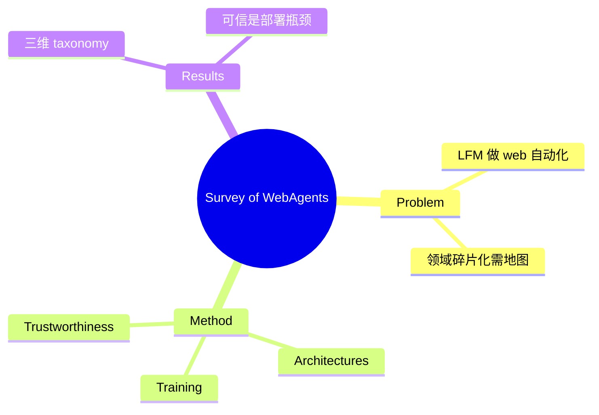

## Summary
第一篇专门面向 WebAgent（基于 Large Foundation Model 的 web 自动化 agent）的系统综述，沿 **architectures / training / trustworthiness** 三条主线组织领域，回答"能否用 LFM 造出自动处理 web 任务的强 agent"这一总问题。KDD 2025 接收，是 web agent 方向的参考锚点。

## Problem & Motivation
web 是电商、办公、检索、政务等真实数字工作流的主要接口，用 LFM（billions 参数、强语言理解与推理）自动化 web 任务有巨大落地价值。但领域快速膨胀、工作碎片化，缺一张把"agent 怎么搭、怎么训、可不可信"三件事统一起来的地图。作者提供这张地图，作为后续研究的 positioning 参考。

## Method
> [未获取全文，仅基于 abstract + 页面结构]

综述的三维分类框架：

1. **Architectures（架构）**：WebAgent 的感知-规划-执行组织方式。领域内可区分几类范式——text-finetuned agent（如 WebGPT）、HTML-pretrained agent（如 WebAgent/HTML-T5）、prompting-based instruction-following agent（用轻量提示做 zero-shot 决策）。
2. **Training（训练）**：从 SFT、trajectory imitation 到 RL 的训练路线，关注学习效率与数据来源。
3. **Trustworthiness（可信）**：把可靠性/安全性作为与能力并列的一等维度——决策可信、对抗鲁棒、隐私是实际部署的前提。

## Key Results
综述类论文，无实验数字。核心贡献是 taxonomy 与 open challenge 梳理：强调 trustworthiness 与架构设计同等重要，agent 决策可靠性仍是部署瓶颈。

## Strengths & Weaknesses
**亮点**：领域首篇专门 WebAgent 综述，architectures/training/trustworthiness 三分法清晰，适合作为 [[Topics/WebAgent-Survey]] 的外部参考锚点与 related work 起点。

**局限**：(1) 截至 2025-03，未覆盖后续 deep-research 分支（WebSailor 系）与大规模 visual web RL（WebGym 系）的爆发；(2) trustworthiness 一节偏概念梳理，缺对 indirect prompt injection（[[Papers/2605-WebTrap]]/WASP）等具体攻击面的深入。属"了解即可"的 landmark reference。

## Mind Map

## Notes
- 与 vault 的 [[Papers/2411-GUIAgentSurvey]]、[[Papers/2508-OSAgentsSurvey]]、[[Papers/2501-ACUSurvey]] 互补：那三篇是宽 GUI/CUA/OS，本篇专注 web 模态。
