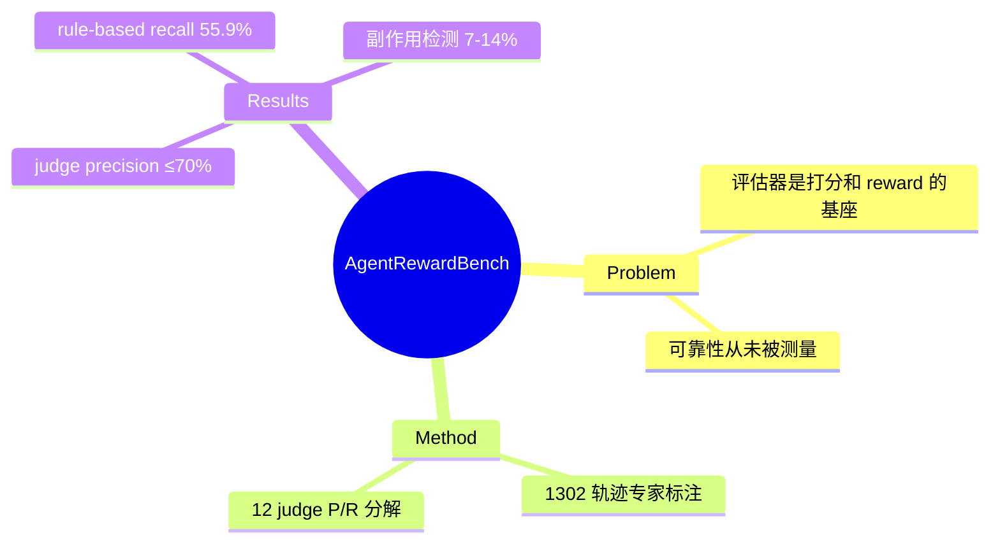

## Summary

首个系统评测"web agent 轨迹自动评估器"的 benchmark：1302 条轨迹（5 个 benchmark × 4 个 agent）由 6 名专家标注 success/side-effect/repetition，用来测 12 个 LLM judge。两个核心数字：**没有任何 judge 的 precision 超过 70%**（judge 说成功的轨迹 ~30% 其实失败）；**rule-based 评测 recall 仅 55.9%**（系统性漏判成功轨迹，WebArena 上比专家低 16.7pp）。评测器本身在两个方向上都不可靠。

## Problem & Motivation

轨迹评估是 benchmark 打分和 RL reward 的共同基座。Rule-based 方法（WebArena 式 functional check）难以扩展到新任务、且 exact-match 会拒绝合法的替代解（例："The closest national park is Acadia National Park" 因不严格等于 "Acadia National Park" 被判失败）；LLM judge 可扩展但可靠性从未被系统测量。

## Method

- **轨迹收集**：WebArena(100 任务)/VisualWebArena(100)/AssistantBench(33)/WorkArena(18)/WorkArena++(100)，共 351 任务 66 网站；4 个 agent（GPT-4o、Claude 3.7 Sonnet、Llama-3.3-70B、Qwen2.5-VL）经 AgentLab/BrowserGym 统一超参跑出 1302 条轨迹（196 dev / 1106 test）。
- **专家标注**：6 名领域专家，3 个二值问题（是否成功 / 是否有多余动作引起副作用 / 是否空转循环）；Gradio 界面看截图+推理+DOM；分歧当面讨论至共识；inter-annotator agreement 89.3%。
- **被测 judge**：12 个（GPT-4o/Claude/Llama/Qwen/GPT-4o-mini × 输入表示变体），另比较已有方法 AER-C/AER-V/NNetNav。

## Key Results

- **LLM judge precision 天花板 ~70%**：最佳 GPT-4o 69.8% P / 83.1% R。用 judge 过滤轨迹做 SFT/RL 时，~30% 的"成功"样本是假的。
- **Rule-based 系统性低估**：recall 55.9%；WebArena 上专家 55.1% vs rule-based 30.8%（Claude 轨迹）；VWA 低估 18.5pp。**同一 agent 的"官方分数"显著低于真实能力**。
- **无 judge 通吃**：WorkArena 上 GPT-4o 94.6% P，VWA 上最好只有 64.8%——judge 选型 benchmark-dependent。
- **输入表示反直觉**：screenshot-only (64.5% P) > AXTree-only (61.5%) > 两者都给 (62.1%)——**信息更多反而分散 judge**。
- **副作用检测近乎不可用**：precision 7–14%；重复循环检测尚可（78–92%）。

## Strengths & Weaknesses

**Strengths**：把"评估器可靠性"从轶事变成测量，precision/recall 双向分解干净；专家标注协议扎实（89.3% agreement）；同时打了 rule-based（低 recall）和 LLM judge（低 precision）两边的脸。

**Weaknesses / 边界**：
- 标注者全是 web agent 研究者，success 定义偏技术可行性而非用户意图。
- 没有给出改进方案，只有诊断；四类 judge 错误（grounding mismatch、misleading reasoning 等）只做了定性归类。
- 副作用 7–14% precision 的原因未深挖——这对 safety 评测是重要空白。

## Mind Map

## Notes

- **对 AFE 的证据价值（verifier 轴的核心测量）**：与 vault 已有证据拼成完整谱系——程序化 verifier 94.1% 人类对齐（[[Papers/2605-OpenComputer]]）> 视觉证据 judge 87.4%（[[Papers/2605-AndroidDaily]]）> WebJudge ~85%（[[Papers/2504-OnlineMind2Web]]）> 通用 LLM judge ≤70% precision（本文）> rule-based recall 55.9%（本文）。结论：**可靠评测的关键变量是环境状态的可观测性**——能程序化读状态时不要用 judge；这正是 AFE `verify()` affordance 的动机。
- rule-based 低 recall 与 LLM judge 低 precision 是**双向失败**：前者要求环境暴露精确状态断言但断言写死了；后者不依赖环境但看不见 hidden state。混合式（[[Ideas/HybridVerifier-GUIRuntime]]）有明确空间。
- screenshot > AXTree+screenshot 的反直觉结果值得记住：给 verifier 的观察也要做信息设计，不是越多越好。
