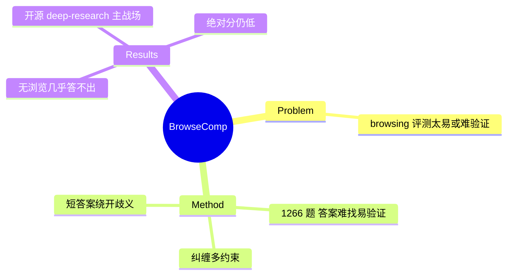

## Summary
OpenAI 的 browsing agent benchmark：1266 个"答案难找但易验证"的问题，要求 agent 在网络上持久、有创造性地检索纠缠的多约束信息才能定位唯一答案。设计上刻意用短的可验证答案、绕开歧义，成为 deep-research / browsing agent 的高难标尺（WebSailor 系、DeepResearch 均在其上竞争）。

## Problem & Motivation
现有 browsing 评测要么太易（可 shortcut）、要么答案难验证。要衡量真正强的浏览 agent，需要一类**答案极难找到、但一旦给出就容易核对**的题——考验 agent 在开放网络里的持久性与检索创造力，而非语言生成能力。

## Method
- **1266 问题**，每题答案短、唯一、可验证。
- **纠缠多约束设计**：问题涉及 hard-to-find、entangled information，需同时满足多个约束才能锁定唯一实体/答案，逼迫 agent 做持久的多步浏览与交叉验证。
- **刻意简化评测面**：只要短答案匹配，绕开长文生成与歧义消解——像"编程竞赛之于编程 agent"一样，是一个不完整但有用的能力探针。

## Key Results
> [未获取全文数字，仅基于 abstract]

- 无浏览能力的 LLM（GPT-4o 等）几乎答不出（答案本就设计成难找）；带浏览/深度检索的强 agent（OpenAI Deep Research 系）明显更高。
- BrowseComp-en / BrowseComp-zh 成为开源 deep-research 的主战场：[[Papers/2507-WebSailor]]-72B en 12.0 / zh 30.1；[[Papers/2509-WebSailorV2]] en 35.3 / zh 44.1——绝对分仍不高，说明持久检索远未解决。

## Strengths & Weaknesses
**亮点**：(1) "难找易验证"的设计极干净，规避 judge 主观性，是 deep-research 的硬核标尺；(2) 纠缠多约束逼出真正的持久检索能力；(3) OpenAI 出品 + 中英双版，社区采用度高，是 [[Topics/WebAgent-Survey]] deep-research 路线的核心 benchmark。

**局限**：(1) 作者自承"sidesteps 真实用户 query 分布"——刻意构造的难题不等于真实 research 需求；(2) 短答案可验证但无法评测综合报告质量；(3) 纯信息检索，不含真实界面事务操作（与 WebArena 系正交）。

## Mind Map

## Notes
- 与 [[Papers/2311-GAIA]]（更简单）、[[Papers/2606-KBrowseComp]]（韩语版）、HLE（更难）构成 deep-research 难度梯队。
- 是 [[Papers/2606-WebGym]] 聚合的 10 个 source task set 之一（BrowseComp）。
