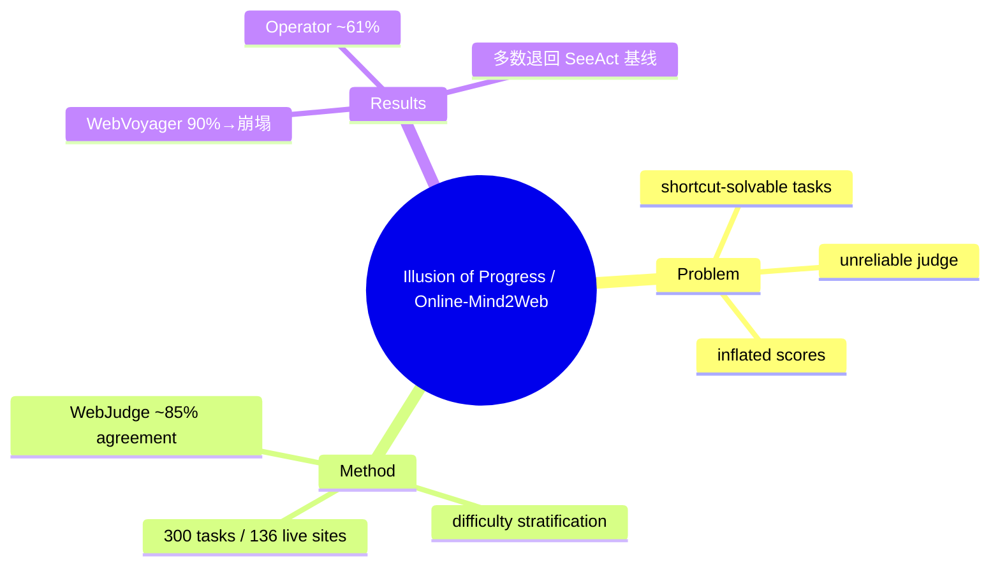

## Summary
系统性揭穿 web agent 的"进步幻觉"——WebVoyager / static Mind2Web 等旧 benchmark 因 shortcut 可解、judge 与人工一致性低而严重高估 agent 能力；作者构建 **Online-Mind2Web**（300 任务 / 136 真实网站，按步数分难度）+ **WebJudge**（LLM-as-Judge，~85% 人工一致）做真实在线评测，发现旧 benchmark 上 ~90% 的成绩在真实动态站点上崩塌，多数 agent 退回 2024 年初 SeeAct 水平，只有 OpenAI Operator 达 ~61%。

## Problem & Motivation
web agent 领域近一年宣称的"大幅进步"很可能是评测假象。作者指出旧 benchmark 三个系统性缺陷：(1) **Shortcut 可解**——WebVoyager 中大量任务可被"只用 Google Search"的简单 agent 解掉（可达 ~51%），任务缺覆盖与多样性；(2) **judge 不可靠**——LLM-as-Judge 与人工判断一致性低，把错的判成对；(3) **分数虚高**——static Mind2Web 缓存页面禁止真实探索、且随网站漂移失效。这些叠加导致"reported results 系统性乐观"。没有可信的真实在线评测，就无法判断 web agent 是否真的可部署——这是全领域的方法论前提问题。

## Method
**Online-Mind2Web 构建**：从原始 Mind2Web 的 650 个任务出发，47% 因失效/歧义/CAPTCHA 保护被丢弃；从 167 个可用任务中改写 24 个、从 Mind2Web-Live 导入 34 个、针对高流量域新写 75 个，最终 300 任务覆盖 136 个真实网站（shopping / finance / travel / government 等）。按人工标注步数分三档难度：Easy（1–5 步，83）、Medium（6–10 步，143）、Hard（11+ 步，74）。**不依赖缓存页面**，直接在 live、动态、会演化的真实站点上评测。

**WebJudge 自动评测**：提出一个 LLM-as-Judge pipeline，做 dynamic task encoding + 关键截图选择 + 基于任务的逐项判定，达到 **~85% 人工一致性**，显著优于既有自动评测。作者同时警示——同一 agent 在 human eval / WebJudge / 自定义 agentic judge 下分数差异很大，judge 方法学本身是分数可比性的关键变量。

## Key Results
- **真实在线设置下成绩全面崩塌**：WebVoyager 上报的 ~90% success 在 Online-Mind2Web 上大幅下滑；多数 agent 无法超越 2024 年初的 SeeAct 基线。
- **只有 OpenAI Operator 达 ~61%**，是唯一在 live 环境明显拉开身位的系统。
- **难度分层暴露长程短板**：Hard（11+ 步）任务是主要失败区，失败集中在 numerical reasoning 错误与低效导航。
- 核心 takeaway：**web agent 的真实能力远低于 leaderboard 叙事；评测 realism（live 站点 + 可靠 judge + 反 shortcut 任务）是这个领域最被低估的瓶颈**。

## Strengths & Weaknesses
**亮点**：(1) 领域急需的"打假 + 立新标"工作，Online-Mind2Web + WebJudge 已成为真实 web agent 评测的事实参考（COLM 2025）；(2) 把"评测方法学"提升为一等研究对象，与 [[Papers/2400-WebcanvasBenchmarkingWebAgents]]（keynode 在线评测）、[[Papers/2600-HowSmartIsYour]] 等构成"评测可信度"证据链；(3) 难度分层 + 反 shortcut 的任务筛选协议可复用。

**局限**：(1) 规模仍有限（300 任务），且真实站点会漂移，长期维护成本高（这正是 [[Papers/2600-WebHarbor]] 用 Docker mirror 想规避的张力）；(2) WebJudge 85% 一致性意味着 ~15% 误判仍会污染排行；(3) 只测 end-to-end success，不诊断失败归因（互补于 [[Topics/CUA-Survey]] 的 verify/recover 视角）。这篇是 [[Topics/WebAgent-Survey]] 中"评测 realism"主线的核心锚点。

## Mind Map

## Notes
- 与 vault 的 validated insight"真实长程/组合工作流远未饱和"高度呼应——这里是 web 模态的最强单点证据。
- 方法论启示：任何 web agent 新方法若只报 WebVoyager/沙盒分数，应被要求补 Online-Mind2Web / live 评测。
