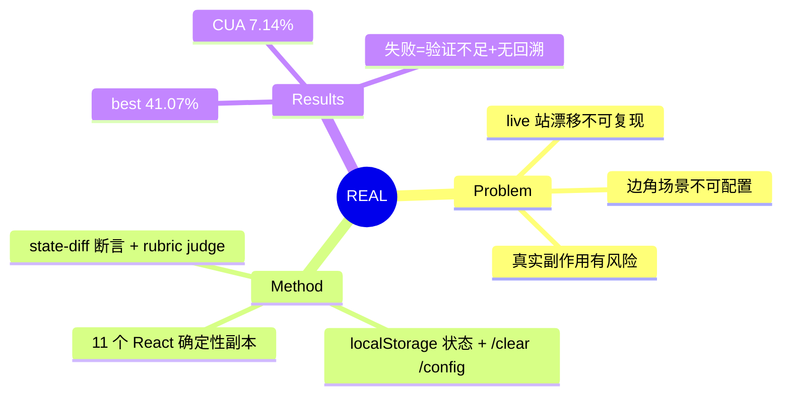

## Summary

REAL 用现代前端栈（React/Next.js）重建了 11 个高频真实网站（Amazon/Gmail/Airbnb/Uber/LinkedIn 等）的**确定性副本** + 112 个任务：所有数据静态化、时间锁定、状态存于浏览器 localStorage（`/clear` 一键重置、`/config` URL 参数注入环境配置），评测用 localStorage state-diff 程序化断言 + 信息检索 rubric LLM judge。最强模型 Claude 3.7 Sonnet Thinking 仅 41.07%，OpenAI CUA 仅 7.14%。

## Problem & Motivation

四类既有环境的缺陷倒逼出"确定性副本"设计：(1) live 网站内容/UX 持续漂移，**可复现评测几乎不可能**；(2) 生产网站**无法配置边角场景**（缺货、网络延迟、错误注入）；(3) 真实状态变更（支付、改数据）有安全与成本风险；(4) WebArena 类自托管站是老式多页应用，**不反映现代 React SPA 复杂度**，且缺 reward 信号/state-diff 供 RL 用。

## Method

- **确定性机制**：所有可变信息（价格、库存、消息）固定；日期选择器/时区锁定；同一任务条件可精确重放。
- **状态架构（关键设计）**：网站状态全部存 **browser localStorage**——跨页面/多 tab 持久，导航到 `/clear` 即重置，`/finish` 端点展示 initial state 与 current state 的 **diff** 供检查。**状态被搬到了 agent 侧可控的地方**，服务器无状态化 → 天然支持并行（每个 CDP session 一个独立环境实例）与公开托管（Vercel，免部署免登录）。
- **配置注入**：`/config` URL 参数控制全局设置（延迟、ARIA 标签开关）与站点特定参数（错误模式、价格乘数、位置预设）——**环境可编程初始化**。
- **任务**：112 个，信息检索 / 状态变更 / 混合三类 + 难度分级 + **impossible tasks**（如订不存在的航班，测幻觉抵抗）。
- **评测**：状态变更任务用 f_eval 程序化比对 localStorage diff 与预定义 key-value 断言；信息检索用 g_eval rubric LLM judge；binary reward。

## Key Results

- Claude 3.7 Sonnet Thinking **41.07%**（最佳）> Gemini 2.5 Pro 38.39% > o3 34.82% > DeepSeek V3 19.64% > GPT-4o 14.29% > **OpenAI CUA 7.14%**；小模型近乎失效（Llama-3.1-8B 1.79%）。
- TopWork（Upwork 副本）和 FlyUnified（订机票）最难。
- 失败模式：(1) **状态验证不足**——动作未完成就继续推进；(2) 导航失败且**缺有效回溯机制**。

## Strengths & Weaknesses

**Strengths**：把"确定性"工程化成三件套（数据静态化 + 时间锁定 + localStorage 状态），公开托管消除部署摩擦（对比 WebArena 每站 ~6GB Docker）；`/config` 可编程初始化 + `/finish` state diff 是 agent-facing affordance 的现成实例；impossible tasks 设计对抗 overclaim。

**Weaknesses / 边界**：
- localStorage 方案的代价：**无真实后端**——多用户共享状态、服务端业务逻辑、真实数据规模都被简化掉了；确定性是用"砍掉动态性"换的，这与 WebArena mirror 真实后端的路线是不同折中。
- 仅 11 站 112 任务，binary reward，作者自认缺 dense/step-wise reward，RL 训练用途受限。
- 副本对原站的保真度没有量化验证（对照 [[Papers/2605-MobileGym]] 的 95.1% sim-to-real retention 测量，REAL 缺这个数字）。

## Mind Map

## Notes

- **对 AFE 的证据价值**：REAL 展示了"环境状态一等对象化"的一种极端实现——状态整个搬进 localStorage，于是 reset（/clear）、init（/config）、verify（state diff 断言）、inspect（/finish）全部变成 URL 级 affordance，零基建成本。与 [[Papers/2600-WebHarbor]]（Docker mirror 真实后端）和 [[Papers/2600-InfinitewebScalableWebEnvironment]]（合成生成）构成 realism-controllability spectrum 上的三个点。
- 其失败模式分析（验证不足 + 无回溯）与 vault 的 verify/recover 瓶颈结论（[[Topics/RealWorldGUIAgent-Reliability-Survey]]）跨环境一致。
- 注意口径：REAL 的 41% 与 Online-Mind2Web 的 Operator ~61% 不可直接比（任务集不同），但两者共同支撑"进步幻觉"——受控环境下 frontier 模型也远未解决 web 任务。
