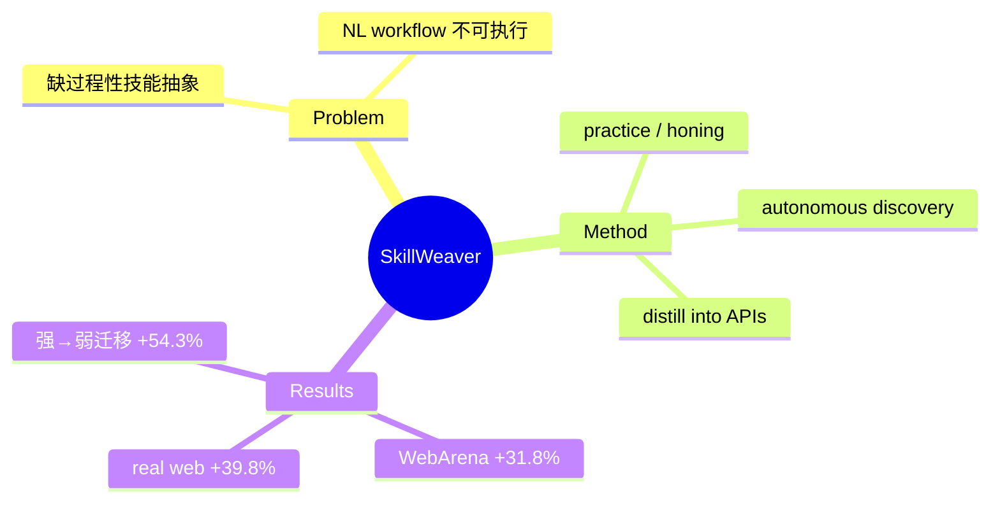

## Summary
SkillWeaver 让 web agent 自主探索网站、把复用交互模式蒸馏成轻量**可执行 API/程序 skill**，构建不断扩张的 skill 库以提升在未见网站的能力；WebArena 相对提升 31.8%、真实网站 39.8%，且强 agent 合成的 skill 可迁移给弱 agent（最高 +54.3%）。

## Problem & Motivation
现有 web agent 缺少关键的自我改进能力：无法把过程性知识抽象成可复用、可组合的技能。AWM 类方法归纳的是自然语言 workflow（"what to do"），不可直接执行。SkillWeaver 主张用**可执行程序**表示技能——具备可验证、可组合的优势，直接补上"how to execute"这一端。

## Method
三阶段自我改进循环：

1. **Autonomous Skill Discovery（自主发现）**：agent 主动探索新网站，识别可复用的交互模式（如"搜索并筛选商品""填写并提交表单"）。
2. **Practice / Honing（练习打磨）**：在多个网站实例上反复执行候选 skill 做提炼与验证，剔除不稳定的。
3. **Distillation into APIs（蒸馏成 API）**：把实践经验固化为轻量、可复用的 API 函数，存入可组合的 skill 库，供后续任务在未见网站上直接调用。

核心是"propose → practice → distill"闭环，把探索得到的过程性经验转成可验证的可执行资产。

## Key Results
- **WebArena**：相对成功率 +31.8%。
- **真实网站**：相对成功率 +39.8%。
- **Skill 迁移**：强 agent 合成的 API skill 提升弱 agent 表现，WebArena 上最高 **+54.3%**——证明技能是跨 agent 可转移的知识资产（弱模型可"消费"强模型的 skill 库）。

## Strengths & Weaknesses
**亮点**：(1) 可执行 skill 兼具可验证 + 可组合，比 NL workflow 更接近落地；(2) "强合成→弱受益"的迁移结果有实际部署价值（用强模型离线造 skill 库，线上跑弱模型）；(3) 与 [[Papers/2409-AgentWorkflowMemory]] 构成"NL workflow vs executable skill"的经典分野。

**局限**：(1) 自主探索的 skill 覆盖度/正确性依赖底层 agent 能力，长尾交互难自动发现；(2) skill 库膨胀后的检索/命中/维护成本（呼应 2606.15017 的 token 性价比质疑）；(3) 网站改版会使已固化 API skill 失效——静态 skill 与动态网页的张力。属 [[Topics/WebAgent-Survey]] 的"Memory 与自我改进"路线。

## Mind Map

## Notes
- 与 AWM 同出 Neubig/Yu Su 系，可视为 AWM 的"可执行版"后继。
- 迁移结果启示部署范式：skill 库作为跨模型共享资产 = web agent 的"共享工具层"。
