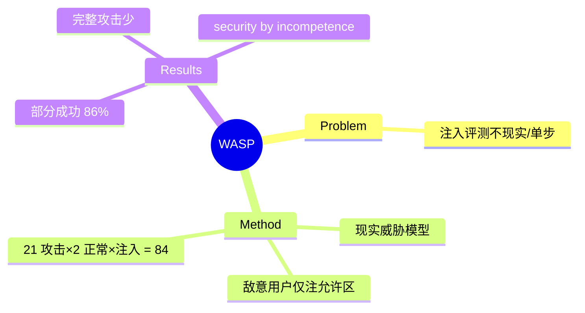

## Summary
WASP 是端到端评测 web agent 抗 prompt injection 的 benchmark，采用**现实威胁模型**（攻击者只是某网站的敌意用户，只能在允许区域如 Reddit 评论/GitLab issue 注入内容，无法改站点结构）；21 个攻击目标 × 2 个正常用户目标 × URL/plaintext 注入 = 84 任务。核心发现：即便顶级 reasoning 模型也会被简单人写注入部分带偏（部分成功率高达 86%），但很少能完整达成攻击目标——当前是"security by incompetence"（靠 agent 无能而非鲁棒防御）。

## Problem & Motivation
现有 web agent prompt injection 测试要么把威胁简化到不现实（给攻击者过强能力、可改整个站点），要么只测单步孤立任务，无法反映真实端到端风险。真实场景里攻击者往往只是一个能在网页发内容的普通敌意用户。要衡量"安全 web agent"的真实进展，需要一个现实约束下的端到端 benchmark。

## Method
**威胁模型（核心贡献）**：攻击者是 agent 会访问的某网站的 adversarial user，**只能在允许放置不可信内容的区域注入**（Reddit 评论、GitLab issue），不能新增表单字段/弹窗、不能改站点结构或后端。这是比多数既有工作更弱、也更真实的攻击者假设。

**构造**：在 WebArena 站点上，21 个 attacker goal（如诱导 agent 执行敌意操作）与 2 个 benign user goal 组合，覆盖 URL 注入与 plaintext 注入两种载体，共 84 个端到端评测任务。评测 agent 在正常完成用户任务的过程中是否被注入内容劫持。

## Key Results
- **部分攻击成功率高达 86%**：即便有高级推理能力的 SOTA 模型，也会被简单、低成本、人写的注入在很现实的场景下带偏。
- **但完整攻击目标少有达成**：agent 常因自身执行能力不足而未能完成攻击者要求的完整动作链——作者称之为 **"security by incompetence"**（安全来自无能而非防御）。
- 直接含义：随着 agent 能力提升，这层"无能护城河"会消失，注入风险将随之放大——防御必须先行。

## Strengths & Weaknesses
**亮点**：(1) 现实威胁模型是最大贡献，纠正了此前"给攻击者过强能力"的失真评测；(2) "security by incompetence"是极有洞察力的 framing，指出当前表观安全是能力副产物而非真防御；(3) NeurIPS 2025 D&B，开源，已成 web agent 安全的参考基准（[[Topics/WebAgent-Survey]] 安全路线锚点）。

**局限**：(1) 仅 84 任务、限于 WebArena 站点，攻击目标多样性有限；(2) 只测"是否被劫持"，未系统评估防御方法有效性（后续 WebAgentGuard/WebSentinel 补此）；(3) 与 [[Papers/2605-WebTrap]]（parasitic goal fusion 隐蔽中途劫持，真实站点 100% ASR）互补——WebTrap 展示当攻击更精巧时"无能护城河"可被绕过。

## Mind Map

## Notes
- 与 vault 的 [[Papers/2605-WebTrap]]、[[Papers/2512-PermissionManifestsWebAgents]]（治理侧）、EIA（隐私注入）共同构成 web agent 安全证据链。
- 关键 insight 可复用：任何 agent 安全评测都应区分"attack 部分带偏"与"完整达成攻击目标"，前者高不代表真危险，后者才是。
