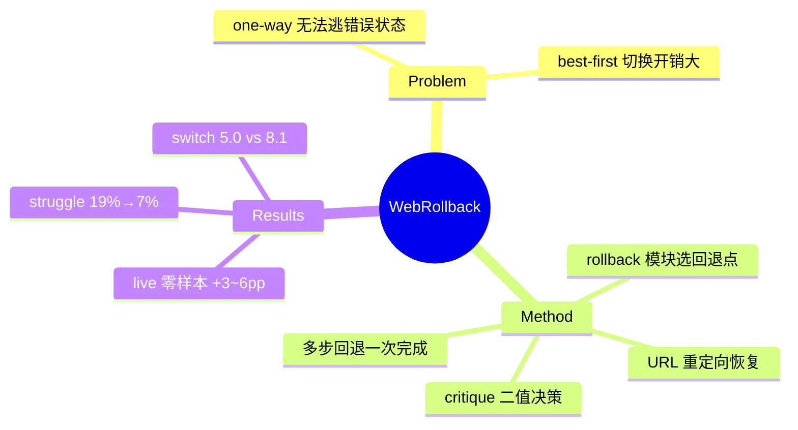

## Summary
把 rollback（多步回退到轨迹中任意先前状态）做成 web agent 自己决策调用的显式机制：critique 模块每步二值判断 continue/rollback，rollback 模块选择回退目标，浏览器通过 URL 重定向恢复状态——在 one-way greedy 与 best-first search 之间取得"能逃错误状态但不频繁切换"的中间点，live benchmark 零样本 +3~6pp。

## Problem & Motivation
主流 web agent 是 greedy one-way search：一条轨迹走到黑，进入错误状态后无法高效逃脱。best-first search（如 Tree Search for LM Agents）虽能回溯，但频繁 state switch 开销大（8.1 vs 5.0 次切换）。作者的立场是让**模型直接控制搜索过程**：agent 自己判断当前状态是否值得继续，自己决定回退到哪一步——把回溯从外部搜索算法的控制流变成 agent 的可调用动作。

## Method
三模块架构：

- **Action Module**：基于当前观察预测下一动作（常规 agent）。
- **Critique Module**：每步做二值决策（continue / rollback），判断当前状态质量；借鉴 self-refinement 思路。
- **Rollback Module**：一旦触发 rollback，选择回退到轨迹中哪个先前状态——**多步回退一次完成**，区别于既有工作只有单步 `go_back`。

状态恢复实现：记录 state trajectory，回退时**通过 URL 重定向重置浏览器环境** + 轨迹切片（Algorithm 1）。这是纯 agent 侧实现，不依赖环境提供快照。

## Key Results
- **零样本**（Llama-3.3-70B / Qwen2.5-72B）：Mind2Web-Live Full% 24.07/27.36 vs one-way 20.92/24.53；WebVoyager Full% 44.30/51.90 vs 38.06/49.56。
- **效率**：state switch 次数 5.0/4.5，显著低于 best-first 的 8.1/6.3。
- **微调**（Llama-3.1-8B / Qwen2.5-7B）：rollback 数据微调后同样领先，Mind2Web-Live 21.70/20.75。
- **Struggle ratio**：需要恢复能力的实例中 one-way 卡死 19%，rollback 仅 7%。
- **Test-time scaling**：步数预算 8→16 时 rollback 曲线上升更快——回退能力放大步数预算的边际收益。

## Strengths & Weaknesses
**亮点**：(1) 把"回溯"从搜索算法的外部控制流转为 agent 的一等动作，是 agent-controlled recovery 的最干净实证——介于 one-way 和 tree search 之间的第三条路径；(2) 在 live 站点（Mind2Web-Live、WebVoyager）上验证，不依赖沙盒；(3) struggle ratio 是很好的 recovery 专项度量。

**局限**：(1) 状态恢复靠 URL 重定向——**只能恢复 URL 可编码的状态**，表单输入、购物车、后端 session 全部丢失，作者自认"irreversible changes 下 reverting 不可行"；这正是缺环境级快照支持的天花板；(2) 仅 web navigation 域、微调只到 7B；(3) 没有与环境级 checkpoint 的对照——无法回答"agent 侧 URL 近似恢复损失了多少收益"。

对本方向的意义：WebRollback 证明了 agent 自主调用 recovery 的收益存在且可测，但其实现受限于浏览器 URL 技巧——恰好是 [[Ideas/AgentFacing-WebRuntime]] 中 engine-level `checkpoint()/restore()` affordance 要补的缺口，与 [[Papers/2512-WebOperator]] 的可逆性分类互补。

## Mind Map

## Notes
- 与 [[Papers/2407-TreeSearchLMAgents]] 对照：同为回溯，Tree Search 是算法持有控制权（value function 决定探索顺序），WebRollback 是 policy 持有控制权（agent 自判自回）。控制权归属是 recovery 设计的一个独立维度。
- URL-only 恢复的失败模式没有被系统测量（哪些任务因状态丢失而恢复失败）——这是一个可做的 ablation 空隙。
