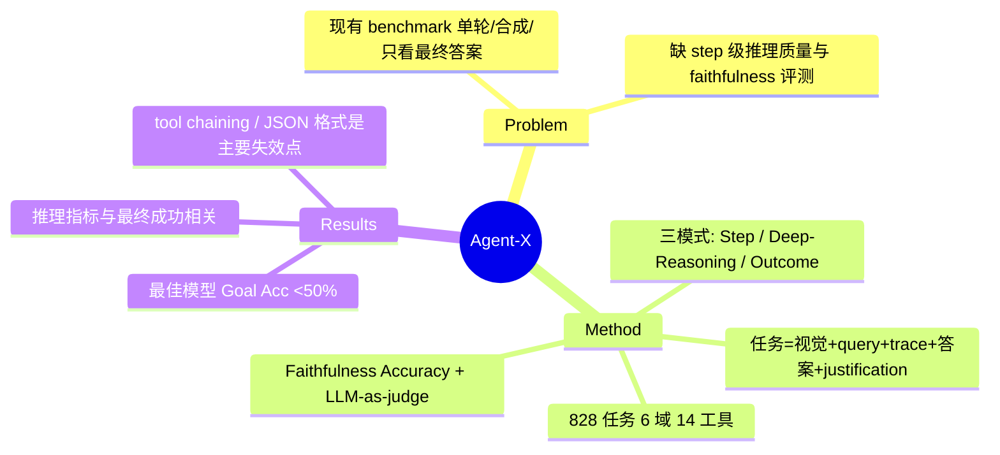

## Summary

Agent-X 是一个面向 vision-centric agentic 任务的 benchmark，专门评估多模态 agent 的**推理链质量与 faithfulness**（而非仅最终答案对错）；它把每条 trajectory 拆成 step 级与 deep-reasoning 级，用一组细粒度指标（含 Faithfulness Accuracy）+ LLM-as-judge 打分，发现即便最强模型在真实多步视觉任务上的 full-chain 成功率也 <50%。

## Problem & Motivation

现有 agentic benchmark（如 GAIA、GTA）多用**单轮、合成、单一视觉模态**的查询，且几乎只看最终答案是否正确，缺少对**多步推理是否 logically coherent、tool 使用是否正确、每一步是否 grounded 在视觉证据上**的原则性评估（§1）。这正是 CUA/多模态 agent 领域一个被忽视的评测缺口：当模型给出看似合理的 chain-of-thought 时，我们并不知道该推理链是否忠实反映了它对图像/视频的真实理解，还是 post-hoc rationalization。Agent-X 的目标是提供一个 step-level 评测框架，把"推理过程质量"作为一等公民来度量。

## Method

**任务形式化**：每个任务 S_i = (V_i, Q_i, T_i, R_i, A_i, J_i)，其中 V_i 是图像/视频多模态上下文、Q_i 是查询（刻意不在 query 中点名工具）、T_i 是所用工具子集、R_i 是推理 trace {(tool_j, args_j, result_j)}、A_i 是最终答案、J_i 是自然语言 justification（§3）。

**数据构造（半自动 pipeline）**：LMM 先为每个视觉输入生成候选 query 与初始 step-by-step trace（JSON 式对话），再由 5 名标注者逐条 review、修正 tool 调用与事实对齐，最终从 1,021 候选精炼到 828 个 validated 任务（§3.2–3.3）。数据覆盖 6 个环境：general visual reasoning、web browsing、security & surveillance、autonomous driving、sports、math reasoning；源数据集包括 CityScapes、BDD100K、COCO、Visual Genome、MathVista 等。工具库含 14 个可执行工具（SceneDescriber、OCR、RegionDescriber、WebSearch、ObjectCounter 等），分布于 perception / visual ops / math / artistic 四类。

**三种评测模式 + 细粒度指标（Table 3）**：
- **Step-by-Step 模式**：Grounding Score G_s（对物体/区域/属性的正确引用）、Tool Precision T_p（每步选对工具）、Tool Accuracy T_acc（工具输入输出正确）。
- **Deep Reasoning 模式**：**Faithfulness Accuracy F_acc（整个推理过程的逻辑一致性）**、Context Score C_s（有效使用多模态与常识上下文）、Factual Precision F_p（事实无 hallucination）、Semantic Accuracy S_acc（覆盖所有语义必要元素）。
- **Outcome 模式**：Goal Accuracy G_acc（最终答案正确率）、生成类任务的 G_a*、Toolset Accuracy（整体工具选择/使用的 F1）。

**评判方式**：事实类 query 用 exact match，解释类用 GPT-4o 做 descriptive match；主判 GPT-4o，辅判 Qwen-14B，并与人工标注交叉验证，报告称跨 judge 的模型排名稳定（§4.1，Appendix E）。

## Key Results

- **头条结论**：没有任何模型在 Goal Accuracy 上超过 50%——最强的 o4-mini 约 45% G_acc，GPT-4o 约 37%，Gemini-2.5-Pro 约 40%；开源最好者 Qwen2.5-VL-7B 约 36%，多数开源模型 <30%（Abstract / Table 4）。
- **推理指标与结果相关**：推理指标持续高的模型更可能在最终任务上成功；报告举例 GPT-4o 的 F_acc≈0.81、F_p≈0.79、S_acc≈0.59 与其 G_acc≈0.37 相关（§4.2）。
- **Tool 使用是瓶颈**：tool-related 指标方差最大，argument formatting 与 tool chaining 是最薄弱环节（§4.2）。
- **错误剖析（Table 5）**：formatting 错误占 26–45%（非法 JSON、多次工具调用、格式违规），reasoning 错误 14–34%（视觉误读、空间推理失败），planning 错误 0.2–17.6%。例如 Gemini-1.5-Pro 有 44.5% JSON 格式错误、34.3% 视觉误读；GPT-4o 有 17.6% "no response" 犹豫。

## Evidence Ledger

| Claim ID | Claim | Type | Source locator | Evidence excerpt | Status |
|:--|:--|:--|:--|:--|:--|
| C1 | 828 个 validated 任务（716 图 + 112 视频），2,807 次工具调用，平均 3.4 步/任务 | benchmark scale | Figure 3a / §3 | "828 tasks ... 716 images + 112 videos ... 2,807 tool invocations ... 3.4 steps" | source-verified |
| C2 | 工具库含 14 个可执行工具，跨 6 个任务环境 | benchmark scope | §3.1 | "14 executable tools" across perception/visual/math/artistic | source-verified |
| C3 | 无模型 Goal Accuracy 超过 50%；o4-mini 最佳约 45%，多数开源 <30% | headline number | Abstract / Table 4 | "achieve less than 50% full-chain success" | source-verified |
| C4 | GPT-4o 报告值 F_acc≈0.81、F_p≈0.79、S_acc≈0.59（与 G_acc≈0.37 相关） | per-model metric | §4.2 | "GPT-4o's Facc=0.81, Fp=0.79, Sacc=0.59 correlate with Gacc=0.37" | not-checkable |
| C5 | Faithfulness Accuracy (F_acc) 定义为"整个推理过程的逻辑一致性" | metric definition | Table 3 | "Faithfulness Accuracy (Facc): Logical consistency across reasoning process" | source-verified |
| C6 | 错误类型：formatting 26–45%，reasoning 14–34%，planning 0.2–17.6% | error breakdown | Table 5 | "Formatting errors: 26–45% ... Reasoning errors: 14–34%" | not-checkable |
| C7 | venue = ICLR 2026；v1 = 2025-05-30，v2 = 2026-05-24 | provenance | arXiv abs page | "ICLR 2026 ... v1 May 30 2025; v2 May 24 2026" | source-verified |

## Strengths & Weaknesses

**Strengths**
- 直击 §5.5 缺口：把"reasoning trace 质量/faithfulness"从口号变成**可操作、可分解到 step 的指标集**，且区分 grounding / tool / faithfulness / factual / semantic 五个维度，比单一"CoT 对不对"细得多。
- 数据真实且多模态（含 112 段视频、6 个真实域），半自动 + 人工双重把关，比纯合成 benchmark 更贴近部署场景。
- 提供了有信息量的 failure taxonomy（formatting / reasoning / planning），对定位 CUA agent 的推理失效点有直接参考价值。

**Weaknesses / 审视**
- **Faithfulness 的度量本质是 LLM-as-judge**：F_acc 用 GPT-4o 判"逻辑一致性"，这与 CoT faithfulness 文献中"推理是否真实驱动了输出"的因果定义并不等价——它测的是 trace 的表面 coherence，而非 trace 与内部计算的因果一致性。用它当 faithfulness 的 proxy 有 overclaim 风险。
- 用 GPT-4o 既做主判又是被评模型之一，存在 self-preference 偏置隐患；虽有 Qwen-14B 与人工交叉验证，但需谨慎。
- 严格说这**不是 GUI/computer-use agent** benchmark：工具是 OCR/WebSearch/ObjectCounter 等视觉/检索工具，web browsing 只是 6 域之一，不涉及真实浏览器状态转移或 OS 级操作。它代表的是 §5.5 中"多模态 agent"分支，而非 GUI action 分支。
- 每任务平均仅 3.4 步，属于中短 horizon，对长 horizon CUA 轨迹的推理质量评估外推性有限。

## Mind Map

## Notes

- 选作 CUA 综述 §5.5（reasoning trace 质量/faithfulness 评测）"多模态 agent"分支的代表作：它是少数把 faithfulness 做成 step 级可量化指标并配 failure taxonomy 的评测 benchmark。若综述另有"GUI 专属推理注释/评测"需求，可对照 Step-GUI (2512.15431，CSRS 把 step 级推理锚定到 trajectory 级信号) 与 AgentProcessBench (2603.14465，step 级过程质量诊断但 text-only)。
- **Tag 说明（供 coordinator 复核）**：本文核心是 VLM 多模态推理评测，`computer-use` 是较宽松的 agent umbrella 归属（因其为 tool-using 多模态 agent、含 web browsing 域，且被 CUA 综述引用）。若按 tags.md "不因调用工具/浏览器就标 GUI/computer-use" 的纪律从严，可降为 `[VLM]` 单 tag。
- **诚实纪律**：本轮无独立 verifier，`verification_status: unverified`。frontmatter institute 仅确认 MBZUAI（据 github org `mbzuai-oryx`）；Torr(Oxford)/Shah(UCF)/Khan 等的具体机构未从抓取页面确证，故未写入。C4/C6 的精确小数来自 WebFetch 对 HTML 全文的摘要抽取、未逐行复核，标 not-checkable。
