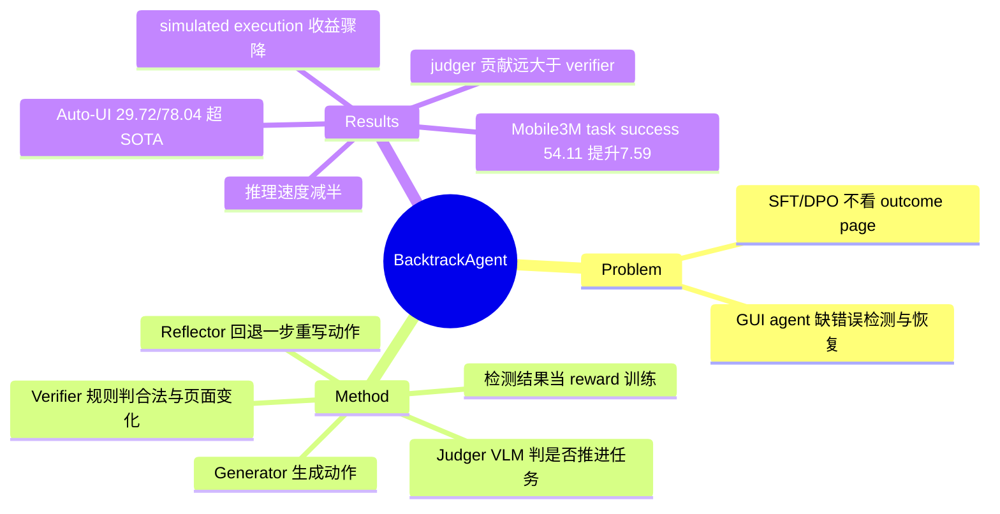

## Summary

针对 GUI agent 缺乏错误检测与恢复机制的问题，提出 Generator + Verifier(规则) + Judger(模型) + Reflector(模型) 四模块框架：每步动作执行后由 verifier/judger 检测是否出错，出错则丢弃结果页、回到执行前页面由 reflector 重写动作（最多 3 次），并把检测结果作为 reward 加入训练；在 Mobile3M 上 task success rate 提升 7.59%（54.11%），Auto-UI 上 task/step 双超 SOTA。

## Problem & Motivation

现有 GUI agent 训练（SFT 复刻成功轨迹、DPO 配对正负样本）只优化单步动作准确率，**不看动作执行后的 outcome page**，因此既难判断当前页面是否偏离任务，也没有从错误状态恢复的机制——多步任务中一步错则全轨迹失败。已有 reflection 类方法（Mobile-Agent-v2/E、InfiGUIAgent）依赖 GPT-4o 级别 prompt 反思，输出难控、无法训练特定技能。BacktrackAgent 主张显式利用 action 执行前后的页面变化做 error detection + error recovery，并把检测信号回灌训练。

## Method

**推理循环**（每个时间步 t，最多 max_reflection=3 次重写）：

1. **Generator**：输入 (task X, 当前页 P_t, 候选动作空间 Acts(P_t), 历史动作 a_<t)，输出动作 a_t。
2. **执行** a_t^i 得到结果页 P_{t+1}（Mobile3M 用图结构数据集的 actual execution，Auto-UI 用在截图上画标注的 simulated execution）。
3. **Verifier**（规则模块，错误检测）：输入 (P_t, P_{t+1}, a_t)，输出 p^v∈{0,1}。两条规则：(a) 动作合法可执行（属于 click/scroll/input/complete 且元素/参数格式正确）；(b) 执行后页面必须变化（P_t == P_{t+1} 判 ineffective，除非任务完成）。
4. **Judger**（模型模块，错误检测）：输入 (X, P_t, Acts(P_t), a_<t, a_t, P_{t+1})，二分类输出 p^j——该动作是否推进任务完成/是否导向 error page。Prompt 就是问 "whether the next action is helpful to complete the task (Yes or No)"。
5. **Reflector**（错误恢复）：verifier 或 judger 任一判错时触发。输入 (X, P_t, Acts(P_t), a_<t, 本步所有已尝试动作 a_t^{<i}, 最新失败动作及其结果页 P^i_{t+1})，输出新动作 a_t^{i+1}。Prompt 明确要求"生成一个与之前所有尝试都不同的新动作"（把 reflect history 喂给它以防无限循环）。
6. 两模块都判对 → 定格 a_t，进入 t+1；超过 3 次仍不过 → 取最后动作继续。

**关键点——backtrack 的目标与实现**：backtrack **固定回退一步**——判错就丢弃 P^i_{t+1}、回到动作执行前的 P_t 重新生成，不做多步回溯、不搜索回退目标。"回到 P_t" 之所以可行，是因为两个 benchmark 都不是 live 环境：Mobile3M 是预先 BFS 遍历好的页面图（推理时按 device state 匹配最近的 unique page，执行 = 图上查询下一节点），simulated execution 更是只在当前截图上画框/箭头示意。**GUI 不可逆操作问题被环境设定完全绕开，论文未讨论真机上如何撤销已执行动作**。

**训练**（backbone Qwen2-VL-7B）：Generator 先在原始导航数据 SFT；再用它在训练集上重新生成动作 + 模拟/实际执行拿 outcome page，构造 Judgment 数据集（四元组 X, P_t, a_t, P_{t+1} → 二分类标签，用 IoU+text 对齐 golden 判有效性）和 Reflection 数据集（取 100% 无效动作 + 20% 有效动作）。三个模型都用 cross-entropy 训练；第二阶段（称 RL）把 verifier loss (1−p^v) 和 judger loss P(p^j=0) 以 β1=β2=0.1 加进 generator/reflector 的 loss——即**直接拿错误检测结果当 action reward**，类似 value-based RL（对标 DigiRL/DistRL）。

## Key Results

- **Mobile3M**：task success rate 54.11%（vs ReachAgent SFT+RL 46.52，+7.59）；task-level acc Both 33.51 (+3.72) / IoU 43.25 / Text 36.67；step-level IoU 84.94 (+1.62) / Text 83.24 (+1.47)。10 次重采样测试 + 2 次换种子重训，波动 <1.2%，p<1e-4。
- **Auto-UI**（AITW 清洗版，5 子集分别微调）：task-level 29.72（vs ReachAgent 25.28、MobileVLM 25.53）、step-level 78.04（vs 77.36）。
- **Ablation（Mobile3M）**：整个 backtrack 机制 Δtask success +5.65；其中 judger 贡献 +5.32，verifier 仅 +0.45（agent 变强后 invalid action 本来就少）；RL 阶段 +1.93。**用 simulated execution page 做 backtrack 只 +0.70 且 task/step-level acc 反而下降**——outcome page 不真实时错误检测失灵。
- **错误检测/恢复质量（Mobile3M, Table 5/6）**：detection precision 75.12% / recall 43.58%；全部动作中 11.29% 被判错，其中 8.48% 真错、**2.81% 是误伤**；真错的里面 reflector 只救回 2.37%（6.11% 修不好），误伤的里面 0.78% 被改坏。恢复模块整体 accuracy 仅 ~39-43%。
- **代价**：推理速度降 ~50%（judger 是大头，~0.8s/step）。

## Strengths & Weaknesses

**亮点**：
- 把 "看 outcome page 做 step-level 错误检测" 从 prompt 工程变成可训练组件，且检测信号双用（推理时触发 backtrack + 训练时当 reward），是干净的闭环设计。
- Table 5/6 的错误检测混淆矩阵 + 恢复成败分解在 GUI agent 论文里少见，诚实暴露了机制的真实精度（precision 75%、recall 44%、恢复率 <40%）。
- actual vs simulated execution 的对照（+5.65 vs +0.70）是有信息量的 negative evidence：backtrack 的收益几乎全部来自 outcome page 的真实性。

**局限**：
- **不做错误归因**：verifier/judger 只输出二值 "这步对不对"，不区分错误来源（动作本身错 vs 环境意外 vs belief 过时）；reflector 的恢复策略对所有错误一视同仁——"换一个不同的动作重试"。环境是确定性的数据集图，popup 等 unexpected event 根本不在问题空间里，belief staleness 也不存在（每步都重新观察页面）。
- backtrack 深度固定为 1 步、恢复方式固定为同页重写，错误发生在更早步骤时无法多步回滚（Figure 2 的红箭头全部只回一格）。
- 依赖数据集环境的"可回退性"，回避了真实 GUI 的不可逆性（下单、发送、删除），离 live agent 还有距离。
- benchmark 全部来自作者自家系（Mobile3M/ReachAgent/MobileVLM 同一团队），且 judger 训练标签用 IoU/text 对 golden answer 匹配定义"有效"，隐含"golden 轨迹唯一正确"假设（虽有 equivalent page 缓解）。
- input 类动作被 backtrack 反而变差（IoU −1.60 / text −2.00 vs ReachAgent）：输入后页面变化不明显导致误判，且回退重写时 keyword 被改向任务原文。

## Mind Map

## Notes

- 对 "mismatch 归因分派恢复" idea 的直接价值：BacktrackAgent 是**检测但不归因、恢复策略单一**的代表——detection 只回答 yes/no，recovery 恒等于"回一步换动作"。它的失败数据（6.11% 检测到但修不好、0.78% 误伤后改坏、input 动作被改坏）恰好是"统一恢复不够用"的证据。
- 与 [[Papers/2600-BeapAgentBacktrackableExecution]]（backtrackable execution + adaptive planning）、[[Papers/2500-ScaletrackScalingBackTracking]]（训练时 back-tracking 预测）、[[Papers/2410-ExACT]]（reflective MCTS 探索）构成 GUI 回溯机制的对照组；与 [[Papers/2505-GEM- Gaussian Embedding Modeling for Out-of-Distribution Detection in GUI Agents]] 的 OOD 检测视角互补（GEM 检测"没见过"，本文检测"没做对"）。
- 注意：arXiv v1 PDF 附录截断（缺 Appendix C–H），完整版见 ACL Anthology EMNLP 2025 版（pp. 4250-4272, oral）。
