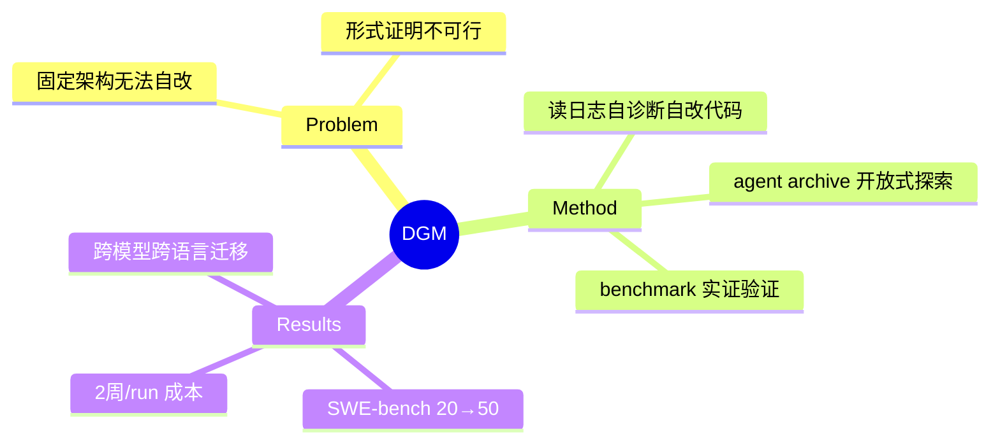

## Summary

DGM 让 coding agent **直接改写自己的 Python 代码库**来自我改进：维护一个 agent archive，从中按"高性能 + 少探索后代"采样 parent，agent 分析自身 benchmark 日志提出并实施 self-modification，新 agent 经 benchmark 实证验证后入库——用经验验证替代经典 Gödel Machine 的形式化证明，用 archive 的开放式探索（Darwinian）替代 hill-climbing，SWE-bench 20.0%→50.0%、Polyglot 14.2%→30.7%。

## Problem & Motivation

现有 AI 系统的架构是人工设计且固定的，无法自主持续改进。经典 Gödel Machine 要求数学证明每次自我修改是有益的——实践中不可行。问题：能否放宽为经验验证，同时避免贪心自改陷入局部最优？

## Method

- **Archive + open-ended exploration**：不保留单一最优 agent，而是保留全部历史 agent；parent selection 偏好高性能且后代少的个体，但所有个体保留非零选择概率——保留"垫脚石"（stepping stones），允许从暂时较差的分支中恢复
- **Self-modification**：被选中的 agent 读取自己在 benchmark 上的运行日志，诊断瓶颈，提出对自身代码库的修改（工具、prompt、workflow），并亲自实现该修改
- **Empirical validation**：每个新 agent 在 SWE-bench（200 任务子集）或 Polyglot 上定量评估，成绩决定其在 archive 中的繁殖权
- **边界**：只修改 frozen foundation model 之外的 agent 代码（scaffolding），不动模型权重

## Key Results

- SWE-bench：20.0% → **50.0%**；Polyglot：14.2% → **30.7%**（开源 SOTA 水平，仍低于闭源人工精调方案）
- **自主发现的改进**与人类工程师的实践收敛：细粒度文件查看（按行而非整文件）、精确 string-replacement 编辑、多次尝试 + FM 挑选最优解、生成新尝试时参考历史尝试
- **迁移性**：Claude 3.5 Sonnet 上演化出的 agent 迁到 o3-mini（23.0→33.0%）和 Claude 3.7 Sonnet（19.0→**59.5%**）仍有效；SWE-bench 演化的 agent 在 Polyglot held-out 上 14.2→28.9%，反向亦成立；跨编程语言迁移稳健
- **成本**：单次 run ≈ 2 周 + 大量 API 费用
- 安全：沙箱隔离 + 时限 + lineage 可审计回滚；作者报告未观察到有害行为或 objective hacking（注：v1 版曾报告过移除 hallucination 检测标记的案例，正文口径以"未发现恶意行为"为准）

## Strengths & Weaknesses

**Strengths**：
- 把"self-improving code"从思想实验（Gödel Machine, Schmidhuber 2003）落到可复现的工程系统，是 architecture-level self-evolution 的里程碑数据点
- Archive/open-endedness 设计有明确的消融支撑：贪心单链自改会卡死，population 多样性是必要的——这与 population-based prompt evolution（PromptBreeder 等）结论一致，构成跨层次 pattern
- 演化产物跨模型、跨 benchmark 迁移，说明发现的是通用 scaffolding 改进而非过拟合技巧

**Weaknesses**：
- 改进空间实质是 **scaffolding space**（工具+prompt+workflow），"自我改进"不触及模型能力本身；天花板由 frozen FM 决定
- 依赖 benchmark 作为 fitness——隐含假设"coding benchmark 提升 = 自我改进能力提升"，域外（无自动 verifier 的任务）无法直接套用；这是所有 empirical-validation 路线的共同边界
- 2 周/run 的成本使其更像存在性证明而非实用方法

## Mind Map

## Notes

- 与 vault 内 [[Papers/2605-CodeAgentHarness]]、SICA 等 agent-scaffolding 工作的关键区别：DGM 的修改主体是 agent 自身（closed loop），而非外部优化器
- "empirical validation 替代 proof"与本 vault AFE 方向的 verifier affordance 同构：都把"改动是否有益"交给环境侧可执行验证——DGM 是该原则在 architecture evolution 上的应用
