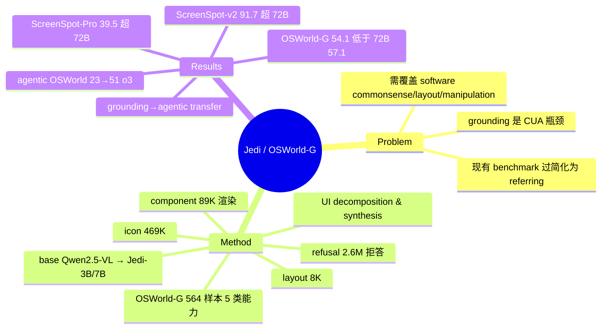

## Summary

Jedi 用 UI decomposition & synthesis 程序化合成了 4M 规模的 computer-use grounding 样本（icon / component / layout / refusal 四类），并发布按能力细分的 OSWorld-G（564 样本）benchmark；在 Qwen2.5-VL 上训练的 Jedi-7B 以远小的模型在 ScreenSpot-v2 / ScreenSpot-Pro 上超过 UI-TARS-72B，并证明改进 grounding 能直接把 OSWorld 端到端 agentic 成功率大幅提升。

## Problem & Motivation

GUI grounding（把自然语言指令映射到屏幕上具体动作/坐标）被作者定位为 computer-use agent 的关键瓶颈。核心批评是现有 grounding benchmark 把任务简化成短 referring expression，无法覆盖真实交互所需的 software commonsense、layout understanding 与 fine-grained manipulation；因此需要一条能规模化、又能覆盖这些细粒度能力的数据供给路线。与依赖 web crawl（OS-Atlas）或真人标注（GroundCUA）不同，本文选择程序化合成——从渲染/反编译得到带精确坐标 ground truth 的样本。

## Method

数据侧走 "multi-perspective decoupling"，按界面构成拆成多类合成 pipeline，再与已有开源数据集混合：

- **Icon data（469,501 图）**：从 GitHub 仓库与反编译软件收集图标，做 captioning + grounding。
- **Component data（89,388 图）**：code-and-rendering pipeline，用 Material UI 渲染组件，并做 real-world augmentation。
- **Layout data（7,918 图）**：来自 Figma 原型与 OSWorld / WindowsAgentArena 截图，监督整体布局理解。
- **Refusal data（2.6M）**：故意构造与截图不匹配的 instruction，训练模型拒绝（reject）不可执行的指令。
- **整合已有数据集**：SeeClick、OS-Atlas、Aguvis 等（Table 9 约 1.4M 额外标注样本）。

合计约 4M examples。评测侧提出 **OSWorld-G**：564 个精标样本，覆盖 text matching / element recognition / layout understanding / fine-grained manipulation / refusal 等类别，含 32 种 UI 元素类型，用以把 grounding 能力按维度诊断（而非 ScreenSpot 式单一 referring）。模型侧以 **Qwen2.5-VL** 为 base，训练 **Jedi-3B / Jedi-7B**（64× H100，3B ~20h、7B ~30h）。

## Key Results

- **ScreenSpot-v2**（Table 2）：Jedi-7B 平均 91.7%，超过 UI-TARS-72B 的 90.3%。
- **ScreenSpot-Pro**（Table 3）：Jedi-7B 平均 39.5%，高于 UI-TARS-72B 的 38.1%；对比 UGround-V1-7B 31.1%、OS-Atlas-7B 18.9%。
- **OSWorld-G**（Table 5）：Jedi-7B 54.1%，仍**低于** UI-TARS-72B 的 57.1%（此最难基准上纯合成未反超 72B）。
- **Agentic OSWorld**（Table 6）：o3 planner 单独 23% → o3 + Jedi-7B grounding 51%，说明改进 grounding 直接 transfer 到端到端能力。
- Abstract 另给出一套口径："improving from 5% to 27% on OSWorld"，与 Table 6 的 23%→51% 数字不一致，疑对应不同 planner 设置，本轮未 reconcile（见 Evidence Ledger C8）。
- 作者论点："smaller models are already sufficient in terms of pure grounding ability" —— 7B 在纯 grounding 上已足够，不必更大模型。

## Evidence Ledger

| Claim ID | Claim | Type | Source locator | Evidence excerpt | Status |
|:--|:--|:--|:--|:--|:--|
| C1 | Jedi 含约 4M examples，被称为当时最大的 computer-use grounding 数据集 | 规模/SOTA | Abstract；§Data / Table 9 | "release Jedi, the largest computer use grounding dataset with 4 million examples" | source-verified |
| C2 | 4M 组成：refusal 2.6M、icon 469,501、component 89,388、layout 7,918，+ 整合已有数据集约 1.4M | 规模/构成 | §Data construction / Table 9 | icon 469,501; component 89,388; layout 7,918; refusal 2.6M | source-verified（经 WebFetch 摘取，未逐表复核） |
| C3 | OSWorld-G = 564 样本，含 32 种元素类型，按 text matching/element recognition/layout/fine-grained manipulation/refusal 分类 | benchmark 构成 | §OSWorld-G | "564 finely annotated samples" | source-verified |
| C4 | Jedi-7B ScreenSpot-v2 平均 91.7%，超 UI-TARS-72B 90.3% | 数字/SOTA | Table 2 | Jedi-7B 91.7 vs UI-TARS-72B 90.3 | source-verified |
| C5 | Jedi-7B ScreenSpot-Pro 平均 39.5%，超 UI-TARS-72B 38.1% | 数字/SOTA | Table 3 | Jedi-7B 39.5 vs 38.1 | source-verified |
| C6 | Jedi-7B OSWorld-G 54.1%，**低于** UI-TARS-72B 57.1%（未反超） | 数字/可比性 | Table 5 | Jedi-7B 54.1 vs UI-TARS-72B 57.1 | source-verified |
| C7 | Agentic OSWorld：o3 planner 单独 23% → o3 + Jedi-7B grounding 51% | 因果/数字 | Table 6 | 23% → 51% (o3 + Jedi-7B grounding) | source-verified |
| C8 | Abstract 另称 grounding 改进使 OSWorld "from 5% to 27%"，与 C7 的 23%→51% 口径不同，未 reconcile | 数字/一致性 | Abstract vs Table 6 | "improving from 5% to 27% on OSWorld" | contradicted（surface 冲突；疑不同 planner 设置，本轮无 verifier 未核实） |
| C9 | base model = Qwen2.5-VL，训练 Jedi-3B/7B，64× H100 | 方法事实 | §Training | base Qwen2.5-VL; 64 NVIDIA H100 | source-verified |

> verification_status = unverified：以上数字均照抄原文（Abstract + arxiv/html 全文经 WebFetch 摘取），本轮无独立 verifier，未逐表核对、未复现。C8 的两套 OSWorld 口径尤其需要在入库前回原文 reconcile。

## Strengths & Weaknesses

**Strengths**

- 把 grounding data 生产从 "crawl / 人工标注" 转为 "程序化 render + synthesis"，可控、可扩展，且渲染天然带精确坐标 ground truth，规避人工标注噪声——这是与 OS-Atlas（A11y 自动遍历）、GroundCUA（真人密标）不同的第三条数据来源路线，正好补齐 §5.2 的 synthesis 分支。
- OSWorld-G 按 text matching / element recognition / layout / fine-grained manipulation / refusal 拆分能力，比 ScreenSpot 系只测 referring 更能定位失败在哪一维。
- refusal data（2.6M）显式教模型拒绝 mismatched instruction，是 grounding 数据里少见的负样本/拒答设计。
- 把 grounding 改进直接接回 agentic OSWorld（Table 6 的 23%→51%），从孤立 benchmark 连回 end-to-end 能力，是本文最有 first-principles 价值的证据。

**Weaknesses**

- "4M" 中 refusal 占 2.6M（约 65%），真正的定位样本约 1.4M，规模数字需拆开解读，不宜直接与"元素数"口径的 OS-Atlas 13M/ScaleCUA 17.1M 对齐比较。
- 合成源（Material UI 渲染、Figma 原型、GitHub 图标）与真实专业软件分布存在 gap：OSWorld-G 上 Jedi-7B 54.1% 仍低于 UI-TARS-72B 57.1%，纯合成在最难基准上尚未封顶。
- 端到端提升存在两套口径（abstract 5%→27% vs Table 6 23%→51%），且强依赖闭源 o3 planner，grounding 贡献与 planner 贡献未完全解耦。
- 对照 §5.2 的 GroundCUA：700K 人工密标在 5 个 grounding benchmark 平均 70.5 反超 JEDI-7B 56.1（GroundCUA 自报口径），提示合成路线在标注密度/真实性上仍有天花板——"synthesis 便宜可扩展" 与 "human dense 质量更高" 构成本节的核心张力。

## Mind Map

## Notes

- 归位：CUA-Survey §5.2 GUI Grounding Data 的 **synthesis 分支代表作**，与 OS-Atlas（accessibility 自动遍历）、GroundCUA（真人密集标注）、ScaleCUA（hybrid 双环）构成"来源三分 + hybrid"的四象限；Jedi 补齐了"程序化渲染合成"这一象限。
- OSWorld-G 已被 vault 内多篇（如 ScaleCUA）当作评测基准引用，本篇是其出处，入库后可作为 OSWorld-G 的 canonical 引用锚点。
- 待办（入库/引用前）：回原文 reconcile C8 的 5%→27% 与 23%→51% 两套 OSWorld 数字，确认各自对应的 planner/agent 设置；核对 code repo URL（本轮未确认，code 字段留空以免 fabricate）。
