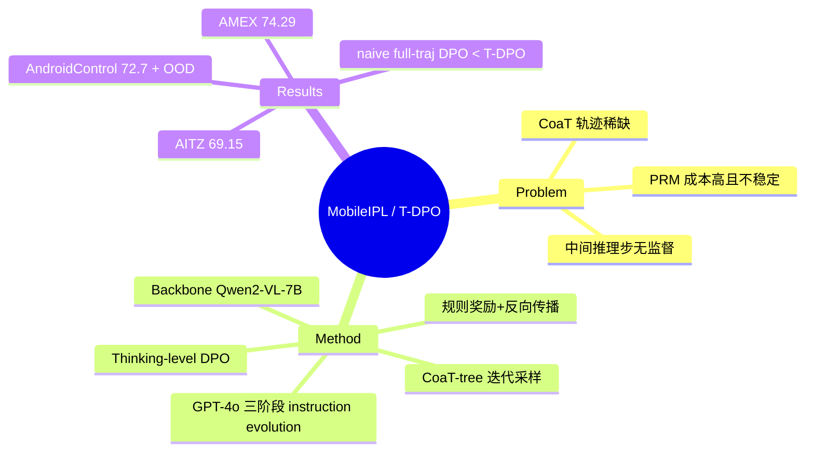

## Summary
MobileIPL 针对 CoaT 范式下 mobile GUI agent "中间推理步质量无监督"的问题，通过迭代采样构造 CoaT-tree、用规则奖励给叶节点打分并反向传播，得到 thinking-level DPO（T-DPO）偏好对，从而在**不训练 PRM、不做逐步人工标注**的前提下提炼 step-level 偏好信号。配合 GPT-4o 的三阶段 instruction evolution 做 warm-up SFT 抗过拟合，在 AITZ / AMEX / AndroidControl 三个 mobile benchmark 上超过 OS-ATLAS、UI-TARS 等 continual-pretraining 基线并展示 OOD 泛化。

## Problem & Motivation
CoaT（Chain of Action-Planning Thoughts）把每个动作显式拆成 Description → Action-Thought → Action-Decision → Grounding 四步推理，能提升 VLM-based mobile agent，但高质量 CoaT 轨迹稀缺、限制表达力与泛化。现有 self-training 存在两难：要么只用最终 action 是否正确作监督，忽略中间推理步质量、易 reward hacking 产生 suboptimal reasoning；要么依赖昂贵的 process-level 标注去训练 PRM（process reward model），后者本身训练不稳定、成本高。

这正是 CUA-Survey §7.5 的核心张力：如何把失败/次优经验从**轨迹级排序**细化到**关键决策点**，同时避开 PRM 的标注与稳定性代价。相较 EvoCUA 的离线"首分叉 step-level DPO"与 TGPO 的"PRM 自动过程奖励"，MobileIPL 提供第三条路线——迭代采样 + 规则奖励反向传播。

## Method
- **CoaT-tree 构造**：每个 action 分解为 4 个 dialogue stage（Description / Action-Thought / Action-Decision / Grounding）；对每步采样 K 个 continuation，逐步展开成树结构。
- **规则奖励 + 反向传播**：叶节点打分 v(s_t)——命中 ground-truth action a* 记 1，type 匹配记 v_type + score_match，否则 0；内部节点按 v(s_{t-1}) = c · (1/K) Σ_k v(s_t^(k)) 反传。整个过程无需 PRM，用规则化 reward 替代不稳定的过程奖励模型。
- **T-DPO（Thinking-level DPO）**：在同一前缀 s_{1:t-1} 下、用树内正/负 thinking 分支 (s_t^+, s_t^-) 构造偏好对，在**推理步**而非整条轨迹上做偏好优化，损失为标准 DPO 形式 −E log σ(β log[π_θ(s_t^+)/π_ref] − β log[π_θ(s_t^-)/π_ref])。
- **Iterative Preference Learning（IPL）**：多轮 sample → score → T-DPO 迭代，逐轮扩充树并提高含正负样本的分叉比例（据文中从 4% 提升到 31%），改善偏好对质量。
- **三阶段 instruction evolution**：GPT-4o 基于真实 mobile UI 截图生成 Level I（通用 GUI Q&A：grounding/reference/描述）、Level II（widget caption 与关系）、Level III（结构框架预测 FAQ）三层 Q&A，用于 warm-up SFT 抗过拟合并提升 layout 理解与 embedding 多样性。
- **Backbone**：Qwen2-VL-7B（另测以 UI-TARS-7B 为 seed model）。

## Key Results
> 数字来自 arXiv HTML 全文的自动抽取（WebFetch），本轮无独立 verifier；部分对照项存在抽取噪声，已在 Evidence Ledger 标注需回表核对。

- **AITZ**：MobileIPL 总准确率（type match）69.15%，对照 OS-ATLAS-7B 65.11（+4.04）、UI-TARS-7B 65.61（+3.54）——三者内部一致。
- **AMEX（long-horizon）**：overall 74.29%，超过 previous SOTA SphAgent-7B 70.71（+3.58）。（抽取给出的 OS-ATLAS / UI-TARS 对照项数值疑似重复/失真，未采信。）
- **AndroidControl（high-level instructions）**：Step.Acc 72.7%；OOD 子集 in-domain 73.6 / app-unseen 70.0 / task-unseen 72.2，显示跨 app、跨 task 的泛化。
- **Ablation（AITZ, Table 5）**：去 IPL、去 instruction evolution、去负样本、以及"整轨迹 naive DPO"四项均下降，其中**整轨迹 naive full-trajectory DPO 显著劣于 T-DPO**，直接支撑"step-level 优于 trajectory-level"的核心论断（各项绝对基线与 69.15 头条口径无法对齐，绝对数值待回表核对）。

## Evidence Ledger
| Claim ID | Claim | Type | Source locator | Evidence excerpt | Status |
|:--|:--|:--|:--|:--|:--|
| C1 | AITZ 总准确率(type match) 69.15%，vs OS-ATLAS-7B 65.11、UI-TARS-7B 65.61 | benchmark 数字 | Table 1 (AITZ) | "MobileIPL 69.15% … +4.04 vs 65.11 … +3.54 vs 65.61" | source-verified（内部一致，经二次抽取） |
| C2 | AndroidControl high-level Step.Acc 72.7%；OOD 73.6/70.0/72.2 (in/app-unseen/task-unseen) | benchmark 数字 | Table 3–4 (AndroidControl) | "72.7% Step.Acc … 73.6 / 70.0 / 72.2" | source-verified（经二次抽取） |
| C3 | AMEX overall 74.29%，+3.58 over SphAgent-7B 70.71 | benchmark 数字 | Table 2 (AMEX) | "MobileIPL 74.29% … SphAgent-7B by 3.58%" | source-verified（74.29/70.71 一致；OS-ATLAS/UI-TARS 对照项抽取失真，未采信） |
| C4 | 整轨迹 naive DPO 显著劣于 T-DPO，支撑 step-level 主张 | 机制/消融断言 | Table 5 (AITZ ablation) | "Naive DPO on full trajectories: 60.3% (−5.1%)" | not-checkable（消融绝对基线与头条 69.15 口径无法对齐，趋势可采信、数值待核） |
| C5 | 用规则奖励反传替代 PRM 以避免 process-level 标注与训练不稳定 | 方法/机制断言 | Abstract + Method | "scores leaf nodes using rule-based reward … without … PRM" | source-verified |
| C6 | Backbone 为 Qwen2-VL-7B（另以 UI-TARS-7B 为 seed） | 配置事实 | Method / Fig 3c | "Backbone Model: Qwen2-VL-7B … UI-Tars-7B as seed" | source-verified |

## Strengths & Weaknesses
**Strengths**
- **简洁且可扩展**：用规则奖励 + 树反向传播替代 PRM，训练更稳、标注成本更低，契合 simple / scalable 品味；step-level(thinking-level) 信号定位到具体推理分支，缓解长轨迹信用稀释。
- **对照到位**：ablation 直接把 T-DPO 与整轨迹 naive DPO 对比，为"step-level 优于 trajectory-level"提供内生证据，而非仅靠 headline SOTA。
- **泛化证据**：AndroidControl OOD 子集（app-unseen / task-unseen）给出跨分布迁移信号。
- 为 §7.5 补上"无 PRM 的迭代 step-level 偏好"这一路线，与 EvoCUA（离线首分叉 DPO）、TGPO（PRM 自动过程奖励）、AgentQ（MCTS + AI 过程监督 Q 值）形成四路对照。

**Weaknesses**
- **正样本非唯一正确**：规则奖励只覆盖 action type / grounding 命中，无法判定"多解 GUI 状态"下哪条 thinking 真正更优——与 GUI-Libra 揭示的 partial verifiability 边界同源，偏好对里"更优"分支可能只是碰巧命中标注动作。
- **离线/半在线局限**：不观察 current policy 在真机上引发的新状态、恢复路径与分布漂移；DigiRL / DistRL 的在线路线在这一点上仍有不可替代价值。
- **评测口径**：AITZ/AMEX/AndroidControl 均为 offline step-level 指标（Step.Acc / type match / grounding），非真机 end-to-end task success；且各方法 backbone 不同，跨 backbone 不能裸比。
- **数据可复现性**：本轮部分对照数字（AMEX 的 OS-ATLAS/UI-TARS 对照、ablation 绝对基线）经自动抽取存在噪声，需回 Table 1/2/3/5 核对后方可引用为强定量结论。

## Mind Map

## Notes
- content_scope = full-text（arXiv HTML via WebFetch），但所有数字均为二次抽取、本轮无独立 verifier，故 verification_status = unverified；建议入库后由 verifier 回 Table 1/2/3/4/5 逐项核对，尤其是 AMEX 对照项与 ablation 绝对基线。
- **标题版本差异**：arXiv v1 列表标题为 "Enhance Mobile Agents Thinking Process Via Iterative Preference Learning"，OpenReview / 后续版本为 "MobileIPL: Enhancing Mobile Agents Thinking Process via Iterative Preference Learning"（此处采用后者作为 canonical title）。
- **§7.5 归位**：可作为"迭代 step-level 偏好、无 PRM"代表并入 §7.5，与 [[Papers/2601-EvoCUA]]（离线首分叉 step-DPO）、[[Papers/2509-TGPO]]（tree + PRM 自动过程奖励）、[[Papers/2408-AgentQ]]（MCTS + AI 过程监督 Q 值构 step-level 偏好）对照；跨论文 pattern 是"如何在多解 GUI 状态下低成本获得 step-level 偏好信号"，各自答案在标注成本 vs 可验证性上取不同折衷。
- code / project page 未检索到公开链接（留空）。
