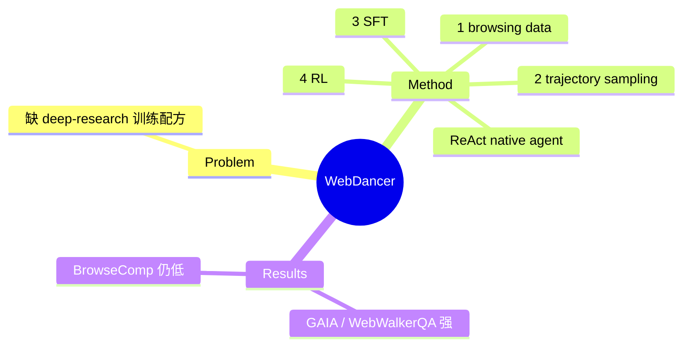

## Summary
WebDancer 是 Tongyi WebAgent 家族里搭起"数据→SFT→RL"完整训练管线的 ReAct 式 native 信息检索 agent：用**四阶段范式**（browsing data construction → trajectory sampling → SFT → RL）从零训练自主 deep-research 能力，在 GAIA、WebWalkerQA 等长程信息检索 benchmark 上取得强表现。

## Problem & Motivation
真实 deep research 需要在开放网络里做多步推理 + 迭代检索，但缺少端到端的 agentic 训练配方——多数方案靠 prompt 拼装闭源模型，学不到稳定的自主检索能力。WebDancer 想给出一条可复制的 native agent 训练路径：数据怎么造、轨迹怎么采、SFT/RL 怎么衔接。

## Method
基于 **ReAct**（thought→action→observation 迭代）的 native agent，四阶段训练范式：
1. **Browsing Data Construction**：构建 web 交互数据集（QA + 可执行浏览任务）。
2. **Trajectories Sampling**：采集高质量多步 action 轨迹（含搜索/点击/导航 + 推理）。
3. **Supervised Fine-Tuning**：用轨迹做 SFT 冷启动，建立基础 agentic 行为。
4. **Reinforcement Learning**：RL 优化提升泛化与长程一致性。

核心是把"信息检索 agency"当作可训练能力，用统一管线把数据构造与两阶段训练串起来。

## Key Results
- 在 **GAIA** 与 **WebWalkerQA**（长程信息检索 benchmark）上表现强劲，验证四阶段范式对自主检索能力的有效性。
- （作为 [[Papers/2507-WebSailor]] 的前身，WebDancer-32B 在 BrowseComp-en 约 2.5%——WebSailor 后来用高不确定性任务把小模型也拉高，7B 达 6.7%。）

## Strengths & Weaknesses
**亮点**：(1) 提供可复制的 deep-research native agent 训练全流程（数据+SFT+RL），是 Tongyi 家族承上启下的方法基座；(2) ReAct + 两阶段训练成为该支线的标准范式；NeurIPS 2025。

**局限**：(1) 在最难的 BrowseComp 上绝对分低，暴露"任务不够难/不确定"的训练数据瓶颈——正是 [[Papers/2507-WebSailor]] 用 SailorFog-QA 要补的；(2) 纯文本检索，多模态由 [[Papers/2508-WebWatcher]] 承接；(3) deep-research 支线不含真实界面事务操作。属 [[Topics/WebAgent-Survey]] deep-research 路线。

## Mind Map

## Notes
- Tongyi 家族链：WebWalker(benchmark) → **WebDancer** → [[Papers/2507-WebSailor]] → [[Papers/2508-WebWatcher]] → [[Papers/2509-WebSailorV2]]。
