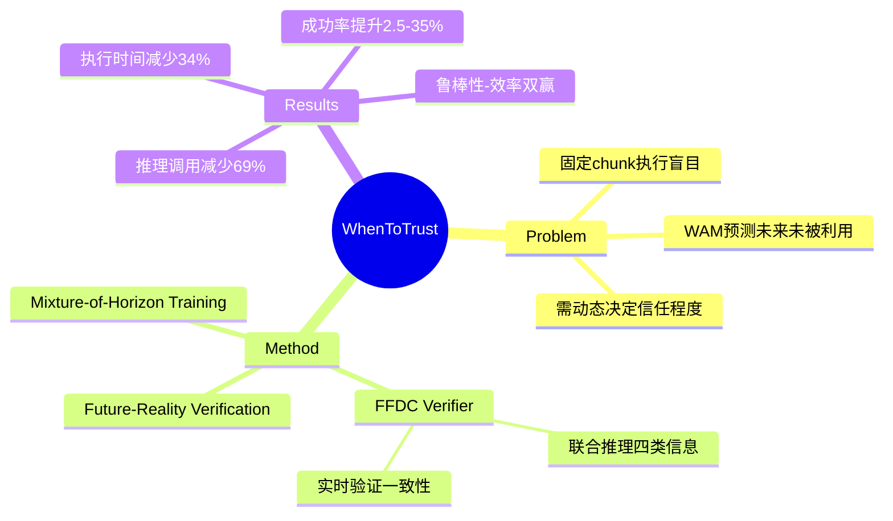

## Summary
提出 World Action Models 的自适应执行策略：将 action chunk 长度决策建模为"未来-现实验证"问题，通过 FFDC verifier 实时判断 WAM 预测的未来是否仍可信，动态调整执行长度，在 RoboTwin 上减少 69% 推理调用、34% 执行时间，同时提升成功率。

## Problem & Motivation

现有 World Action Models (WAMs) 的核心局限：**每次推理后执行固定数量的预测动作，无法感知"想象中的未来"是否仍与真实物理执行一致。**

- 简单可预测阶段（如接近刚性物体）：WAM 预测可能长期准确，频繁重规划浪费计算
- 复杂接触密集阶段（如折叠布料、复杂接触操作）：预测可能迅速失效，盲目执行长 chunk 导致失败
- 现有自适应执行方法（基于 action uncertainty、entropy）未利用 WAM 的独特能力：**预测未来视觉观测**
- 核心挑战：不是选择更好的固定 chunk size，而是决定 **"何时 WAM 的想象仍值得信任"**

> [未获取全文，仅基于 abstract]

## Method

### 核心思路：Future-Reality Verification

将自适应执行建模为验证问题：机器人应持续比较 WAM 预测的未来与真实观测，当预测与现实一致时继续执行，当出现偏差时提前重规划。

### FFDC (Future Forward Dynamics Causal Attention)

轻量级 verifier，联合推理四类信息：
1. **Predicted future actions**：WAM 预测的剩余动作序列
2. **Predicted visual dynamics**：WAM 预测的未来视觉观测
3. **Real observations**：真实传感器观测
4. **Language instructions**：任务指令

输出：判断当前 action rollout 是否仍可信任的置信度

**设计特点**：
- 利用 WAM 的独特属性（预测未来视觉观测）进行自验证
- 当预测视觉动态、真实观测、计划动作因果一致时，继续执行当前 chunk
- 当出现不一致时，触发提前重规划

### Mixture-of-Horizon Training

提升长时域轨迹覆盖率，支持自适应执行：
- 训练时混合不同 horizon 的轨迹
- 增强模型对各种执行长度的泛化能力

> [未获取全文，仅基于 abstract]

## Key Results

### RoboTwin Benchmark

| 指标 | 改进幅度 |
|:-----|:--------|
| WAM forward passes 减少 | 69.10% |
| 执行时间减少 | 34.02% |
| 成功率提升（vs short-chunk baseline） | +2.54% |

### Real-world Experiments

- 成功率提升 **35%**（绝对值）

### 关键发现

- 自适应 chunk size 作为 prediction-observation consistency 的涌现结果
- 保持长时域执行的效率，同时恢复接触密集阶段的响应性
- 实现了鲁棒性-效率的良好权衡

> [未获取全文，仅基于 abstract]

## Strengths & Weaknesses

### Strengths

1. **问题定义精准**："when to trust imagination" 是 WAM 独有的问题，抓住了核心矛盾
2. **方法设计优雅**：FFDC 利用 WAM 预测未来视觉观测的特性进行自验证，而非依赖 action-side uncertainty
3. **结果令人信服**：同时提升效率和成功率（通常这两者 trade-off），减少了 69% 推理调用
4. **与现有工作区分清晰**：明确指出现有自适应执行方法未利用 WAM 的 visual prediction 能力

### Weaknesses

1. **Binary supervision 局限**：从论文 conclusion 可知 FFDC 用 binary supervision 训练，可能无法覆盖真实世界执行偏差的多样性
2. **Verifier 训练数据依赖**：需要构造 positive/negative 样本，数据构造策略对泛化影响未充分讨论
3. **额外推理开销**：虽然减少 WAM 调用，但 FFDC 本身需要持续运行，开销分析不够详细
4. **未验证跨 embodiment**：仅在 RoboTwin 和 real-world manipulation 验证

### 潜在影响

- 为 WAM 部署提供新范式：从固定 chunk 执行转向 reliability-aware control
- 可能启发其他"自验证"机制的设计
- 与 PFD (Privileged Foresight Distillation) 形成互补视角：PFD 关注训练时利用未来信息，本文关注推理时验证未来预测

> [未获取全文，仅基于 abstract]

## Mind Map

## Notes

- **与 PFD 的关系**：PFD 关注"未来信息在训练中的作用"，本文关注"推理时如何验证未来预测"，两者从不同角度利用 WAM 的 future prediction 能力
- **"涌现式自适应"概念**：chunk size 不是预设的超参，而是从 consistency 涌现，这种设计思路值得借鉴
- **Limitation 文中已提及**：binary supervision 可能不够丰富，未来可探索更细粒度的 failure mode learning
- **应用场景**：contact-rich manipulation 是主要受益场景，简单 approaching 阶段可长时域执行