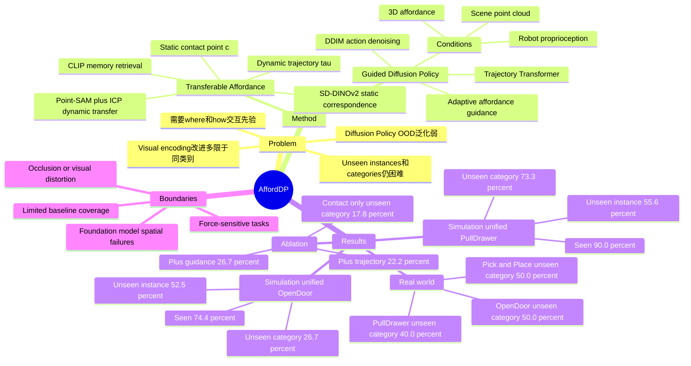

## Summary
AffordDP 将 3D contact point 与 post-contact trajectory 形式的 transferable affordance 显式接入 diffusion policy，并在采样时用 adaptive affordance guidance 约束 end-effector 靠近目标交互点，从而提升机器人操作在 unseen instances / unseen categories 上的泛化。

## Problem & Motivation
Diffusion Policy 在机器人 imitation learning 中能建模多模态动作分布，但论文指出其 OOD generalization 仍然弱：当物体位置、形状、外观或类别变化时，普通 image-based DP 与 point-cloud-based DP3 都容易失效。已有工作主要改进 visual feature encoding，例如 3D point cloud、SIM(3)-equivariant network 或 3D semantic field，但泛化通常仍局限于相似外观或同类别对象。

作者的核心问题 formulation 是：机器人泛化不应只依赖 observation encoder，而应利用 task-specific interaction prior，即知道与物体的 “where” 和 “how” 交互。AffordDP 因此把 affordance 定义为 `Phi=(c, tau)`：`c` 是 3D contact point，回答在哪里接触；`tau` 是 contact 后 end-effector 的 3D trajectory，回答如何继续操作。

## Method
### Transferable Affordance

AffordDP 维护一个 affordance memory，每条记录包含 task name、affordance `Phi={c,tau}`、CLIP image feature `z` 和 RGB-D 恢复的 object point cloud。推理时先在同一 task 的 memory 中用 cropped object 的 CLIP feature cosine similarity 检索最相似 source object，再把 source affordance 迁移到 target object。

**Static affordance transfer.** 给定 source contact point，AffordDP 用 SD-DINOv2 生成 pixel-level semantic features，在 target image 中通过 feature matching 找对应 2D point，再 back-project 到 3D world coordinates，得到 target static affordance `c_3D`。这里的已知假设是 foundation vision model 的 semantic correspondence 足够稳定；论文后文也承认 foundation model 对 spatial information 的理解会限制 affordance transfer。

**Dynamic affordance transfer.** 论文没有直接做 whole-object registration，因为不同 instance / category 的整体 shape 和 scale 可能差异很大。它把 translation 和 rotation 分开估计：translation 来自 source / target 3D contact point 的差值；rotation 来自 Point-SAM 以 contact point 为 prompt 分割 manipulable part 后，对 source / target part point cloud 做 ICP registration。最终用 `tau_T = R tau_S + t` 迁移 post-contact trajectory。

### Affordance-Guided Diffusion Policy

Policy 条件包括 scene point cloud `O_t`、robot proprioception `S_t` 和 affordance `Phi`。`O_t` 和 `S_t` 分别经 MLP 编码，contact point 经 MLP 编码，trajectory `tau` 经 Transformer encoder 和 `[CLS]` token 表示；这些条件共同输入 DDIM-style conditional diffusion model 来预测 action sequence。

仅把 affordance 作为 condition 仍可能不够精确，因为 diffusion model 优先拟合整体 action distribution，不保证满足接触点这类 task constraint。AffordDP 因此在 sampling 过程中加入 adaptive affordance guidance：通过 forward kinematics 得到 end-effector position `p_ee`，在 `||p_ee-c_3D||_2 < theta` 时使用距离 loss `L_g=||p_ee-c_3D||_2`，并沿该 loss 的梯度修正 DDIM sampling step。该 guidance 只在接近 contact point 的范围内生效，避免 gripper 很远或已抓住物体后仍被强制拉向接触点。

### Training / Evaluation Setup

Simulation 使用 IsaacGym、GAPartnet objects、Franka arm 和 side-mounted depth camera；expert demonstrations 由 CuRoBo motion planner 生成。Real-world 使用 Franka arm 与 RealSense D455，通过 teleoperation 收集 demonstration。Baselines 是 image-based Diffusion Policy (DP) 和 point-cloud-based 3D Diffusion Policy (DP3)，评价指标是 success rate。

论文设置了两种训练方式：object-specific policy training 使用单个 object 的 30 条 demonstrations，主要测试 variance robustness；unified policy training 对每个 task 选 5 个 simulation objects、每个 object 20 条 demonstrations，测试 seen instance、unseen same-category instance 和 unseen category。真实实验采用 unified policy training，每个 task 有 4 个 objects，每个 object 25 条 demonstrations，即每个 task 共 100 条 demonstrations。

## Key Results
### IsaacGym / GAPartnet Simulation: Object-Specific Policy

在 `PullDrawer` 和 `OpenDoor` 的 object-specific setting 下，AffordDP 在高 variance 数据上优势最明显。Table 2 中，`PullDrawer-Hard` 成功率为 **26.7%**，高于 DP **13.3%** 和 DP3 **16.7%**；`OpenDoor-Hard` 成功率为 **50.0%**，高于 DP **30.0%** 和 DP3 **20.0%**。在 easy setting 下差距较小，例如 `PullDrawer-Easy` 三者都是 **80.0%**，说明 affordance 主要帮助高变化或 OOD 情况，而不是简单场景。

### IsaacGym / GAPartnet Simulation: Unified Policy

Table 3 显示 AffordDP 在 seen / unseen / unseen category 三类测试对象上都优于 DP 和 DP3。`PullDrawer` 中，AffordDP 达到 seen **90.0%**、unseen instance **55.6%**、unseen category **73.3%**；对应 DP 是 **20.7% / 6.7% / 3.3%**，DP3 是 **41.3% / 10.0% / 3.3%**。`OpenDoor` 中，AffordDP 达到 seen **74.4%**、unseen instance **52.5%**、unseen category **26.7%**；对应 DP 是 **23.3% / 17.5% / 3.3%**，DP3 是 **41.1% / 5.0% / 5.6%**。

### Real-World Franka Tasks

Table 4 的 real-world `PullDrawer` / `OpenDoor` / `Pick&Place` 结果表明，DP 在全部真实任务上为 **0.0%**，DP3 有有限成功率，AffordDP 在所有场景最高。具体而言，AffordDP 在 `PullDrawer` 上达到 seen **67.5%**、unseen instance **45.0%**、unseen category **40.0%**；`OpenDoor` 上达到 **80.0% / 50.0% / 50.0%**；`Pick&Place` 上达到 **52.5% / 65.0% / 50.0%**。DP3 在对应三任务的 unseen category 上分别为 **10.0% / 30.0% / 15.0%**。

### Ablation / Additional Results

Table 5 的 simulation ablation 显示，只有 contact point 时成功率为 seen **72.2%**、unseen instance **42.5%**、unseen category **17.8%**；加入 trajectory 后变为 **71.6% / 50.0% / 22.2%**；再加入 affordance guidance 后达到 **74.4% / 52.5% / 26.7%**。这说明 dynamic affordance 和 sampling guidance 的主要收益集中在 unseen instance / unseen category，而不是 seen objects。

Appendix 的 spatial generalization experiment 在 `PullDrawer` 上用 30 条 expert demonstrations，对 1000 个随机位置评估：DP3 成功 **65** 次，AffordDP 成功 **170** 次。论文还展示了 zero-shot unseen scene transfer 到 kitchen environment，但只给定定性结论和 project website 视频说明，没有给出表格化成功率。

## Strengths & Weaknesses
**已知 Strengths.** 这篇的核心 insight 简洁：与其只强化 diffusion policy 的视觉编码，不如显式引入可迁移的 manipulation prior，并把 affordance 同时用于 conditioning 和 sampling-time guidance。`3D contact point + post-contact trajectory` 比只预测 2D point 或 3D point with direction 更能表达 “where + how”。

**已知 Strengths.** 实验覆盖 simulation 与真实机器人、object-specific 与 unified training、seen / unseen / unseen category，并且包含 ablation。尤其 Table 3 / Table 4 中 unseen category 的差距很大，支持作者关于 transferable affordance 帮助跨类别泛化的主张。

**已知 Weaknesses / boundaries.** AffordDP 依赖多个外部感知模块：Grounded-SAM / CLIP 做 memory retrieval，SD-DINOv2 做 semantic correspondence，Point-SAM 和 ICP 做 part-level registration。论文自己的 limitations 指出，当 foundation models 在 severe occlusion 或 visual distortion 下失败时，AffordDP 也会受限；需要 precise force control 且 affordance 难以提取的任务也不适合，例如不破坏鸡蛋的抓取。

**已知 Weaknesses / evaluation caveats.** 主实验 baselines 是 DP 和 DP3；虽然 related work 讨论了 GenDP、G3Flow、Equibot、Im2Flow2Act 等更近方法，但主要结果表没有与这些方法直接比较。因此“outperforms previous diffusion-based methods”的强度应按实验覆盖理解，而不能扩展为对所有 concurrent diffusion-policy 方法的完整比较。

**推测.** 对 embodied research 的启发是，affordance 可以作为一个低维、任务相关、跨类别可迁移的接口，既不完全依赖端到端 observation encoder，也不退回到 brittle open-loop planner。对 GUI-agent / computer-use 的直接 relevance 不应 overclaim：论文实验只覆盖 robotic manipulation，没有研究 screen UI 或 web interaction。

**不知道.** 论文没有给出 code URL、DOI、foundation model failure rate、affordance transfer 的单独成功率、ICP registration 失败比例，也没有报告不同 memory size / retrieval error 对 policy 的 sensitivity。因此还不知道最终瓶颈主要来自 semantic correspondence、part segmentation、trajectory transfer，还是 diffusion policy 本身。

## Mind Map

## Notes
- 与 Robo-ABC / RAM 这类 paper related work 中的 training-free affordance transfer 相比，AffordDP 不只预测 2D contact point 或 3D contact point with direction，而是迁移 3D contact point 与 post-contact trajectory，并把它们接入 learned diffusion policy。
- 与 GenDP / G3Flow 这类 3D semantic field 路线相比，论文声称 AffordDP 不依赖 multi-view semantic field，而是用 3D affordance trajectory 作为 condition；但主实验没有直接与 GenDP / G3Flow 做数值对比。
- 最值得追的 follow-up 是把 Table 5 的 ablation 再拆细：分别测 static correspondence error、dynamic trajectory transfer error 和 guidance weight / threshold 对最终 success rate 的影响。当前论文只报告了组件级 ablation，未给出 affordance transfer 质量与 policy success 的因果分解。
