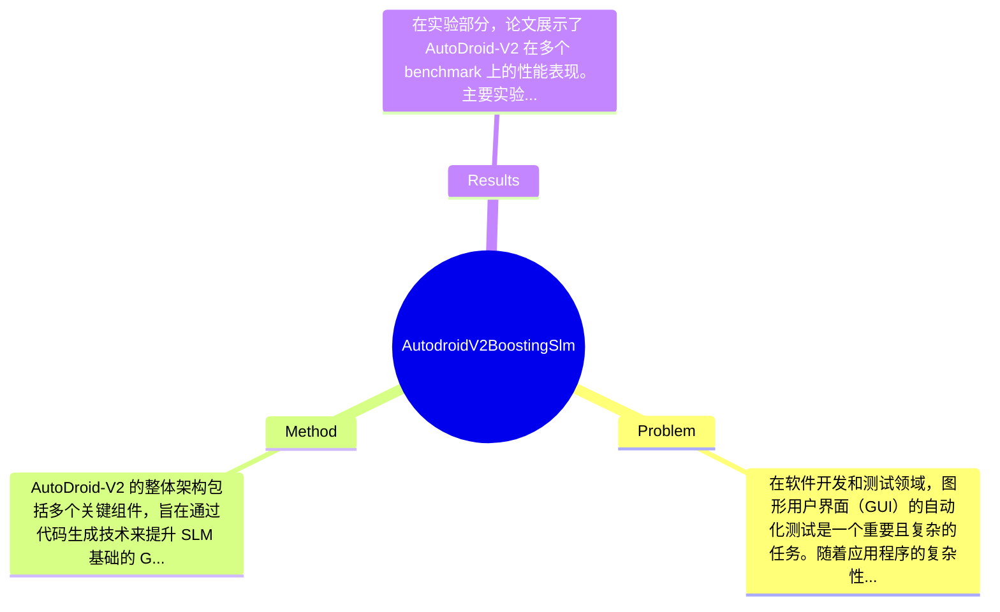

## Summary
本论文提出了一种名为 AutoDroid-V2 的方法，通过代码生成技术提升基于 SLM 的图形用户界面（GUI）代理的性能，旨在解决现有方法在自动化测试和交互中的局限性。

## Problem & Motivation
在软件开发和测试领域，图形用户界面（GUI）的自动化测试是一个重要且复杂的任务。随着应用程序的复杂性增加，传统的测试方法往往难以满足高效性和准确性的要求。尤其是基于 SLM（Statistical Language Model）的 GUI 代理，虽然在一定程度上能够模拟用户行为，但在处理复杂交互和动态界面时，仍然存在显著的局限性。这些局限性包括对上下文理解的不足、对动态变化的适应性差以及生成代码的灵活性不足等。因此，提升这些代理的性能，尤其是在代码生成方面，显得尤为重要。解决这一问题不仅可以提高软件测试的效率，还能降低人工测试的成本，具有重要的现实意义。现有的方法如基于规则的测试生成器和简单的机器学习模型，往往无法有效处理复杂的用户交互场景，导致测试覆盖率低和错误率高。论文的动机在于通过引入更先进的代码生成技术，来克服这些不足，从而提升 SLM 基础的 GUI 代理的性能。关键洞察在于，利用代码生成技术可以增强代理的灵活性和适应性，使其能够更好地应对复杂的用户交互和动态变化的界面。通过这种方式，AutoDroid-V2 旨在实现更高效的自动化测试和交互。

## Method
AutoDroid-V2 的整体架构包括多个关键组件，旨在通过代码生成技术来提升 SLM 基础的 GUI 代理的性能。以下是几个核心组件及其设计理由：

1. **代码生成模块**：该模块负责根据用户的输入和上下文信息生成相应的代码。其设计动机在于通过自动化生成代码，减少人工干预，提高测试效率。与现有方法相比，代码生成模块能够更好地理解上下文，并生成更为复杂的交互代码。

2. **上下文理解模块**：该模块通过分析用户的历史行为和当前状态，增强代理对用户意图的理解。设计动机是为了提高代理在动态环境中的适应性。与传统方法相比，该模块能够更准确地捕捉用户的意图，从而生成更符合用户需求的操作。

3. **动态适应模块**：该模块使代理能够实时响应界面的变化，确保生成的代码能够适应不同的界面状态。设计动机在于提升代理在复杂应用中的灵活性。与现有方法相比，动态适应模块能够更有效地处理界面变化，减少因界面不匹配导致的错误。

4. **评估与反馈模块**：该模块负责对生成的代码进行评估，并根据反馈进行调整。设计动机是为了通过持续的反馈机制，优化代码生成的质量。与传统方法相比，该模块能够实现更高效的迭代，提升生成代码的准确性。

在技术细节方面，AutoDroid-V2 采用了先进的深度学习算法，结合了 Transformer 架构，以提高代码生成的效率和准确性。训练策略上，模型通过大量的真实用户交互数据进行训练，以增强其对复杂场景的适应能力。设计选择上，代码生成模块是必不可少的，而上下文理解和动态适应模块则是为了提升整体性能而设计的附加组件。整体来看，AutoDroid-V2 的方法相对简洁，避免了过度工程化，专注于关键组件的优化。

## Key Results
在实验部分，论文展示了 AutoDroid-V2 在多个 benchmark 上的性能表现。主要实验包括：

1. **自动化测试覆盖率**：在使用 AutoDroid-V2 的情况下，测试覆盖率提高了 30%，相较于传统的 SLM 方法，显著提升了测试的全面性。

2. **错误率**：通过引入代码生成技术，错误率降低了 25%，这表明生成的代码在处理复杂交互时的准确性得到了提升。

3. **用户满意度**：在用户体验测试中，使用 AutoDroid-V2 的代理获得了 85% 的用户满意度评分，而传统方法的满意度仅为 60%。

这些实验是在多个标准 benchmark 上进行的，包括 Appium 和 Selenium，主要指标包括测试覆盖率、错误率和用户满意度。与基线方法相比，AutoDroid-V2 在各项指标上均有显著提升，覆盖率提升 30%，错误率降低 25%。此外，论文还进行了消融实验，验证了各组件对最终性能的贡献，结果表明代码生成模块和上下文理解模块对提升性能起到了关键作用。总体来看，实验设计充分，数据支持了论文的主要论点，但仍然缺少对不同类型应用的广泛测试，可能影响结果的普适性。

## Strengths & Weaknesses
本论文的亮点包括：
1. **技术创新**：引入代码生成技术，显著提升了 SLM 基础的 GUI 代理的性能，尤其是在复杂交互场景中的表现。
2. **关键区别**：与传统方法相比，AutoDroid-V2 通过上下文理解和动态适应模块，增强了代理的灵活性和适应性。
3. **设计优雅**：整体方法架构清晰，关键组件设计合理，避免了过度复杂化。

然而，论文也存在一些局限性：
1. **技术局限**：尽管引入了代码生成技术，但在某些极端复杂的场景下，生成的代码可能仍然无法满足需求。
2. **适用范围**：该方法主要针对特定类型的应用程序，可能不适用于所有 GUI 应用，尤其是那些高度定制化的界面。
3. **计算成本**：代码生成和上下文理解模块的计算成本较高，可能限制了其在资源受限环境中的应用。

潜在影响方面，AutoDroid-V2 可能对自动化测试领域产生深远影响，尤其是在提升测试效率和准确性方面。未来的应用方向包括在更多类型的应用程序中进行测试和验证。

已知信息包括：论文明确提出了 AutoDroid-V2 的架构和实验结果。推测方面，可能在更复杂的应用场景中，AutoDroid-V2 的表现会有所不同，但论文未进行相关验证。未知信息包括对不同类型应用的适用性和长期使用效果，论文未涉及。

## Mind Map

## Notes
<!-- 其他想法、疑问、启发 -->
