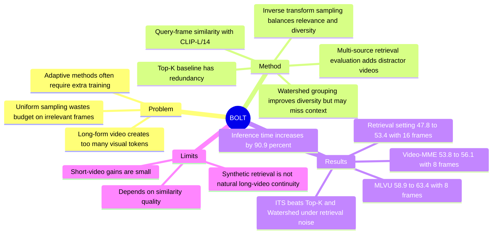

## Summary
BOLT 是一个 training-free 的 long-form video VQA frame selection 方法：用 query-frame similarity 构造概率分布，再通过 inverse transform sampling 在相关性和多样性之间折中选帧。它还提出 multi-source retrieval evaluation，把多个视频拼接成带 distractor 的伪长视频，以检验 uniform sampling 在 noisy context 下的失效。核心结果是 LLaVA-OneVision-7B 在 Video-MME 从 53.8% 提升到 56.1%，在 MLVU 从 58.9% 提升到 63.4%，不需要额外训练 VLM。

## Problem & Motivation
长视频理解的瓶颈不是只有模型能力，也包括 token budget 下“看哪几帧”的问题。LLaVA-OneVision 每帧使用 196 visual tokens，作者指出 30 FPS 的一小时视频若不压缩会需要约 20M tokens；因此大型 VLM 通常只能采样少量帧。

现有主流做法是 uniform frame sampling，但它隐含假设视频中每段内容对 query 同等重要。这个假设在 short / trimmed video 中尚可，在 instructional video、surveillance video、egocentric long video 中很容易失效：大量 irrelevant background 会占用 visual token budget，并可能分散 VLM 的注意力。

已有 adaptive temporal selection 方法如 Goldfish、LongVU、Frame-Voyager 开始用 visual-text similarity 做选择，但部分方法需要额外训练或 fine-tuning；论文中特别提到 Frame-Voyager 训练需要 32 H100 GPUs。BOLT 关心的问题是：能否只在 inference time 改变 frame selection，就提升现有 VLM 的 long-form video understanding？

## Method
论文先验证“选对帧”本身的重要性，再提出 query-guided frame selection。

**Ground-truth segment analysis.** 作者使用 MultiHop-EgoQA，因为该数据集为每个 video-question pair 提供 question-related temporal intervals。实验比较三种输入：从整段视频 uniform sampling、只从 ground-truth segments 采样、只从非 ground-truth segments 采样。所有模型输入 8 frames，用 average sentence similarity 评估；结果显示 GT segments 比 uniform 更好，非 GT segments 更差，说明 irrelevant context 会伤害回答质量。

**Multi-source retrieval evaluation.** 由于 Video-MME 等通用 VQA benchmark 缺少 temporal segment annotation，作者构造了一个更 noisy 的评测设置：随机选取 K 个 duration 相近但视觉内容不同的视频，用 brief black-frame transitions 拼接成 pseudo-long-form video，再从其中一个视频的问题集中抽取 query。模型必须在拼接视频中找到与问题相关的片段，而不是只在 trimmed video 上回答。

**Frame selection strategies.** 论文比较了四类策略：

1. **Uniform sampling**：固定间隔抽取 N frames，作为现有 VLM 的常用 baseline。
2. **Top-K selection**：用 CLIP 或 SigLIP 计算 query 与每帧的 cosine similarity，选 similarity 最高的 K frames。问题是容易选到重复帧，缺少 temporal diversity。
3. **Watershed grouping**：把 similarity curve 当作 temporal landscape，按 peak / valley 分组后从高分 peak regions 中取 representative frames。它减少了 Top-K 的冗余，但可能丢失 broader temporal context，尤其不利于 why / how 类 causal reasoning。
4. **Inverse Transform Sampling (ITS)**：先把每帧 similarity score 归一化到 [0, 1]，再用 $\alpha$ 控制分布 sharpness，构造 cumulative distribution function，从其 inverse 上按均匀间隔采样。高相关帧更可能被选中，但低相关帧仍有非零概率，从而保留一定 context 和 diversity。

实现上，作者以 1 FPS 抽帧，用 pretrained CLIP-L/14 提取 visual / textual embeddings；$\alpha=2.5$ 用于 EgoSchema、LongVideoBench、NextQA，$\alpha=3$ 用于 Video-MME 和 MLVU。实验使用 LMMs-Eval 评测 multiple-choice tasks，并在两张 A100 GPU 上运行。

## Key Results
**标准 benchmark，LLaVA-OneVision-7B + BOLT。** 在 Video-MME without subtitles 上，8 frames 从 53.8% 提升到 56.1%，16 frames 从 56.9% 提升到 57.8%，32 frames 从 58.5% 提升到 59.9%。在 MLVU 上，8 frames 从 58.9% 提升到 63.4%，16 frames 从 61.2% 提升到 65.8%，32 frames 从 63.2% 提升到 66.8%。在 LongVideoBench 上，8 / 16 / 32 frames 分别从 54.2 / 55.7 / 56.4 提升到 55.6 / 57.0 / 59.6。

**短视频 benchmark 的收益较小。** EgoSchema Full 从 59.17 / 59.49 / 60.36 提升到 59.23 / 59.86 / 60.66；NextQA 在 8 frames 完全不变，为 77.4%，16 frames 从 78.1 提升到 78.3，32 frames 从 79.4 提升到 79.5。作者也指出 NextQA 的视频较短，因此 BOLT 的收益不明显。

**Off-the-shelf VLM 泛化。** 在 Video-MME without subtitles、8 frames 设置下，BOLT 将 Video-LLaVA 从 37.6% 提升到 39.3%，LongVA 从 48.5% 提升到 51.6%，InternVL2 从 52.6% 提升到 53.3%，LLaVA-Video 从 56.0% 提升到 58.6%。

**Multi-source retrieval evaluation 更能暴露 uniform sampling 的问题。** 在 Video-MME、K=4、LLaVA-OneVision-7B 设置下，GT segments 16 frames 为 56.85%；uniform 64 frames 只有 52.11%，uniform 16 frames 降到 47.78%，blind test 为 40.85%。BOLT 在 retrieval setting 下把 16 frames 从 47.8% 提升到 53.4%，64 frames 从 52.1% 提升到 54.9%。

**Frame selection ablation。** 在 Video-MME、LLaVA-OneVision-7B、16 frames 下，standard setting 中 Uniform 为 56.85，Random 为 55.15，Top-K 为 57.10，Watershed 为 57.23，ITS 为 57.78；retrieval-based setting 中 Uniform 为 47.78，Random 为 46.05，Top-K 为 48.45，Watershed 为 49.15，ITS 为 53.37。ITS 的主要优势出现在 noisy retrieval setting，而不是干净的 standard setting。

**Similarity measure 与 hyperparameter。** Caption-based similarity 反而低于 baseline：Video-MME 上 Uniform 为 56.85，Caption 为 55.47，SigLIP 为 57.00，CLIP 为 57.78，CLIP+SigLIP 为 57.83。$\alpha$ 在 2 到 3.5 范围内都超过 uniform：例如 Video-MME uniform 56.90，而 $\alpha=2$ 为 58.37；MLVU uniform 61.24，而 $\alpha=3$ 为 65.76；LongVideoBench uniform 55.72，而 $\alpha=3.5$ 为 58.41。

**Background noise 与推理成本。** 当 multi-source retrieval 的 K 从 1 增加到 8 时，Uniform 从 56.85 降到 44.82，ITS 从 57.78 降到 49.04，说明 ITS 也会随 distractor 增加而退化，但退化更慢。Supplement 中，16 frames 的 LLaVA-OneVision-7B 单样本 VLM inference 为 1.32s，CLIP visual feature 为 1.21s，ITS 本身仅 0.003s，总时间 2.53s，相比 baseline 增加 90.9%；GPU memory 近似相同。

## Strengths & Weaknesses
**Strengths.**

1. **问题 formulation 简洁且重要。** 论文没有训练新 VLM，而是抓住 long-form VQA 的一个基础瓶颈：limited context 下 frame budget 应该服务于 query，而不是平均分配给整段视频。
2. **multi-source retrieval evaluation 有诊断价值。** 标准 trimmed benchmark 容易低估 distractor 的伤害；拼接多个视频后，uniform sampling 从 GT-segment 56.85% 降到 47.78%，接近 blind test 40.85%，这个实验很好地暴露了“看错帧”的代价。
3. **ablation 结构清楚。** Top-K、Watershed、ITS、similarity measure、$\alpha$、background noise K、subtitles、off-the-shelf VLM 都有对比，能看出 BOLT 的收益主要来自“query relevance + diversity”的折中，而不是单纯增加 query-awareness。
4. **工程上易接入。** BOLT 不需要 VLM fine-tuning，也不改变 downstream VLM；对于已有 video-LLM pipeline，这是一个可插拔的 inference-time selection module。

**Weaknesses / Limitations.**

1. **已知限制：依赖 query-frame similarity。** 作者明确指出 BOLT 的有效性依赖准确的 query-frame similarity，而 similarity 不一定反映 reasoning task 的真实相关性；未来需要更 robust 的 similarity metric，尤其是 varied video content、query context 和 multi-round VQA。
2. **推理时间不是免费。** ITS 本身只需 0.003s，但 CLIP feature extraction 让总推理时间从 1.32s 增加到 2.53s，增幅 90.9%。所以 “without training” 不等于 “without inference overhead”。
3. **标准 benchmark 的增益不总是大。** NextQA 8 frames 完全不变，EgoSchema 的提升也很小；Video-MME 16-frame long split 甚至从 48.2 降到 47.3。论文的 strongest case 是 noisy / long-form / distractor-heavy setting，而不是所有 video QA。
4. **multi-source retrieval 是合成压力测试。** 拼接多个无关视频能模拟 distractor，但不等同于真实长视频中的 narrative continuity、event dependency 或 procedural causality。它证明 uniform sampling 在 distractor 下脆弱，但不能完全代表自然长视频理解。
5. **不知道：对 GUI / embodied agent 视频是否成立。** 从研究相关性看，BOLT 对 screen recording、egocentric video、robot demo 的 token-efficient observation selection 有启发；但论文没有在 GUI-agent、web-agent、robot policy 或 embodied planning 上实验，不能直接声称能提升 agent performance。

## Mind Map

## Notes
- **已知**：BOLT 的核心贡献是 training-free query-guided frame selection，不是新 VLM、不做 fine-tuning，也不是 video token spatial compression。
- **已知**：论文最有说服力的证据来自 noisy / long-form setting，包括 multi-source retrieval evaluation 和 MLVU / LongVideoBench 等长视频 benchmark。
- **推测**：对 GUI-agent / embodied-agent 方向的启发是“observation selection 可以是 query-conditioned 的”，例如从长 screen recording 或 robot demo 中选与当前 instruction 相关的 frames；但这只是迁移假设，需要重新评测。
- **不知道**：BOLT 在 multi-round VQA、需要 OCR / object detector / state tracking 的 GUI 视频、以及需要 causal temporal reasoning 的 agent 任务中是否仍然有效。
- **我的判断**：rating=4。它的方法非常简单，但问题切得准，实验能清楚说明 uniform sampling 在 distractor-heavy long video 中的脆弱性；对 VLM / video-LLM 研究有直接参考价值，对 GUI-agent 和 embodied research 则是间接启发。
