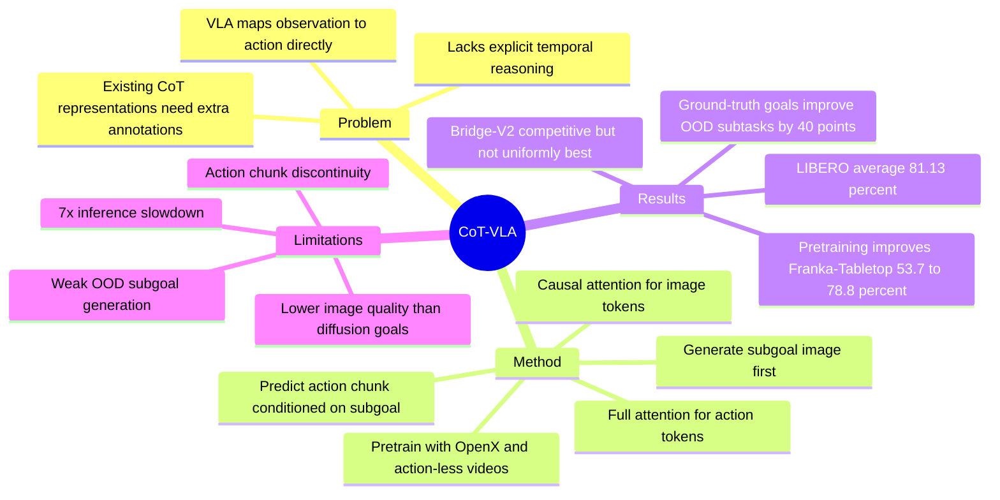

## Summary

CoT-VLA 解决现有 Vision-Language-Action models 直接从 observation 和 language instruction 预测 action、缺少显式 temporal planning / reasoning 的问题。它让 7B VILA-U-based VLA 先 autoregressively 生成未来 subgoal image 作为 visual chain-of-thought，再基于当前图像、指令和 subgoal 用 full attention 预测 action chunk。

## Problem & Motivation

现有 VLA 通过把 pretrained VLM fine-tune 到 robot demonstrations 上，已经能从视觉和语言输入生成机器人动作，但多数方法仍是直接 input-output mapping。论文指出这种范式缺少中间推理步骤，因而在复杂 manipulation task 中缺乏 temporal planning 或 reasoning capability，也不容易解释模型为什么要执行某个动作。已有 embodied CoT 工作常使用语言计划、keypoints、bounding boxes 等中间表示，但这些表示通常需要额外 preprocessing 或 annotation。CoT-VLA 的动机是：robot demonstration video 自然包含未来状态，subgoal image 可以作为更直接的 visual reasoning state，并且 action-less videos 也能参与训练 visual reasoning。

## Method

核心形式是两阶段闭环控制：给定当前 observation `s_t` 和 instruction `l`，模型先预测 `n` frames ahead 的 subgoal image `s_{t+n}`，再预测从当前状态到该 subgoal 的一段 action sequence。部署时模型重复执行：生成 subgoal image，生成 `m` 个 actions，执行 action chunk，读取新 observation，进入下一轮 closed-loop control。

模型基座是 VILA-U，一个同时支持 image/text understanding 与 generation 的 unified multimodal foundation model。CoT-VLA 使用 7B VILA-U，输入图像分辨率为 256 x 256，每张图像编码为 16 x 16 x 4 visual tokens；训练时优化 LLM backbone、projector 和 depth transformer，vision tower 保持 frozen。

训练目标由两部分组成。第一部分是 visual token prediction：对 `(instruction, current image, future image)` 序列做 subgoal image generation，用 causal attention 和 next-token prediction 学习 visual CoT。第二部分是 action token prediction：对 `(instruction, current image, subgoal image, action chunk)` 序列预测动作，7-DoF action 的每个维度离散到 256 bins，并复用 text tokenizer 中最少使用的 256 个 token 作为 action bin tokens。和 OpenVLA 等 prior VLA 不同，CoT-VLA 对 action tokens 使用 full attention，使同一个 action chunk 内的 action tokens 可以相互交互；默认 action chunk size 为 10。

数据流程分为 pretraining 和 downstream adaptation。Pretraining 使用 Open X-Embodiment 子集作为 robot demonstrations，并加入 EPIC-KITCHEN-100 与 Something-Something V2 作为 action-less video data；supplementary material 给出的 pretraining 配置包括 global batch size 2048、10 epochs、总计 11K A100 GPU hours。Downstream 阶段再在 LIBERO、Bridge-V2、Franka-Tabletop 等目标设置上用 task-specific demonstrations fine-tune，保持与 pretraining 相同的 frozen vision tower 设置。

## Key Results

- **LIBERO simulation benchmark**：CoT-VLA-7B 平均 success rate 为 **81.13 ± 0.6%**，高于 OpenVLA fine-tuned 的 **76.5 ± 0.6%**、Octo fine-tuned 的 **75.1 ± 0.6%** 和 Diffusion Policy 的 **72.4 ± 0.7%**。分项上，CoT-VLA 在 LIBERO-Spatial 为 **87.5 ± 1.4%**，LIBERO-Goal 为 **87.6 ± 0.6%**，LIBERO-Long 为 **69.0 ± 0.8%**；但在 LIBERO-Object 上为 **91.6 ± 0.5%**，略低于 Diffusion Policy 的 **92.5 ± 0.7%**。
- **Bridge-V2 real-robot benchmark**：每类 10 trials，CoT-VLA 在 Visual / Motion / Semantic / Language 四类 generalization 上分别为 **65% / 60% / 50% / 70%**。它在 Motion 和 Semantic 上高于 OpenVLA 的 **45% / 40%**，但在 Visual 和 Language 上低于 OpenVLA 的 **75% / 75%**；论文将这些低项主要归因于 action chunking 导致的 grasping failures，而不是 visual reasoning 错误。
- **Franka-Tabletop real-robot adaptation**：正文报告 CoT-VLA 在小规模 demonstration setting 下取得最高平均表现，并在 single-instruction 与 multi-instruction 任务上都有提升；但 per-task exact numbers 主要出现在 Figure 4，正文未列出完整数值表。Pretraining ablation 给出明确数字：带 OpenX + action-less video pretraining 的 CoT-VLA 从 **53.7%** 提升到 **78.8%**，相对提升 **46.7%**。
- **Visual reasoning ablation / OOD long-horizon subtasks**：在两个由未见 subtasks 组合而成的 Franka-Tabletop 任务中，使用 generated goal images 的成功率分别为 **20%** 和 **0%**；换成 ground-truth goal images 后分别提升到 **60%** 和 **40%**。这支持论文的因果判断：更好的 subgoal image generation 能转化为更好的 action execution，但当前 generated subgoal 对 OOD 任务仍不足。
- **Component ablation**：论文在 LIBERO-Spatial 与 LIBERO-Goal 上比较 vanilla VLA、加 action chunking、加 hybrid attention、完整 CoT-VLA，结论是 action chunking、hybrid attention、visual CoT 都带来提升，完整 CoT-VLA 最好；但对应的 Figure 6 没有在正文表格中列出 exact numerical values，因此不应补写具体幅度。

## Strengths & Weaknesses

**已知亮点**：

- 方法问题切得很清楚：不是再堆一个 VLA backbone，而是把 VLA 缺少显式 intermediate reasoning 的问题转成 future image generation + action chunk execution。
- 中间表示选择简洁：subgoal images 不需要 keypoint / bbox / language-plan 额外标注，可以直接来自 robot videos，也允许 EPIC-KITCHEN-100、Something-Something V2 这类 action-less videos 训练 visual reasoning。
- 架构选择与任务匹配：text/image generation 用 causal attention，action chunk prediction 用 full attention，避免把所有 action dimensions 当成完全线性的 next-token chain。
- 实验覆盖 simulation 与 real robot，包括 LIBERO、Bridge-V2、Franka-Tabletop，并对比 Diffusion Policy、Octo、OpenVLA、SUSIE 等不同路线 baseline。
- Ablation 比较有信息量：pretraining 从 53.7% 到 78.8%，ground-truth goal image 从 20%/0% 到 60%/40%，说明 visual reasoning quality 是当前瓶颈之一，而不是一个无关装饰模块。

**已知局限**：

- 推理开销显著：生成 action 前需要先生成 256 image tokens，即使用 action chunking 和 parallel decoding，论文仍报告 average **7x slowdown**。
- Visual quality 不是最强：autoregressive image generation 的视觉质量低于 diffusion-based models，Bridge-V2 讨论中也承认 SUSIE 生成的 goal images 视觉质量更高。
- Action chunking 有控制副作用：chunk 之间可能产生 discontinuous actions，并且执行 chunk 时缺少 high-frequency feedback；论文把 Bridge-V2 上部分 grasping failures 与这一点关联起来。
- OOD visual reasoning 仍弱：Table 3 中 generated goal images 在两个 OOD long-horizon subtasks 只有 20% 和 0%，说明当前 model 还不能可靠生成 entirely new task 的 subgoal。
- 训练成本高：pretraining 使用 12 个 A100 GPU nodes、共 11K A100 GPU hours；这限制了复现和快速迭代。

**推测**：

- CoT-VLA 的真实价值可能在于为 VLA 提供一个可监督、可视化的 intermediate state，而不仅是提高平均 success rate。对 GUI-agent / computer-use agent 来说，类似的 visual future-state reasoning 也许可以迁移到“先预测期望屏幕状态，再执行 UI action”的范式，但论文没有在 digital GUI 上验证。
- Subgoal image 作为 CoT 是否总是优于 language / bbox / waypoint，可能取决于任务是否需要细粒度几何与可见物体状态；对于高度接触丰富或目标不可见的 manipulation，image-only subgoal 可能不够。

**不知道 / 不应推断**：

- 论文没有给出 DOI，也没有在正文中给出 GitHub code link；只给出了 videos/project page。
- Figure 4 和 Figure 6 的部分细节没有以 machine-readable table 形式列出，不能从正文中推断每个 Franka-Tabletop task 或每个 component ablation 的精确数值。
- 论文没有证明 CoT-VLA 能泛化到 mobile manipulation、bimanual manipulation、humanoid whole-body control 或 GUI agent；这些只是可能的后续方向。

**个人判断**：评分 4。它是 visual reasoning for VLA 的重要代表工作，方法简单且与 embodied-reasoning 方向高度相关；但推理慢、生成质量和 OOD subgoal generation 仍是硬瓶颈，尚未达到“必读 foundation paper”的程度。

## Mind Map

## Notes

- 与 [[2407-ECoT|ECoT]] 的关键差异：ECoT 主要把 reasoning trace 显式文本化/结构化，CoT-VLA 则把 reasoning trace 放到 pixel-space subgoal image。两者都在回答同一个问题：VLA 的 intermediate reasoning 应该是什么表示。
- 与 world-model 路线的关系：CoT-VLA 不是完整 dynamics world model，但它把 future visual state 放进 policy inference loop，和 later VLA+world-model 工作有自然连接。
- 值得后续追问：visual subgoal 是否需要每步都生成？如果只在 uncertainty 高、instruction grounding 难、或 long-horizon phase transition 时生成，可能能保留 reasoning benefit，同时降低 7x slowdown。
