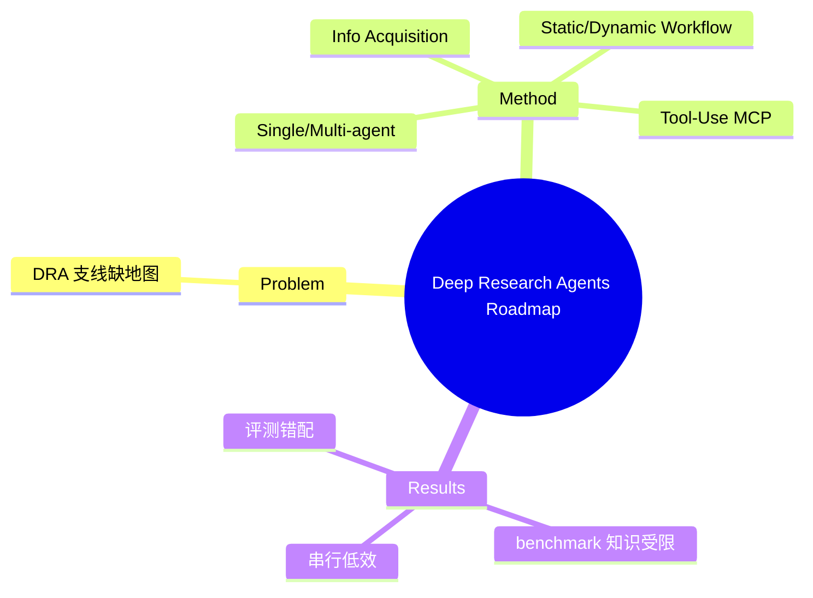

## Summary
Deep Research Agents (DRA) 支线的系统综述与 roadmap：把 DRA 定义为"用动态推理 + 自适应长程规划 + 多跳检索 + 迭代工具使用 + 结构化报告生成来完成复杂多轮研究任务"的自主系统，并沿 information acquisition / tool-use / workflow / architecture 四轴分类，指出 benchmark 外部知识受限、串行执行低效、评测与目标错配三大缺口。

## Problem & Motivation
2025 年 web agent 从"操作网页 GUI"分化出 deep research 支线（OpenAI/Gemini DeepResearch、Tongyi WebSailor 家族），但这类系统的能力边界、组件设计、评测方法缺乏统一梳理。作者提供一张系统地图 + roadmap，界定 DRA 是什么、由哪些能力构成、还差什么。

## Method
> [未获取全文，仅基于 abstract + 页面结构]

**DRA 定义**：autonomous AI system，组合 dynamic reasoning、adaptive long-horizon planning、multi-hop information retrieval、iterative tool use、structured analytical report generation，处理复杂多轮信息研究任务。

**四轴 taxonomy**：
1. **Information Acquisition**：API-based retrieval vs browser-based exploration。
2. **Tool-Use Frameworks**：code execution、multimodal input、Model Context Protocol (MCP)。
3. **Workflow Types**：static vs dynamic planning。
4. **Agent Architecture**：single-agent vs multi-agent。

WebDancer/WebSailor/WebShaper 类系统落在 dynamic workflow / multi-agent 分类下（search + navigate 紧凑工具集 + ReAct 闭环）。

## Key Results
综述无实验。核心 open problem：(1) 现有 benchmark 外部知识访问受限；(2) 串行执行效率低（缺并行检索）；(3) 评测指标与真实 DR 目标错配。配 awesome-list 仓库持续维护。

## Strengths & Weaknesses
**亮点**：为 deep-research 这一新范式提供及时的组织框架，四轴分类实用；与 [[Papers/2507-WebSailor]]（方法代表作）互为"综述-实证"配对，是 [[Topics/WebAgent-Survey]] deep-research 路线的参考锚点。

**局限**：(1) 领域演进极快，2025-06 快照会迅速过时（WebSailor-V2 等已出）；(2) 与"操作网页 GUI"的 web agent 边界未充分讨论——DRA 更偏 QA/report，不含真实界面事务操作。属"了解即可"的 landmark reference。

## Mind Map

## Notes
- 与 "RL Foundations for Deep Research Systems: A Survey"(2509.06733) 互补：那篇偏 RL 训练，本篇偏 agent 组件/架构。
