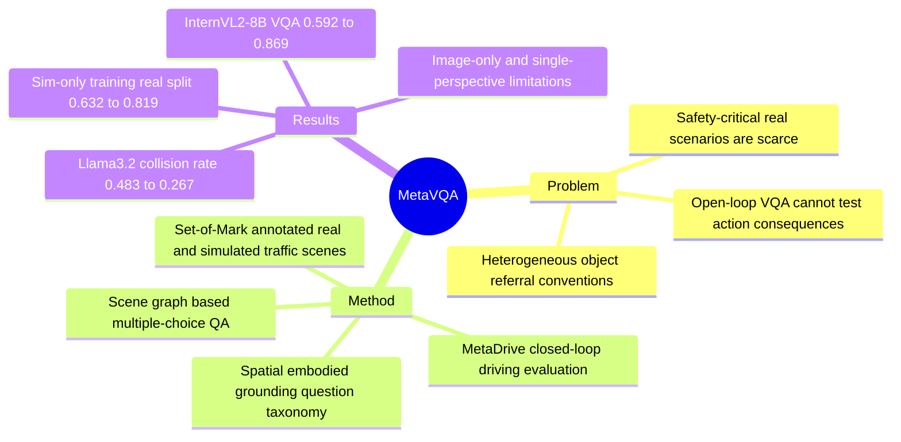

## Summary
MetaVQA 提出一个面向 VLM embodied scene understanding 的 benchmark / dataset，把 Set-of-Mark 标注的真实与仿真驾驶图像、基于 scene graph 的 VQA、以及 MetaDrive closed-loop driving evaluation 放在同一套协议下。它的核心贡献不是新模型结构，而是用较清晰的 object referral、sim-to-real VQA、safety-critical closed-loop scenarios 来检验 VLM 是否真的学到 spatial awareness 和 action consequence reasoning。

## Problem & Motivation
作者把 embodied scene understanding 分成两个相互关联的能力：spatial awareness，即从单目 2D observation 内化 3D 世界中物体之间的空间关系；embodied understanding，即以 ego 为中心理解物体、预见 action consequence，并选择达到目标的 action。

已有 autonomous driving VQA benchmarks 的问题主要有两类。第一，不同工作使用不一致且不直观的 object referral convention，例如 DriveLM 用 camera ID + 2D bbox vertices，ELM 用中心点 pixel 坐标，这会把“模型不懂场景”和“模型不懂提问格式”混在一起。第二，大多数评测停留在 open-loop VQA；即使有 closed-loop-like 设定，也可能依赖人工驾驶描述或 world model observation，因此 action 没有真实后果，或者长期 rollout 会出现视觉失真。

MetaVQA 想解决的是一个更接近 embodied agent 的诊断问题：VLM 在看到 egocentric traffic scene 时，是否能稳定理解 marked objects、相对位置、距离、朝向、潜在碰撞，以及这种理解是否能迁移到 closed-loop driving decisions，尤其是 safety-critical scenarios。

## Method
MetaVQA 的 pipeline 有三步。

1. **Scenario aggregation**：数据来自 nuScenes 和 Waymo Open Motion Dataset。由于 WOMD 没有 RGB observations，作者用 MetaDrive / ScenarioNet 重建 traffic scenarios 并渲染 egocentric RGB images；nuScenes 则同时使用真实 CAM_FRONT 图像和仿真的 digital twin。

2. **Set-of-Mark prompting**：真实 nuScenes 图像通过投影 3D bounding boxes 得到 2D boxes，仿真图像通过 instance segmentation 得到 boxes / masks，再用 Set-of-Mark 风格的数字标签标注 object of interest。论文的设定是尽量把 perception / detection 问题外包给标注，把重点放在 VLM 的 scene reasoning 上。

3. **QA generation**：从 3D scene graph 中程序化生成 multiple-choice VQA。MetaVQA 总规模为 4,305,450 questions，来自 442,102 annotated frames、400 nuScenes scenarios 和 6,900 Waymo scenarios，覆盖 59,682 seconds / 16.5 hours driving log。问题分为 3 个 supercategories：spatial questions、embodied questions、grounding questions；更细地说，论文列出 30 question types，包括 identify / relative / order / describe spatial relations、ego action 后的 distance / sideness / collision、object-object future collision，以及 label grounding。

训练与测试上，作者为实验抽取了 150,000-question training set：50,000 Waymo simulated、50,000 nuScenes real、50,000 nuScenes simulated；held-out test set 包含 9,725 questions、2,524 annotated frames、212 traffic scenarios。训练时 question-answer pairs 可带 explanation / reasoning 字段来帮助 VLM 学习，但 evaluation 使用 single capitalized multiple-choice answer。

Closed-loop evaluation 使用 MetaDrive。每 5 个 simulation steps，即 0.5 seconds wall time，VLM 接收 Set-of-Mark annotated front-view image、当前 destination / speed / allowed actions，然后选择一个离散 action；action 被映射到 steering / acceleration / brake 控制并送回 simulator。评测包含 120 driving scenarios，其中 60 个来自 nuScenes，60 个是用 CAT 从 WOMD 生成的 safety-critical scenarios。

## Key Results
- **Grounding / answerability**：human pilot study 中，6 名 novice participants 在 35 个 sampled questions 上平均 accuracy 为 88.05%，std 为 7.54%；best participant 94.2%，worst participant 74.2%。在 467 个 grounding questions 上，多数 VLM 能 zero-shot 对齐 text label 和 marked region，平均 accuracy 为 69.6%；Qwen2 最高，为 87.4%，GPT-4o 为 83.1%，InternVL2-8B 为 70.2%。

- **Set-of-Mark annotation ablation**：appendix 中用 Qwen2 固定模型、固定 base images 和 label mapping 做 grid search；box + black background + text size 1.25 的 overall / grounding 为 0.472 / 0.933，是报告表格中的最佳 overall 与并列最佳 grounding。最终 MetaVQA 固定为 bounding-box annotations、black text background、text size 1.00，理由是减少 label occlusion。

- **VQA benchmark**：Table 4 中，GPT-4o 是最佳 zero-shot baseline，overall / sim / real 为 0.628 / 0.602 / 0.655。Fine-tuning 后三个 open model 都显著提升：Qwen2 从 0.539 提到 0.844，Llama3.2 从 0.500 提到 0.774，InternVL2-8B 从 0.592 提到 0.869；其中 InternVL2-8B-finetuned 在 held-out VQA test 上最佳，sim / real 为 0.853 / 0.884。

- **Sim-to-real transfer**：Table 2 中，InternVL2-8B zero-shot 为 0.592 overall / 0.632 real；只用 simulated observations fine-tune 后，overall 到 0.807，real split 到 0.819。只用 real observations fine-tune 后，overall 为 0.825，sim split 也达到 0.792；sim + real 组合最好，为 0.869 overall / 0.853 sim / 0.884 real。

- **Data scalability**：Table 3 中，InternVL2-8B 随 training questions 增加而提升：9,375 questions 得到 0.794 overall，37,500 得到 0.845，150,000 得到 0.869；sim / real 也分别从 0.764 / 0.824 提升到 0.853 / 0.884。

- **Closed-loop driving**：Table 5 中，fine-tuning 后 route completion、off-road rate、FDE 一般改善，但 collision / ADE 不是完全单调。Llama3.2 的 route completion 从 0.529 到 0.632，off-road rate 从 0.658 降到 0.558，collision rate 从 0.483 降到 0.267，FDE 从 40.665 降到 31.811；Qwen2 的 route completion 从 0.615 到 0.667，collision rate 从 0.367 降到 0.300，FDE 从 30.214 降到 27.973。InternVL2-8B 的 VQA test accuracy 从 0.592 到 0.820，route completion 从 0.637 到 0.657，off-road rate 从 0.583 降到 0.517，FDE 从 30.520 到 27.873，但 collision rate 从 0.325 升到 0.367。

## Strengths & Weaknesses
**已知：** 这篇论文的强点是把 VLM 的 object grounding、spatial VQA、action consequence reasoning 和 closed-loop safety-critical driving evaluation 连接起来，而不是只报告 open-loop VQA accuracy。Set-of-Mark + multiple choice 的设计降低了不同 benchmark 中 object referral convention 的干扰；Table 1 的 grounding 结果和 human pilot study 支持“多数 VLM / 人类能理解这套标注和问题格式”这个前提。Sim-to-real transfer 和 closed-loop improvement 也提供了证据，说明 MetaVQA fine-tuning 不只是记住某个 image domain。

**已知：** 论文也诚实暴露了若干 failure cases / confounders。LLaVA-NeXT 在 Table 4 的 overall 只有 0.295，低于 random 0.329，parse fail rate 高达 0.275；作者把这归因于它经常不能输出合法 answer token，甚至拒答。Human pilot 中 question 19 和 question 29 分别有 5/6 和 4/6 participant 回答错误，原因包括 wording ambiguity、远距离物体受 linear perspective 影响、可见性不足；这些问题促使作者修改最终 generation process 和 visibility constraints。

**已知：** 作者自己的 limitations 是：MetaVQA 当前只包含 image observations；复杂 embodied decisions 可能需要 multi-step historical information；数据集也只包含 fixed angle 的 single-perspective observations，而 multi-camera observations 可能提供更充分上下文。

**推测：** MetaVQA 更像是把 driving scene 中的 spatial / embodied primitives 离散化并系统训练，而不是直接学习完整 autonomous driving policy。closed-loop 结果支持“VQA 学到的知识能帮助 action selection”，但一些 collision rate 例外提醒我：VQA test accuracy 与安全驾驶之间不是严格单调关系，simulator action space、scenario distribution、模型预训练差异都可能影响闭环表现。

**不知道：** 论文没有证明这些能力能迁移到真实车辆或非驾驶 embodied settings；也没有给出 multi-camera / video-history setting 下的结果。对于 GUI-agent 方向，已知启发是“reference convention 会显著影响 benchmark diagnosis”，但不知道 Set-of-Mark 式 UI element labeling 是否能带来同等的 closed-loop agent improvement，因为 paper 只在 traffic scenes 上验证。

## Mind Map

## Notes
对 GUI-agent benchmark 的直接启发是：如果 object / UI element referral 方式本身不自然，评测会把 grounding convention failure 和 real scene understanding failure 混在一起。MetaVQA 用 Set-of-Mark 把“指哪一个 object”先标准化，再测试 spatial / action reasoning；GUI agent 也可以借鉴这种分层，把 element identification、spatial relation、action consequence、closed-loop task success 分开报告。

我不完全买账的地方是，论文把 closed-loop improvement 解释为 embodied knowledge generalization，但 driving action prompt 与 simulator dynamics 仍然很特定；这更像是强证据的 proxy，而不是已经证明 VLM 获得通用 embodied intelligence。后续如果要用于我们的 research taste，最值得追的问题不是“再做一个更大 VQA 数据集”，而是如何证明这种离散 VQA supervision 学到的是可组合、可迁移的 scene-action abstraction。
