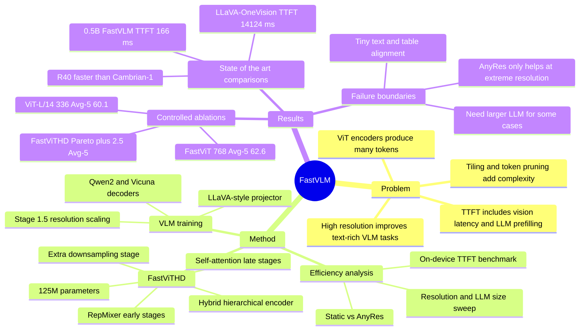

## Summary
FastVLM 研究 VLM 中 vision encoder 的高分辨率效率瓶颈，提出 FastViTHD 这个 hybrid hierarchical encoder，用更少 visual tokens 和更低 vision latency 改善 time-to-first-token。论文的核心贡献是把 resolution、visual token count、vision latency、LLM prefilling latency 和 LLM size 放在同一个实机 Pareto 分析里，而不是只报告 benchmark accuracy。主张最强的证据来自 LLaVA-style controlled ablations、M1 MacBook Pro latency benchmark，以及和 LLaVA-OneVision、ConvLLaVA、MM1、Cambrian-1 等方法的对比。

## Problem & Motivation
VLM 的高分辨率输入对 text-rich image understanding 很关键，例如 TextVQA、DocVQA、ChartQA 这类任务需要读取小字、表格或文档细节。但常用 ViT-based vision encoders 在高分辨率下会同时产生两个效率问题：vision encoding 本身变慢，visual tokens 变多后又拉高 LLM prefilling time，二者共同增加 TTFT。

已有路线通常用持续预训练适配高分辨率、tiling / AnyRes，或在 ViT tokens 之后做 pruning / resampling。作者认为这些路线要么让同一个 encoder 多次处理 tile，要么先产生大量 tokens 再删减，设计上不够直接。本文的问题 formulation 是：如果目标是高分辨率 VLM，vision backbone 本身是否应该天然 hierarchical，下采样后直接输出更少、更高质量的 visual tokens？

## Method
FastVLM 的整体结构仍是 LLaVA-style VLM：image encoder、vision-language projector 和 decoder-only LLM。方法的新意集中在 vision encoder 与效率评估方式。

第一步，作者先验证 MobileCLIP 中的 FastViT hybrid encoder 能作为 VLM image encoder。FastViT 的卷积部分支持 native resolution scaling，hierarchical 下采样会比 ViT 输出更少 tokens；当 FastViT 从 256×256 扩到 768×768 时，它输出 576 visual tokens，与 ViT-L/14 336×336 相同，但 encoding latency 从 ViT-L/14 的 127.4 ms 降到 34.5 ms，Avg-5 从 60.1/61.2 提到 62.6。作者还尝试 multi-scale features，用 depthwise convolution pooling 聚合早期 stage features，使 Avg-5 从 62.6 小幅升到 62.9。

第二步，作者设计 FastViTHD。它是 5-stage hybrid architecture，前 3 个 stage 用 RepMixer blocks，后 2 个 stage 用 multi-head self-attention blocks；depth 为 [2, 12, 24, 4, 2]，embedding dimensions 为 [96, 192, 384, 768, 1536]，总参数 125.1M。相比简单把 FastViT 的 self-attention stage 加宽加深，FastViTHD 增加额外 downsampling stage，让 self-attention 在更低分辨率 tensor 上运行，并让最终 visual tokens 显著减少。模型先按 MobileCLIP / CLIP setup 在 DataCompDR-1B 上预训练，再进入 VLM instruction tuning。

第三步，论文把 accuracy-latency trade-off 显式建模为 `(Resolution, LLM size, visual token count)` 的选择问题。TTFT 被定义为 vision encoder latency + LLM prefilling time；作者在 M1 MacBook Pro 上用 Core ML benchmark image encoder，用 MLX 估计 LLM prefilling latency。对 FastViTHD / FastViT，作者组合 Qwen2-0.5B/1.5B/7B 与多种输入分辨率，画 Pareto curve，而不是固定一个 LLM 或只看视觉模块耗时。

训练上，ablation 主要用 LLaVA-1.5 2-stage setup：Stage 1 用 LLaVA-558K 只训 projector，Stage 2 用 LLaVA-665K tuning 全模型。主结果还使用 Stage 1.5 的 15M Recap-CC3M + Recap-CC12M resolution scaling，以及 1.1M / 6.5M / 12.5M instruction tuning datasets；最佳模型再用 MammothVL 的 10.6M high-quality instruction tuning 数据做 Stage 3。

## Key Results
- **FastViT vs ViT-L/14 controlled setup**：LLaVA-1.5 + Vicuna-7B 下，ViT-L/14 336×336 为 **576 tokens / 127.4 ms / Avg-5 60.1**；ViT-L/14 trainable 为 **Avg-5 61.2**；FastViT 768×768 为 **576 tokens / 34.5 ms / Avg-5 62.6**。主要增益集中在 text-rich benchmarks：TextVQA **58.2/59.2 → 62.3**，DocVQA **28.1/28.7 → 34.4**。
- **FastViTHD vs ConvNeXT**：Table 4 中，FastViTHD 1024×1024 达到 **256 tokens / 235.6 ms / Avg-5 63.9**，与 ConvNeXT-XXL 512×512 的 **256 tokens / 397.1 ms / Avg-5 63.9** 持平但更快；FastViTHD 768×768 为 **144 tokens / 122.6 ms / Avg-5 62.8**，高于 ConvNeXT-L 512×512 的 **256 tokens / 71.9 ms / Avg-5 61.3**。
- **Token pruning comparison**：FastViTHD 256×256 只用 **16 tokens**，在 GQA / SQA / TextVQA / POPE / VQAv2 / SeedBench 上为 **60.6 / 69.2 / 53.1 / 82.3 / 74.7 / 58.8**；同 token 级别的 ViT-L/14 MQT 为 **57.6 / 67.5 / - / 80.8 / 71.1 / -**。FastViTHD 512×512 的 **64 tokens** 达到 TextVQA **59.3**、POPE **86.4**、SeedBench **61.8**，高于 SparseVLM / VisionZip 等 64-token 设置。
- **Pareto trade-off**：在 FastViTHD vs FastViT 的 Qwen2-0.5B/1.5B/7B sweep 中，作者报告 FastViTHD 的 Pareto curve 比 FastViT 高，给定 TTFT 预算时 Avg-5 提升超过 **+2.5 points**，达到同等 VLM performance 最多可 **3× faster**。论文还指出高分辨率 + 小 LLM 可能 suboptimal，因为小 LLM 无法有效利用过多 visual tokens，TTFT 反而被 vision latency 主导。
- **Main comparison, 0.5B**：FastVLM R4 使用 Qwen2-0.5B、FastViTHD 1024×1024、256 tokens，TTFT **166 ms**，在 TextVQA / DocVQA / SeedBench / MMMU 上为 **62.9 / 70.4 / 69.2 / 32.9**；LLaVA-OneVision R2 使用同为 Qwen2-0.5B 的设置，1152×1152、7290 tokens、TTFT **14124 ms**，对应为 **- / 70.0 / 65.5 / 31.4**。作者据此总结 FastVLM 在同 0.5B LLM 下有 **85× faster TTFT**，vision encoder **3.4× smaller**。
- **Main comparison, 7B / multiple encoders**：FastVLM R40 使用 Qwen2-7B、1024×1024、256 tokens、TTFT **641 ms**，GQA / TextVQA / DocVQA / SeedBench / MMMU 为 **66.0 / 73.1 / 78.7 / 75.9 / 42.8**；Cambrian-1 R44 使用 multiple vision encoders、576 tokens、TTFT **5085 ms**，对应为 **64.6 / 71.7 / 77.8 / 74.7 / 42.7**。论文报告 FastVLM R40 相比 Cambrian-1 约 **7.9× faster**。
- **Text-rich benchmarks**：FastVLM-0.6B R3 在 ChartQA / OCRBench / TextVQA / DocVQA / InfoVQA 上为 **71.4 / 55.8 / 65.8 / 79.1 / 43.3**，相比 SmolVLM2-0.5B 的 **62.8 / 61.0 / 60.2 / 70.5 / 25.5**，除 OCRBench 外更高且 visual tokens 为 **256 vs 1088**。FastVLM Qwen2-7B 1024×1024 + 12.5M IT 在 Table 11 为 ChartQA **77.5**、OCRBench **65.7**、TextVQA **73.4**、DocVQA **82.7**、InfoVQA **51.2**。
- **CVBench / MathVista**：FastVLM Qwen2-7B 1024×1024、256 tokens、116.3 ms vision latency 在 CVBench 2D / 3D / MathVista 上为 **76.7 / 80.9 / 64.8**；Cambrian-1 为 **72.3 / 72.0 / 49.0**，但 Cambrian-1 的 encoder setup 是 multiple resolution / multiple encoders，vision latency **3861.4 ms**。

## Strengths & Weaknesses
**已知：**
- 论文把 VLM efficiency 的瓶颈拆得比较清楚：高分辨率不是只影响 vision encoder，也会通过 visual token count 放大 LLM prefilling cost。这个拆分比单纯报告 encoder FLOPs 更接近真实 VLM latency。
- FastViTHD 的设计选择有多组 ablation 支撑：FastViT vs ViT-L/14、multi-scale feature pooling、FastViTHD vs ConvNeXT、FastViTHD vs token pruning、static resolution vs AnyRes、不同 LLM size + resolution 的 Pareto curve。
- 实验不是只追求小模型：0.5B、1-2B、7B decoder 都有报告，并且在 Qwen2 与 Vicuna setting 下都展示了分辨率、token 数、decoder quality 的相互作用。
- 对 GUI / document-heavy VLM 的间接价值在于，TextVQA、DocVQA、ChartQA、OCRBench、InfoVQA 这些任务都受高分辨率视觉编码影响；FastVLM 说明“更少但更好的 high-resolution tokens”可能比先产生大量 ViT tokens 再 pruning 更直接。

**已知的局限 / failure cases：**
- 论文的 qualitative analysis 承认，DocVQA / ChartQA 失败常发生在 text too small 或 precise alignment required 的场景，例如读表格。提高分辨率有时足够，但 Table 16 显示有些 ChartQA / DocVQA case 需要 higher resolution + larger LLM，单独加分辨率不能解决。
- AnyRes / dynamic resolution 不是无条件更好。作者报告 static resolution 通常有更好的 accuracy-latency trade-off；dynamic resolution 主要在 1536×1536 这类 extreme resolution 且 tile 数较少时有价值，多 tile 会引入更多 semantic breaks。
- 对比近期方法时，training data size、evaluation toolkit 和是否公开可导出模型并不完全一致。论文在表中尽量列出 PT/IT 数据量和 TTFT，但仍不能完全消除跨论文比较的不一致。
- FastViTHD 是 Apple-oriented 实机 benchmark：image encoder 用 Core ML 在 M1 MacBook Pro neural engine 上测，LLM 用 MLX on GPU 估计 prefilling。这个证据对 on-device Apple hardware 很强，但论文没有系统证明同样比例会迁移到 NVIDIA / Android NPU / server GPU。

**推测：**
- 对 GUI agent 来说，FastVLM 的最大启发不是架构细节本身，而是将 screenshot resolution、token budget 和 first-action latency 联合优化。GUI task 往往需要高分辨率 OCR / icon grounding，但 agent 交互又要求低 TTFT；hierarchical encoder 可能比事后 token pruning 更适合这种场景。
- FastViTHD 的优势可能依赖 CLIP-style pretraining + VLM instruction tuning 的共同作用。单看 encoder 的 zero-shot CLIP metrics，它不是所有维度都胜出；真正优势来自高分辨率下输出更少 visual tokens 后，LLM prefilling cost 显著下降。

**不知道 / 未报告：**
- 论文没有直接评估 GUI grounding、web-agent、computer-use 或 embodied closed-loop tasks，因此不能声称 FastVLM 会提升 agent success rate。
- 论文没有报告 OCRBench 上为何 FastVLM-0.6B 低于 SmolVLM2-0.5B，也没有细分哪些 document layouts 对 FastViTHD 仍然脆弱。
- 论文没有给出端到端 generation throughput、长回答 decode latency、memory footprint、energy consumption 或 batch-serving 场景下的完整 profile；TTFT 是重要但不完整的部署指标。
- 没有看到 DOI；论文只在首页给出 arXiv:2412.13303v2 和 GitHub code/models URL。

## Mind Map

## Notes
这篇论文值得放进 VLM / GUI-agent 的 efficiency mental model：screen understanding 里经常默认“提高截图分辨率会变慢”，但 FastVLM 的更细结论是，慢不只来自 pixel compute，还来自 visual tokens 进入 LLM 后的 prefilling。若未来做 GUI agent 的 high-res perception，可以把评价指标从 accuracy-only 改成 `(grounding/doc accuracy, visual tokens, TTFT, first-action success)`。

需要避免 overclaim：FastVLM 证明的是 VLM benchmark 上的 high-resolution efficient encoding，不是 GUI-agent runtime contract，也不是 OCR / document reasoning 的完整解法。论文自己的 failure cases 已经说明，小字、表格对齐、需要知识或 reasoning 的问题仍然会在 higher resolution 或 small LLM 下失败。
