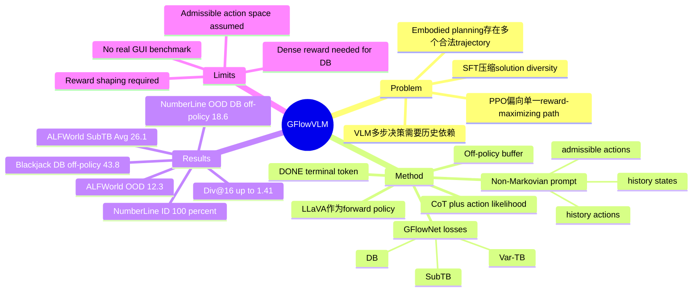

## Summary

GFlowVLM 将 Generative Flow Networks 用作 VLM 的 fine-tuning objective，把多步视觉-语言决策建模为 non-Markovian trajectory sampling，而不是只做 SFT imitation 或 PPO reward maximization。它在 NumberLine、Blackjack 和 ALFWorld 上提升了 success rate、OOD generalization 和 successful trajectory diversity，但依赖可用环境 reward、显式 action space 和 reward shaping。

## Problem & Motivation

作者关注的是 VLM 在 sequential decision-making / embodied planning 中的 multi-step reasoning：模型不仅要读图和理解任务，还要在多步交互中保持历史状态、选择 action，并在多个可行解之间探索。现有 SFT 假设训练样本 IID，容易把策略压到有限 demonstration mode；PPO 类 RL4VLM 优化 cumulative reward，作者认为会偏向单一高回报路径，并可能忽略长期依赖。

这篇论文的核心动机是：许多任务并非只有一个正确 trajectory，尤其 ALFWorld 这类任务存在多个合法计划；如果训练目标只追逐单一最优策略，可能牺牲 diversity 和 OOD robustness。GFlowNets 的吸引力在于学习一个按 reward 成比例采样 terminal states / trajectories 的 stochastic policy，因此理论上更适合生成多个 high-reward reasoning paths。

## Method

**GFlowVLM formulation**：把 LLaVA-1.6-Mistral-7B 作为 forward policy \(P_F\)。在时间步 \(t\)，输入包含当前 visual observation \(o_t\) 和 prompt \(p_t\)；prompt 写入 goal description、history states \(s_{0:t}\)、history actions \(a_{0:t}\) 与当前 admissible action space \(A_t\)。输出包含 CoT reasoning \(c_t\) 和 action \(a_t\)，action 与环境交互后得到 reward、下一状态和下一组可行动作。

**Non-Markovian state**：论文显式把历史 states/actions 放入 prompt，令策略条件为 \(P_F(z_{t+1}\mid z_{0:t}, g;\theta)\)。这是和 FoR 等 Markovian GFlowNet reasoning 方法的主要区别之一；作者认为 long-horizon planning 需要历史依赖。出于计算成本和当前 VLM 多图能力限制，方法只输入当前 image \(o_t\)，历史主要以文本 state/action 形式进入 prompt。

**CoT + action probability**：forward policy 的 log-probability 是 action token likelihood 与 CoT token likelihood 的加权和：

\[
\log P_F = \log P_{\text{Action}}(a_t \mid z_{0:t}, c_t, g; \theta) + \lambda \log P_{\text{CoT}}(c_t \mid z_{0:t}, g; \theta)
\]

论文在 NumberLine 上消融 \(\lambda\)，最终使用 \(\lambda=0.4\)；过高或过低都会让 CoT 或 action likelihood 过度主导。

**Training objectives**：作者比较三种 GFlowNet loss：

- **Var-TB**：控制 trajectory balance 估计量的方差，使 complete trajectory 的采样概率与 reward 成比例。
- **SubTB**：在 subtrajectory 上做局部 flow consistency，适合较长 trajectory。
- **DB**：在每个 transition 上做 detailed balance，需要 dense reward；因此 ALFWorld 因缺少 dense rewards 没有使用 DB。

**Terminal modeling**：SubTB 和 DB 需要估计终止概率 \(P_F(\top\mid z_{0:t})\)。作者向 tokenizer / prompt 引入 `[DONE]` token，并对正确完成 trajectory 做额外 SFT initialization；Table 3 显示没有 SFT initialization 时 SubTB/DB 性能大幅下降。

**Reward handling**：GFlowNets 要求 non-negative reward。NumberLine 和 Blackjack 原环境含负奖励，作者对 reward 做非负化 shaping；ALFWorld 使用 RL4VLM 中的非负 sub-goal / goal reward component，并移除不合法 action 的负项，因为 prompt 已限制模型从 admissible actions 中选择。

## Key Results

**Motivating sequence experiment（1,000 samples, LLAVA-v1.6-Mistral-7B）**：

- Temperature 1.0：GFlowVLM success rate 76.4%、#Solutions 1.60；PPO 为 50.2%、1.13；SFT 为 21.7%、1.03。
- Temperature 1.2：GFlowVLM success rate 77.9%、#Solutions 1.61；PPO 为 49.8%、1.15；SFT 为 22.0%、1.09。
- 这个 toy task 支持作者的局部论点：GFlowNet fine-tuning 比 SFT/PPO 更能保留 Fibonacci 与 arithmetic sequence 两类可行 reasoning paths。

**NumberLine / Blackjack（Table 3, episode success rate %）**：

- In-distribution NumberLine：RL4VLM 89.4，RL4VLM + non-Markovian prompt 90.3；GFlowVLM Var-TB/SubTB/DB on-policy 均为 100.0。
- NumberLine OOD：RL4VLM 3.1，RL4VLM + non-Markovian prompt 4.4；GFlowVLM on-policy Var-TB/SubTB/DB 分别为 6.2/7.0/9.1，off-policy 分别为 17.3/16.7/18.6。
- Blackjack：RL4VLM 40.2，RL4VLM + non-Markovian prompt 41.0；GFlowVLM on-policy Var-TB/SubTB/DB 为 41.4/41.7/42.2，off-policy 为 43.0/42.4/43.8。
- SFT baselines 明显较弱：SFT-w/o-[DONE] 在 NL/NL-OOD/BJ 为 24.8/0.0/23.1，SFT-w/-[DONE] 为 24.0/0.0/20.2。

**ALFWorld（Table 4, success rate %, Div@16）**：

- RL4VLM Markovian：Avg 21.7、OOD 4.8、Div@16 1.12。
- RL4VLM non-Markovian：Avg 22.1、OOD 6.1、Div@16 1.11。
- GFlowVLM SubTB non-Markovian：Avg 26.1、OOD 12.3、Div@16 1.40。
- GFlowVLM Var-TB non-Markovian：Avg 25.7、OOD 10.9、Div@16 1.41。
- 相比 RL4VLM non-Markovian，SubTB 的 ALFWorld Avg 提升 4.0 pp，OOD 提升 6.2 pp，Div@16 从 1.11 提到 1.40。

**Ablations**：

- Off-policy data 对 NumberLine OOD 很关键：DB 从 on-policy 9.1 提升到 off-policy 18.6，Var-TB 从 6.2 到 17.3，SubTB 从 7.0 到 16.7。
- SFT initialization 对 SubTB/DB 是必要条件：无 SFT initialization 时，on-policy SubTB 在 NL/NL-OOD/BJ 只有 23.0/0.0/8.4，DB 只有 24.3/0.0/6.8；加入 SFT initialization 后 on-policy SubTB/DB 达到 100.0/7.0/41.7 和 100.0/9.1/42.2。
- Non-Markovian prompt 普遍更好：ALFWorld SubTB 从 Markovian Avg 22.1、OOD 8.0 提升到 non-Markovian Avg 26.1、OOD 12.3；Var-TB 从 Avg 22.9、OOD 7.6 提升到 Avg 25.7、OOD 10.9。
- 训练效率：作者报告 Figure 3 中 GFlowNets 在 NumberLine、Blackjack、ALFWorld 上比 RL4VLM 更快收敛，达到最佳性能约少用 10,000 environment steps。

## Strengths & Weaknesses

**已知亮点**：

- 方法问题选得合理：multi-step VLM agent 任务常有多个成功 trajectory，GFlowNets 的 reward-proportional sampling 与这个结构匹配。
- 非 Markovian prompt、`[DONE]` terminal modeling、CoT/action likelihood 加权三者形成了一个完整训练方案，而不是只把 GFlowNet loss 粘到 VLM 上。
- 实验覆盖 synthetic arithmetic reasoning、stochastic Blackjack 和 embodied ALFWorld，能看到从 toy 到 embodied planning 的一致趋势。
- Ablation 信息量足：off-policy data、SFT initialization、Markovian vs non-Markovian、不同 GFlowNet losses 都有数字支撑。

**已知局限**：

- NumberLine / Blackjack 的 reward 被改写为 non-negative shaping；虽然作者也跑了 RL4VLM with revised reward，但主表比较仍需要谨慎解读，因为 GFlowVLM 和 RL4VLM 的最强设置并不完全共享同一 reward landscape。
- ALFWorld 结果提升真实但幅度中等：Avg 26.1 仍是低成功率水平，说明方法没有解决 embodied planning 的根本瓶颈。
- DB loss 依赖 dense reward，ALFWorld 无 dense rewards 时无法使用；这限制了方法在 sparse long-horizon environments 中的通用性。
- 方法需要 admissible action space 作为 prompt 输入；这对很多真实 GUI / computer-use setting 不是天然可得。
- 论文只使用 small-sized VLM，并在 limitation 中承认计算资源限制；larger VLM 是否进一步受益仍未验证。
- failure analysis 不系统。Appendix E 展示 PPO 在 ALFWorld 中走向 ottoman、拿 pillow 等错误，而 GFlowVLM 给出两条正确轨迹；但论文没有给出 GFlowVLM 自身失败类型的统计。

**推测**：

- 对 GUI agent / CUA 的启发在于：如果环境有 programmatic verifier、可枚举 admissible actions 或可生成高质量 off-policy trajectories，GFlowNet-style fine-tuning 可能比 PPO 更适合学习多条可行 workflow。
- 这个优势可能主要来自“多模态 trajectory diversity + history conditioning”，而不只是 GFlowNet loss 本身；需要在真实 GUI benchmark 上拆分验证。

**不知道**：

- 不知道该方法在 OSWorld、AndroidWorld、WebArena 等真实 GUI / web-agent benchmark 上是否有效。
- 不知道在无 admissible action list、无 dense reward、只有 screenshot + free-form action 的环境中，如何稳定定义 \(R(x)\) 和 terminal state。
- 论文正文只给出 project page，没有直接给出 GitHub code link；可复现性需要进一步核对 artifact。

## Mind Map

## Notes

- 本文不做 GUI grounding，但它支持一个更一般的训练假设：长程 agent 任务中的“多条正确路径”不应被训练目标过早 collapse 成单一路径。这个结论在本文中由 ALFWorld Div@16 与 qualitative trajectories 支撑。
- 值得 follow-up 的实验：在有 programmatic verifier 的 GUI / web environment 中，把 successful trajectories 的 diversity 作为主指标，比较 SFT、PPO/GRPO、GFlowNet fine-tuning 是否真的产生不同 workflow modes。
- 一个关键风险：GFlowNet 需要 non-negative reward distribution；如果目标环境只有 sparse binary verifier，reward shaping 是否会改变任务本身，需要单独验证。
