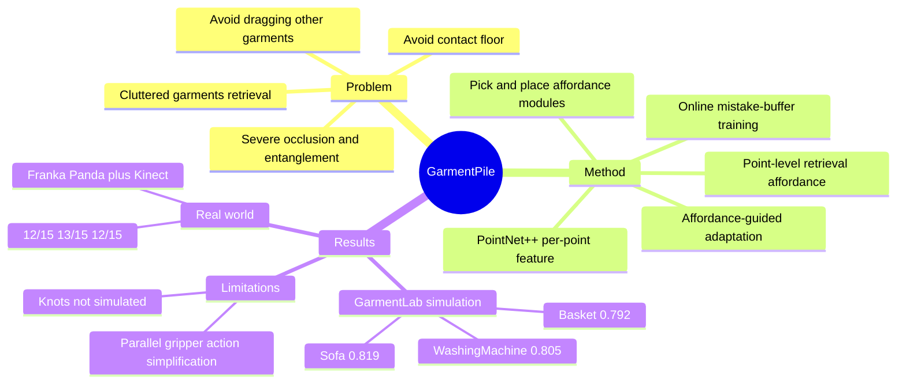

## Summary

GarmentPile 研究 cluttered garments retrieval：机器人需要从衣物堆中逐件取出 garment，同时避免目标衣物接触地面或拖出其他衣物。作者用 3D point cloud 学习 point-level retrieval affordance，并在整体 affordance 不足时触发 affordance-guided pick-and-place adaptation，把高度缠绕的状态重整到更可操作的状态。

## Problem & Motivation

单件 garment manipulation 已经覆盖 unfolding、folding、hanging、dressing 等任务，但真实场景经常是 washing machine、basket、sofa 上的多件衣物堆叠。cluttered garments 比刚体 clutter 或单件 garment 更难：garment 形变空间大，遮挡和缠绕严重，且一次 retrieval 可能让目标衣物接触地面，或把其他衣物一起拖出。

作者的核心判断是：cluttered garments 需要一种能同时表达局部 geometry、整件 garment structure、inter-object relation，以及多个可行动候选点的表示。point-level affordance 适合这个问题，因为每个点的 score 可以表示 retrieval actionability，也能自然表达 multi-modal retrieval candidates。另一个动机是环境缺口：此前 simulation 和 manipulation 主要关注单件 garment 或较简单 deformable objects，因此作者基于 GarmentLab 构建了 9 个 garment categories、126 件 ClothesNet garments、3 类代表性场景的 evaluation environment。

## Method

任务定义为给定 k 件 garment clutter 的 3D point cloud observation $O \in R^{N \times 3}$，逐件 retrieval，并避免两个 failure：target garment 接触地面、retrieving one garment 时拖出其他 garments。retrieval action 被简化为 grasp point $p_{retrieve}$ 加 heuristic retrieval orientation；当没有合适 retrieval point 时，系统执行 adaptation action $(p_{pick}, p_{place})$ 来重整场景。retrieval / pick / place 三类 affordance map 都是 per-point score，归一化到 $[0,1]$，推理时选择最高分点。

Retrieval Affordance Module 使用 PointNet++ 从 point cloud 中提取 per-point feature，再用 MLP + sigmoid 预测每个点的 retrieval score。监督信号来自直接在点 p 执行 retrieval 后得到的 success / failure，loss 是 BCE。论文强调 PointNet++ 的局部到全局特征聚合能让每个点同时携带 local geometry、global structure 和 garment relations，从而避免抓边缘导致接触地面、或抓缠绕区域拖出其他衣物。

Adaptation Module 的触发条件是 learned retrieval affordance 显示当前场景没有足够好的 action points。作者通过经验测试设定规则：当 retrieval affordance > 0.9 的点占比 $P_{high}$ 不超过 0.1 时，执行 adaptation；循环 adaptation 直到 $P_{high} > 0.1$。为了降低 pick-and-place 的大动作空间难度，作者先学 conditioned place affordance：给定 pick point，预测每个 place point 是否能提升 adaptation 后的 retrieval affordance；再用训练好的 Place Module 为每个 pick point 找到 best following place，并以此监督 Pick Module。

训练上，Retrieval Affordance 使用 20,000 条数据训练 120 epochs；Pick 和 Place Affordance 使用 8,000 条数据训练 80 epochs。batch size 分别是 128 和 64，硬件是 NVIDIA GeForce 4090，每个 module 训练少于 24 小时。作者还做 online data boost：把模型在 sampled scenes 中预测失败的点加入 buffer，再和 offline data 混合训练，以提升 unseen clutters 上的 robustness。

## Key Results

- **GarmentLab simulation benchmark**：在 WashingMachine / Sofa / Basket 三个场景上，Ours 的 success rate 分别是 **0.805 / 0.819 / 0.792**，高于 Where2Act 的 **0.585 / 0.643 / 0.624**、Support-M 的 **0.562 / 0.784 / 0.684**、GPT-Fabric-M 的 **0.463 / 0.408 / 0.384**。
- **Ablation on adaptation**：Ours w/o Adaptation 为 **0.712 / 0.702 / 0.693**，Ours w/o Pick Afford 为 **0.724 / 0.704 / 0.716**，Ours w/o Place Afford 为 **0.778 / 0.743 / 0.731**，完整方法为 **0.805 / 0.819 / 0.792**。这说明 adaptation、pick affordance、place affordance 都有贡献，其中 pick affordance 对选择有效 adaptation pick point 尤其关键。
- **Real-world Franka Panda + Kinect benchmark**：Ours 在 WashingMachine / Sofa / Basket 上达到 **12/15 / 13/15 / 12/15**，对比 Where2Act **9/15 / 10/15 / 8/15**、Support-M **8/15 / 12/15 / 9/15**、GPT-Fabric **6/15 / 7/15 / 6/15**。
- **Segmentation baseline analysis**：Support-M 使用 SAM 的 simulation success rate 为 **0.56**，finetune SAM 后为 **0.67**，GT segmentation upper bound 为 **0.73**，但 real-world success rate finetune 前后都为 **8/15**；论文据此说明 segmentation 改进不足以解决 point-level manipulation choice 和 sim-to-real gap。
- **Generalization / adaptation rounds**：seen shapes、seen categories 中的 novel shapes、novel categories 的 success rate 分别为 **0.805 / 0.754 / 0.725**。adaptation rounds 从 0 到 3 时 success rate 为 **0.712 / 0.782 / 0.803 / 0.805**，3 rounds random adaptation 只有 **0.719**。

## Strengths & Weaknesses

**已知的 strengths**：这篇论文把 cluttered garment retrieval 明确建模成 point-level actionability 问题，比 object-level segmentation 或 language-only relation inference 更贴近实际动作选择。方法上的亮点不是单纯预测 retrieval affordance，而是用 retrieval affordance 作为 adaptation 的监督与终止信号，形成 retrieval 和 scene reorganization 的闭环。实验覆盖 simulation 与 real world，且包含 Where2Act、Support-M、GPT-Fabric-M、SAM finetuning、adaptation rounds、novel categories 等多组对照，对 failure mode 的讨论比较充分。

**已知的 weaknesses / limitations**：动作空间被简化为 parallel gripper 的 pick-and-place 和 retrieval point，retrieval orientation 仍是 heuristic，placing positions 通常预定义，因此还不是通用 garment manipulation policy。论文在 limitation 中明确指出 simulation 不能覆盖 knots between garments；这类 extreme cases 可能需要 two robots 或 dexterous hands，而不是单个 parallel gripper retrieval。作者还承认其他 garment configurations 和 correlations 仍可能存在。

**推测**：$P_{high} > 0.1$ 的 adaptation 触发阈值来自 empirical tests，可能对 GarmentLab 的三类场景和当前 policy distribution 有依赖；换成更多 garment categories、更复杂容器或不同 gripper 时，阈值是否稳定还需要重新验证。point-level affordance 作为 dense actionability representation 对 embodied agent 很有参考价值，但本文没有 language-conditioned planning、VLA 或 GUI-agent 组件，和 GUI / VLM agent 的关系主要是表示层面的启发而非直接方法迁移。

**不知道**：论文文本中没有给出 DOI，也没有在正文中提供 GitHub code link；只提到 project page。simulation 表格没有在正文中明确每个 success rate 的 trial count 或 variance，因此无法从文本判断统计显著性。

## Mind Map

## Notes

这篇更像是 embodied visual affordance / deformable manipulation 论文，而不是 VLM 或 agentic planning 论文。对我的启发是：在物理操作里，dense affordance 的价值不只是找到当前最优 action，还可以作为判断当前 state 是否值得操作、是否需要先重整 scene 的中间信号。后续如果关注 GUI-agent 或 computer-use，可以类比思考"actionability map"如何同时承担 action selection 与 state repair trigger，但这只是跨领域启发，不是本文实验结论。
