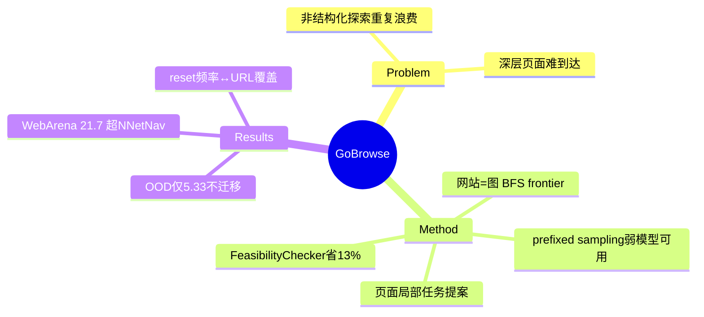

## Summary

Go-Browse 把网站探索形式化为**图发现**（网页=节点、跳转=边），用类 BFS 外循环维护"已发现未探索"URL frontier，内循环在每个页面上做局部任务提案与求解——核心是**信息跨 episode 复用**：一次发现的页面为后续所有任务服务，而非像 NNetNav 那样每条轨迹独立重新导航。在 WebArena 5 域 100 个 URL 收集 9,504 条成功轨迹（$975.57），Qwen-2.5-7B 微调后 WebArena 21.7%，超 NNetNav-7B（18.8%）2.9pp、超 GPT-4o-mini 2.4pp。

## Problem & Motivation

非结构化探索（[[Papers/2410-NNetNav]] 式）浪费算力：独立 episode 反复重新发现相同页面、生成相似任务，且难以到达深层页面。把导航（找到正确页面）与局部任务执行解耦，可以系统性覆盖网站拓扑。

## Method

- **外循环（图发现）**：维护 discovered-but-unexplored URL frontier，BFS 式遍历；每域 20 个 URL、共 100 节点。
- **内循环（页面局部）**：**NavExplorer**（Claude-3.7-Sonnet）提出导航型任务探索邻居页；**PageExplorer**（GPT-4o + Claude）基于当前页功能生成具体可行的本地任务（信息查找/导航/内容修改）；**FeasibilityChecker**（Claude 尝试执行 ≤3 次 + GPT-4o judge）过滤不可行任务——滤掉 403 个任务、省 13% rollout；**Solvers** 用便宜模型（GPT-4o-mini/Qwen-7B）批量产轨迹。
- **Prefixed sampling（关键设计）**：求解器可以**直接从已发现页面出发**（前缀=到达该页的导航），而非每次从根开始——深层节点上成功率显著更高，**让弱模型也能贡献数据**（bootstrapping）。
- 基建：依赖 WebArena 可重置沙盒；reset 频率影响覆盖（1 reset/30 任务→183 URL vs 15 reset/2 任务→260 URL）；5 节点 SLURM 3 周 + 8×H100 微调 40 小时。

## Key Results

- 数据：9,504 成功 + 17,245 失败轨迹 / 3,422 唯一任务 / $975.57。
- **WebArena 21.7%**（Qwen-2.5-7B）：> NNetNav-7B 18.8%、> GPT-4o-mini 19.3%；Reddit 30.7% / Admin 25.3% / Shopping 22.4%。
- **OOD 警示**：Online-Mind2Web 上只有 5.33%（NNetNav-7B 4.00%，GPT-4o-mini 9.33%）——沙盒内结构化探索的收益**不迁移**到真实网站。

## Strengths & Weaknesses

**Strengths**：图发现 framing 干净且可复用（页面级知识是跨任务资产）；prefixed sampling 是"环境提供中间态起点"价值的直接实证——弱模型在深节点的成功率靠它撑起；FeasibilityChecker 的预过滤经济学量化清楚。

**Weaknesses / 边界**：
- **reset 依赖**：内容修改类任务会污染共享沙盒，reset 频率成了覆盖率的调节旋钮（183 vs 260 URL）——图发现范式把环境的 reset 成本直接变成了数据质量约束。
- 只在 WebArena 5 域验证；OOD 5.33% 说明学到的可能是站点拓扑记忆而非通用探索能力（NNetNav 在真 OOD 上反而相对更稳）。
- 17K 失败轨迹未利用（自认，留给 RL）。
- 多模型流水线（Claude+GPT-4o）成本结构复杂，$975 只是 API 账单。

## Mind Map

## Notes

- **对 AFE 的证据价值（map + init affordance 的数据侧实证）**：Go-Browse 的图发现 = 在数据采集时手工构建了 [[Topics/AgentFriendlyEnvironment-Survey]] AFE Protocol 的 `map()`（route graph）；prefixed sampling = 轴 1 L3"可编程注入中间态"的价值证明（深节点成功率、弱模型 bootstrap）。**这两个 affordance 目前只在训练管线里用，没暴露给推理时的 agent**——与 WebOperator 的 checkpoint 同属"engine 能力被 trainer 独占"的证据。
- "reset 频率 ↔ URL 覆盖"的权衡是 reset 成本进入数据质量的直接量化——WebServ 式 O(1) 快照可以让这个权衡消失（每任务独立 fork）。
- OOD 崩塌（21.7%→5.33%）与 [[Papers/2410-NNetNav]] 的 WebArena→live 9.5% 一致：**沙盒合成数据的站点绑定问题是任务供给家族的共同软肋**，支持 survey 轴 5 "任务多样性>单站深度"的推断。
