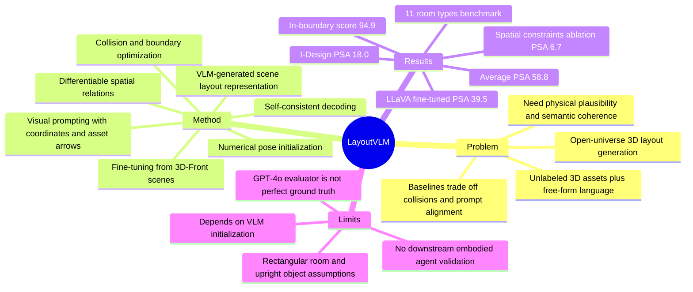

## Summary
LayoutVLM 解决 open-universe 3D layout generation：给定 unlabeled 3D assets 和自由语言指令，生成同时物理可行、语义一致的室内场景布局。核心做法是让 VLM 从带视觉标注的 scene/asset renderings 中生成两种互补表示：numerical pose initialization 和可微 spatial relations，再用 self-consistent decoding 与 differentiable optimization 修正碰撞和越界。实验在 11 个 room types 上把平均 PSA 提到 58.8，明显高于 LayoutGPT 16.6、Holodeck 5.6、I-Design 18.0。

## Problem & Motivation
作者关注的是 open-universe 3D layout generation：输入自然语言 layout criterion、四面墙定义的空间，以及一组无类别标签的 3D meshes，输出每个 object 的 3D position 和 z-axis rotation。这个问题对 embodied agent 很重要，因为自动生成多样、真实、可交互的模拟环境可以扩展训练数据，但难点在于语言语义、空间约束和物理可行性必须同时满足。

已有方法的失败模式很明确：LayoutGPT 这类直接预测 numerical poses 的方法语义上常较合理，但会产生 object collisions 或 out-of-bound placements；Holodeck 这类先生成 spatial scene graph 再做约束搜索的方法更重视物理约束，但在 asset 数量多、约束刚性强或语言细节复杂时难以找到既可行又贴合 prompt 的布局。论文的关键判断是：单靠 VLM/LLM 的一次性 3D 坐标预测不够，单靠离散 constraint search 也不够；需要一个既能表达语义、又能进入连续优化的中间表示。

问题设置本身也有边界：论文假设输入 3D objects 是 upright 的，并用 GPT-4o 判断 front-facing orientation、生成 object textual description；空间形式是由四面 cardinal-direction walls 定义的 room。也就是说，它不是任意建筑结构、任意 mesh 状态下的通用 3D scene synthesis。

## Method
**Scene layout representation.** LayoutVLM 的表示由两部分组成。第一部分是 VLM 预测的 initial object poses `{p_i}`，给优化提供语义合理的初始位置；第二部分是 spatial relations，每个 relation 对应一个 differentiable cost function，用来在优化过程中保留布局语义。论文定义了 5 类 relation：`distance`、`on_top_of`、`align_with`、`point_towards`、`against_wall`，分别覆盖相对距离、堆叠、朝向对齐、面向目标、靠墙放置。

**Visual prompting for VLM layout planning.** 输入给 VLM 的不是纯文字，而是 current scene renderings 和 individual asset views。为了降低 VLM 的空间尺度误差，系统在 3D scene renderings 里加入两类 visual marks：每 2 meters 一个 coordinate point，以及 coordinate frame visualization；对每个 asset 还标注 front-facing arrow，支持 `align_with` / `point_towards` 这类 rotation constraints。面对很多 assets 时，系统先用 LLM 按 semantic asset group 分组，再 group-by-group 放置，并在每组之前重新渲染当前 scene，让 VLM 看到哪些区域已经被占用。

**Self-consistent decoding.** 作者观察到 VLM 可以分别生成 numerical poses 和 pairwise spatial relations，但不一定能保证全局 coherence。LayoutVLM 因此只保留那些已经被 predicted numerical poses 满足的 spatial relations，用这些 self-consistent relations 作为优化中的 semantic loss。这个设计的含义是：如果 VLM 同时在坐标和关系两个表示里表达了同一个约束，那么它更可能是要保留的关键语义，而不是偶然生成的多余约束。补充材料还说明实现时每个 asset 最多保留一个 orientational constraint，且 `on_top_of` 不参与 self-consistency filtering，因为作者经验上认为它通常预测较准确。

**Differentiable optimization.** 最终目标是最小化 `Lsemantic + Lphysics`。`Lsemantic` 来自被保留的 spatial relation costs；`Lphysics` 使用 3D oriented bounding boxes 的 Distance-IoU loss 做 collision avoidance，并周期性把 assets 投影回 room boundary。正文说使用 projected gradient descent，补充材料的 implementation details 写的是 Adam optimizer + Exponential LR scheduler，decay factor 0.96，400 steps，每 100 iterations 做 boundary projection；优化 40 个 assets 的 scene 约需 1-5 分钟和 5-10 次 GPT-4o calls。这里的优化器表述不完全一致，但核心机制都是可微目标 + boundary projection。

**Fine-tuning VLMs.** 论文还把该 scene representation 从 3D-Front dataset 中自动抽取出来，约构造 9000 个 rooms 的训练数据。给定 ground-truth posed objects，系统计算哪些 predefined spatial relations 被满足，再把 numerical poses 和 satisfied relations 作为目标表示，分别 fine-tune GPT-4o 和 LLaVA-NeXT-Interleave；对比项是只 fine-tune 模型直接预测 numerical poses。

## Key Results
**Benchmark setup.** 论文构造了 11 个 room types，每类 3 个 rooms，每个 room 最多 80 个 assets；assets 来自 Objaverse，并经过 human verification；language instructions 由 GPT-4 生成，所有方法共享同一批 pre-processed assets。指标包括 physical plausibility 的 Collision-Free Score (CF)、In-Boundary Score (IB)，semantic coherence 的 Positional Coherency (Pos.)、Rotational Coherency (Rot.)，以及把语义分数按物理可行性加权的 Physically-Grounded Semantic Alignment Score (PSA)。

**Main benchmark.** 在 11-room-type benchmark 的平均结果上，LayoutVLM 达到 **CF 81.8 / IB 94.9 / Pos. 77.5 / Rot. 73.2 / PSA 58.8**。对比 baseline：LayoutGPT 为 **CF 83.8 / IB 24.2 / Pos. 80.8 / Rot. 78.0 / PSA 16.6**，Holodeck 为 **77.8 / 8.1 / 62.8 / 55.6 / 5.6**，I-Design 为 **76.8 / 34.3 / 68.3 / 62.8 / 18.0**。最核心的数字是：LayoutVLM 的平均 PSA 比最强 baseline I-Design 高 **40.8**，主要来自 IB 从 34.3 提到 94.9，同时没有牺牲太多 semantic coherency。

**Room-level signals.** LayoutVLM 在 dense / constraint-heavy rooms 上收益尤其明显。例如 Computer Room 的 PSA 是 **77.0**，而 LayoutGPT / Holodeck / I-Design 分别是 **17.8 / 0.0 / 8.9**；Children Room 的 PSA 是 **88.5**，baseline 分别是 **0.0 / 18.7 / 34.8**；Deli 的 PSA 是 **74.6**，baseline 分别是 **0.0 / 24.4 / 10.4**。这些结果支持作者关于 dense layout 中物理约束和语义关系必须联合处理的 claim。

**Human evaluation.** 为了检查 GPT-4o evaluator 是否和人类偏好一致，作者招募 5 名 graduate students，对 position、orientation、overall performance 进行排序，并为每个 method/metric pair 收集 495 个 ratings。Kendall's Tau 显示 user-user agreement 为 **0.51 / 0.57 / 0.50**，user-GPT-4o agreement 为 **0.49 / 0.61 / 0.46**；这说明 GPT-4o 评分与人类排序有中等一致性，但不是一个无争议的 oracle。平均排名上，LayoutVLM 的 user PSA rank 是 **1.50**，GPT-4o PSA rank 是 **1.45**，均优于 LayoutGPT、Holodeck 和 I-Design。

**Ablation.** 完整 LayoutVLM 为 **CF 81.8±2.5 / IB 94.9±2.2 / PSA 58.8±3.4**。去掉 visual image 后 PSA 降到 **48.2±1.5**；去掉 self-consistency 后降到 **46.4±2.4**；只用 predicted poses、不做 constraints/optimization 时，IB 只有 **14.1±3.0**，PSA 只有 **6.7±1.6**。进一步看 visual marks，去掉 asset mark / coordinate / all visual marks 的 PSA 分别是 **52.2±5.0 / 46.0±2.7 / 43.0±2.2**；去掉 numerical initialization 后 PSA 是 **41.0±1.7**，去掉 spatial constraints 后 PSA 是 **6.7±1.6**。这组 ablation 比 main table 更有信息量：spatial constraints 是物理可行性的关键，numerical initialization 和 visual prompting 主要帮助语义布局。

**Fine-tuning.** 在 residential categories（bedroom、living room、dining room）上，GPT-4o zero-shot 的 PSA 是 **43.2±7.0**；fine-tune on numerical poses 反而只有 **11.9±0.9**，因为 IB 掉到 **29.6±3.0**；fine-tune on LayoutVLM representation 后 PSA 提到 **48.1±1.8**。对 open-source LLaVA-NeXT-Interleave 更明显：random baseline PSA **0.7±0.6**，fine-tune on numerical poses **6.8±2.2**，fine-tune on LayoutVLM representation **39.5±5.7**。这支持作者的结论：该 representation 比直接回归 numerical values 更适合训练 VLM 做 3D layout generation。

## Strengths & Weaknesses
**已知：论文直接支持的优点。**

1. **问题 formulation 有价值。** 它不是单纯做 text-to-3D visual generation，而是为 embodied agents 需要的可分离、可操作 3D assets 生成 layout；物理可行性和 prompt alignment 都是实际瓶颈。
2. **方法抓住了互补性。** Numerical pose estimates 提供 global semantic initialization，differentiable spatial relations 在优化中保留语义并修正物理问题；这个 representation 比纯坐标或纯符号约束都更稳。
3. **Ablation 支撑核心设计。** 去掉 spatial constraints 后 PSA 只有 6.7，去掉 self-consistency 后 PSA 从 58.8 降到 46.4，去掉 visual marks 后也明显下降；这些数字说明不是单纯 GPT-4o 更强，而是 representation + decoding + optimization 的组合有效。
4. **对 open-source VLM fine-tuning 有启发。** LLaVA 从 PSA 0.7 提到 39.5，说明把 3D layout 表达成 VLM 可学习的 structured code/relation representation，可能比直接回归连续 pose 更适合当前多模态模型。

**已知：论文暴露的局限和失败模式。**

1. **仍依赖 VLM initialization。** 结论部分明确说 LayoutVLM 偶尔会因 suboptimal VLM initializations 生成 invalid layouts；也就是说 differentiable optimization 不是全局求解器，初始布局太差时仍会失败。
2. **评估语义主要依赖 GPT-4o evaluator。** 虽然有人类排序验证，但 user-GPT agreement 的 Kendall's Tau 只有 0.46-0.61 量级；这足以作为 sanity check，但不能当作绝对 ground truth。
3. **环境假设较强。** Room 被建模为四面 cardinal walls，objects 假设 upright，front-facing orientation 和 object descriptions 由 GPT-4o 预处理得到；这限制了方法对复杂建筑结构、非标准放置物体和更开放 3D 场景的外推。
4. **搜索空间和成本没有完全解决。** 补充材料说 40 assets 的 scene 优化需要 1-5 分钟和 5-10 次 GPT-4o calls；这对 offline scene generation 可接受，但离 real-time embodied planning 还有距离。
5. **code / DOI 未在论文文本中出现。** 正文只给了 project page URL，没有在论文文本中明确给出 GitHub code link 或 DOI。

**推测：对 GUI-agent / embodied research 的启发。**

1. 对 GUI-agent 来说，最有借鉴价值的不是 3D furniture layout 本身，而是“VLM 生成可优化中间表示”的路线：让模型输出可检查、可修正的 constraints，而不是直接输出最终动作或坐标。
2. 对 embodied simulation 来说，这篇论文可以作为 environment generation 的一个模块：把语言目标变成可交互场景，而不是只生成静态 image/NeRF。下一步更重要的问题可能是把 layout quality 和 downstream agent training / evaluation performance 连接起来。

**不知道 / 未验证。**

1. 论文没有证明生成 layout 能提升某个 downstream embodied agent 的 navigation、manipulation 或 planning performance。
2. 论文没有展示在真实扫描室内场景、非 rectangular room、动态对象或 multi-room floor plan 上的表现。
3. 论文没有量化 VLM hallucinated constraints 的类型分布，只通过 self-consistency 间接过滤；因此还不知道失败主要来自 object recognition、scale estimation、relation selection 还是 optimization local minima。

## Mind Map

## Notes
- **我的判断**：rating=4。它和 GUI-agent 不是直接同题，但对 VLM spatial reasoning、embodied scene generation、可优化中间表示非常相关；方法比单纯 prompt engineering 更有结构性，实验也有足够 ablation 支撑。
- **最值得复用的设计**：让 VLM 同时输出 initial guess 和 constraints，再只保留二者 self-consistent 的关系进入优化。这是一个通用 pattern：用 foundation model 给语义先验，用 differentiable / symbolic machinery 负责可行性。
- **需要后续追踪**：project page 是否公开代码、后续版本是否补充 DOI、是否有研究把 LayoutVLM 生成的 scenes 用作 embodied agent training data，并评估 downstream transfer。
