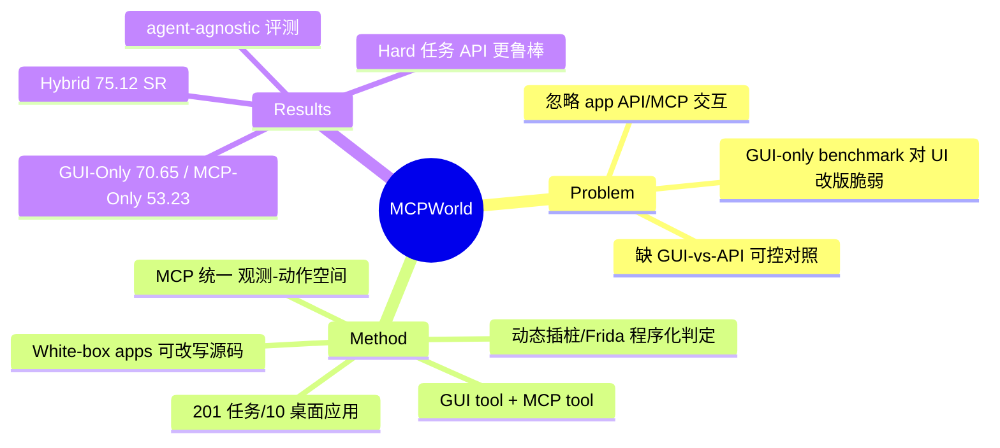

## Summary
MCPWorld 是首个同时评测 API、GUI 及 API-GUI hybrid computer-use agent 的自动化 testbed，核心是用可改写源码的 "white-box apps" 通过动态插桩程序化判定任务完成，从而把评测与具体 UI 状态解耦；含 201 个标注任务，preliminary 实验中 hybrid 配置达 75.12% task completion accuracy。

## Problem & Motivation
现有 CUA benchmark 绝大多数只面向 GUI agent：评测依赖 UI 状态/截图匹配，既对界面改版脆弱，又完全忽略应用通过 API（如 Model Context Protocol, MCP）暴露的功能交互。随着 agent 越来越多地调用外部 tool/API，纯 GUI 评测无法回答一个关键问题——**同一 agent 在有 API 可用时应走 API 还是 GUI，hybrid 路由能否兼得两者之长**。MCPWorld 的动机是提供一个 agent-agnostic、能在同一受控环境内公平对比 GUI-Only / MCP-Only / Hybrid 三种交互模态的统一评测基座。

## Method
**White-box apps 原则。** 与依赖闭源应用黑盒观测不同，MCPWorld 选用源码可得、可修改重编译的桌面应用（据 html 全文为 10 个），据此可以：(1) 自定义"哪些功能、以何种粒度"被抽取为 CUA-callable API（例如为应用加装 MCP server 支持）；(2) 通过监控应用内部行为程序化判定任务完成，而非匹配 UI 像素/文本。

**White-box 验证机制（§3.2）。** 三类手段联合判定 key-step 与最终成功：动态插桩（用 Frida 拦截函数调用、读取内部内存）、targeted code injection（向应用内注入专用探针）、API-driven state querying（查询状态 API、解析日志/数据库）。这使评测与 agent 实现和 UI 状态解耦。

**统一观测/动作空间（§2.2）。** 所有工具按 MCP 标准封装：GUI tool 提供指定分辨率截图 + 通用鼠标键盘操作（底层 xdotool 级），MCP tool 直接调用应用预定义 API 以获得更精确的观测与执行。由此同一 agent 框架只需切换可用工具集合即可构成 GUI-Only / MCP-Only / Hybrid 三种配置。

**基准规模。** 201 个人工 curate + 标注的用户任务，覆盖不同用例与难度（按 step 数分 Easy 0-5 / Medium 5-10 / Hard 10+）；全容器化并支持 GPU 加速。

## Key Results
评测 agent 为官方 Claude computer-use-demo 框架 + claude-3-7-sonnet-20250219，ReAct 式 prompting（§4.1）。三种配置主结果（据 html 全文 Table 4）：

- **GUI-Only**：Task Success Rate 70.65%，Key Step Completion 68.82%
- **MCP-Only**：Task Success Rate 53.23%，Key Step Completion 59.78%
- **Hybrid**：Task Success Rate 75.12%，Key Step Completion 69.63%

即 hybrid（有 API 时走 MCP、无 API 时回退 GUI）优于任一单模态，abstract 中 75.12% 的 headline 即 hybrid 全量成功率。难度分层（Table 6）上，据 §4.3 在 Hard（10+ 步）任务上 MCP-Only 相对下降仅约 23.01%，而 GUI-Only 下降约 54.85%，提示 API 路径在长程/高复杂任务上更鲁棒——这是 GUI vs API routing 的核心经验证据。

## Evidence Ledger
| Claim ID | Claim | Type | Source locator | Evidence excerpt | Status |
|:--|:--|:--|:--|:--|:--|
| C1 | 包含 201 个标注用户任务 | benchmark scale | Abstract | "MCPWorld includes 201 well curated and annotated user tasks" | abstract-only |
| C2 | Hybrid 配置 75.12% task completion accuracy | headline number | Abstract / §1 | "achieve 75.12% task completion accuracy" | source-verified |
| C3 | GUI-Only 70.65% / MCP-Only 53.23% / Hybrid 75.12% Task Success Rate | per-config SR | html 全文 Table 4 | "GUI-Only 70.65% ... MCP-Only 53.23% ... Hybrid 75.12%" | not-checkable |
| C4 | Hard 任务上 MCP-Only 相对下降 ~23.01% vs GUI-Only ~54.85% | routing 鲁棒性 | html 全文 §4.3 / Table 6 | "MCP-Only declined only 23.01% versus GUI-Only's 54.85%" | not-checkable |
| C5 | 覆盖 10 个 white-box 桌面应用 | benchmark scope | html 全文 §1 | "10 widely-used desktop applications" | not-checkable |
| C6 | 用 Frida 动态插桩程序化判定任务完成 | 机制断言 | Abstract / §3.2 | "dynamic code instrumentation ... tools like Frida" | source-verified |
| C7 | 代码与数据集开源 | code/license | Abstract | "code and dataset are publicly available at github.com/SAAgent/MCPWorld" | source-verified |
| C8 | 评测 agent = Claude computer-use-demo + claude-3-7-sonnet-20250219 | setup | html 全文 §4.1 | "official Claude computer-use-demo ... claude-3-7-sonnet-20250219" | not-checkable |

> 说明：C3/C4/C5/C8 的具体数字/事实来自 arXiv html 全文页经小模型抽取，本轮无独立 verifier，未逐条回原文核对，故 verification_status=unverified；标 not-checkable 表示需回原文 Table 4/§4.3 复核。C2/C6/C7 与 abstract 原文一致。institute 据检索快照（BUPT + Pengcheng Lab），arXiv abstract 页未显式列 affiliation，属中置信。

## Strengths & Weaknesses
**亮点。** (1) 正中综述空白：这是把 GUI vs API 路由当作**一等评测对象**、且在同一 agent 框架内可控对照的少数 benchmark 之一，而非各做各的单模态。(2) White-box + 动态插桩的验证范式，从根上绕开了 GUI benchmark 长期的"UI 改版即失效、状态判定靠脆弱匹配"痛点，评测 agent-agnostic。(3) hybrid > GUI-Only > MCP-Only 的次序 + 难度分层证据，给出了"API 更精确高效但覆盖受限、GUI 更通用但长程易级联失败、故需 hybrid 回退"这一 first-principles 结论的量化支撑。

**局限。** (1) 规模偏小：201 任务 / 10 应用，且均为源码可得的 white-box 桌面应用，覆盖面与生态代表性受限，MCP 支持是为评测**人工加装**的，与真实世界 API 可用性分布未必一致。(2) 主实验仅单一 agent（Claude computer-use-demo）+ 单一模型，"preliminary experiments" 自述，routing 结论的模型泛化性未验证。(3) hybrid 的路由是模型自发选择而非受控策略，论文测的是"有无 API 可选"，尚未拆解"何种 routing policy 最优"——这恰是 ToolCUA 等后续工作接手的问题。(4) 桌面场景，未覆盖 mobile（对照 MAS-Bench）与 web。

**对领域影响。** 为 hybrid CUA 提供了可复现的标准评测底座与"白盒程序化判定"方法论，适合作为综述 §4.8/§8.6（GUI vs API routing）的 benchmark 代表作与后续 routing/orchestration 方法的对照基线。

## Mind Map

## Notes
- 与本 niche 的关系：这是"benchmark for hybrid GUI+API / GUI vs API routing"最直接的旗舰基准。相邻工作可 cross-link——MAS-Bench (2509.06477, mobile shortcut-augmented hybrid)、GUI-360 (2511.04307, 含 GUI+API 双层动作的 dataset/benchmark)、ToolCUA (2605.12481, GUI-Tool 路径 orchestration 方法)、"API Agents vs. GUI Agents: Divergence and Convergence" (2503.11069, 概念对照综述)。
- 待核实：Table 4 三配置精确数字、§4.3 难度下降幅度、应用数 10、institute affiliation——digest 入库前建议回 arXiv html 全文逐项核对，再把 verification_status 升级为 source-checked。
