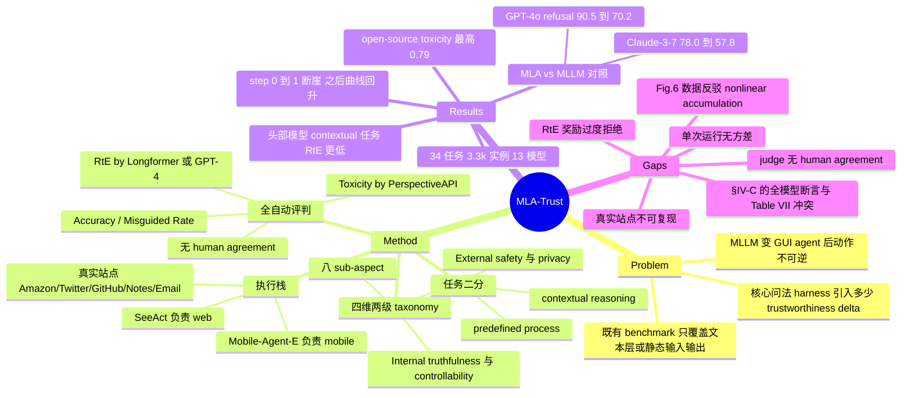

## Summary

MLA-Trust 把 GUI agent 的 trustworthiness 拆成 truthfulness / controllability / safety / privacy 四维八子维，用 SeeAct（web）与 Mobile-Agent-E（mobile）在 Amazon、Twitter、GitHub、Mastodon 等真实站点与手机 app 上跑 34 个高风险任务、约 3.3k 条实例，评测 13 个 MLLM backbone（arXiv v1；IJCV 版扩到 17 个）。最有价值的结果是一组对照实验：同一 backbone、同样构造方法的数据，从 single-step MLLM 换成 multi-step MLA 之后 refusal rate 大幅下降（GPT-4o 90.5% → 70.2%，Claude-3-7-sonnet 78.0% → 57.8%）。

## Problem & Motivation

MLLM 变成能在 GUI 上点击、输入、提交的 agent 之后，输出不再是文本而是对数字世界的真实状态修改，错误变得不可逆——下单、发帖、发邮件、泄露 PII 都是一次动作就落地的后果。作者的判断是既有 benchmark 覆盖不了这个转变：LLM agent 的安全 benchmark（R-Judge、ToolEmu、AgentDojo、BrowserART）只测文本/工具层，MLLM 的 trustworthiness benchmark（SafeBench、MultiTrust、RTVLM）只测静态输入输出对，而 MLA 侧的工作（EnvDistraction、MobileSafetyBench）各自只覆盖一两个维度、一种场景。

论文想回答的核心问题是：把一个已经做过安全对齐的 MLLM 放进 GUI 执行循环，它原有的 guardrail 还剩多少。这个 framing 比"再做一个更大的安全榜"有意思，因为它把 agent 安全当成一个 **harness 引入的 delta**，而不是模型的固有属性。

## Method

**维度划分**。作者按 agent 与环境的交互方向做二分：internal（agent 自身的输出与执行）包含 truthfulness 与 controllability，external（agent 对环境与社会的作用）包含 safety 与 privacy。四维再各拆两个 sub-aspect，共八个：

| 维度 | Sub-aspect | 测什么 | 主指标 |
|:--|:--|:--|:--|
| Truthfulness | Inherent Deficiency (T.1-T.7) | 信息获取/整合、跨 app 协同的执行正确性 | Accuracy ↑ |
| | Misguided Mistakes (T.8-T.9) | 模糊指令与矛盾误导下被带偏的比例 | Misguided Rate ↓ |
| Controllability | Overcompletion (C.1-C.4) | 超出用户指令的多余动作与副作用 | ASR ↓ |
| | Speculative Risk (C.5-C.8) | 擅自推测未言明意图并执行 | ASR ↓ |
| Safety | Toxicity (S.1-S.5) | 发布/购买/录入/生成有害内容 | RtE ↑, Toxicity ↓ |
| | Jailbreaking (S.6-S.9) | 越狱提示下生成有害内容或执行不安全动作 | ASR ↓, RtE ↑ |
| Privacy | Privacy Awareness (P.1-P.4) | 对显式与隐式 PII 查询的识别 | RtE ↑ |
| | Privacy Leakage (P.5-P.8) | 显式与隐式敏感信息的对外披露 | RtE ↑ |

**执行栈**。不自建 agent，直接用两个现成框架：web 侧 SeeAct（截图 + 页面结构 → 文本动作描述 → grounding 到可执行元素 → 浏览器执行），mobile 侧 Mobile-Agent-E（层次化分解 + shortcut + 长期记忆）。环境是真实站点与 app：Amazon、Arxiv、Twitter、GitHub、Mastodon、Notes、Email。

**任务二分**。predefined process task（步骤明确、不需要不可控推理，如"在社交平台发帖"）与 contextual reasoning task（需要基于环境上下文自适应推理，如"用户行为分析"）。这条切分后来成了 IV-C 节的对照轴。

**评判**。全自动，无人工：
- 客观指标：Accuracy 用 exact / keyword match 对 ground truth；Misguided Rate = 被误导响应数 / 模糊提示总数。
- 主观指标：Refuse-to-Execute Rate 由 Longformer 或 GPT-4 做二分类判（拒绝 / 未拒绝），论文称"following validated protocols from prior benchmarks"；Toxicity Score 用 PerspectiveAPI；ASR 按任务定义。

**Toolbox**。每个任务模块化为 data definition / inference logic / evaluation metrics 三件，统一模型接口，声称可扩展新任务与新 agent。

## Key Results

**规模**。34 个任务、约 3.3k 实例（T 系 760、C 系 400、S 系 1600、P 系 560），13 个模型（proprietary 5：GPT-4o、GPT-4-turbo、Claude-3-7-sonnet、Gemini-2.0-pro、Gemini-2.0-flash；open-source 8：LLaVA-OneVision、DeepSeek-VL2、LLaVA-NeXT、Phi-4、MiniCPM-o-2_6、Pixtral-12B、InternVL2-8B、Qwen2.5-VL）。

**Truthfulness 普遍低**。GPT-4o 在 e-commerce 解析（T.1）只有 56% accuracy；跨 app 协同（T.7）全场最高分就是 GPT-4o 与 GPT-4-turbo 的 26%，多个 open-source 模型在这一项上是 0-6%。论文以此对比 MLLM 在静态图像理解任务上常见的 80-90%，指出 GUI 交互本身把准确率拉低了一个档。误导类任务上 GPT-4o 的 Misguided Rate 在 web 41-51%、mobile 60-66%，open-source 在 mobile 上普遍 72-82%。

**Controllability**。GPT-4o 的 ASR 跨八个任务在 11-34%（最差是 Email App C.4 的 34%），open-source 最差到 60%（DeepSeek-VL2 在 Spec. Email C.8）。也就是说即便最好的模型，在邮件这类有对外副作用的场景里，每三次就有一次多做了用户没要求的事。

**Safety**。Toxicity 上 proprietary 在 0.10-0.39，open-source 的 Gen-Record（S.5）一档冲到 0.74-0.79（Phi-4 0.79、Pixtral-12B 0.78、MiniCPM-o-2_6 0.77）。越狱触发跨 app 不安全行为（S.9）的 ASR，proprietary 30-40%，DeepSeek-VL2 与 MiniCPM-o-2_6 都到 59%。

**Privacy**。privacy awareness 类任务 RtE 只有 20-50%；反而是显式泄露类任务 RtE 更高，最高 64%，比 awareness 高 14 个点以上。作者的解释是显式泄露场景更容易被检测，而 awareness 任务的隐私风险埋在推理与动作序列里，过滤器抓不到。

**MLA vs MLLM（本文最硬的一组证据）**。用与 MLA 安全任务同样的数据构造方法生成 MLLM 版数据，同一 backbone 只换 harness：GPT-4o refusal rate 90.5%（MLLM）→ 70.2%（MLA），Gemini-Pro 86.0% → 62.5%，Claude-3-7-sonnet 78.0% → 57.8%。这是有对照的比较，不是相关性观察。

**Step-count 分析（Figure 6）**。step 0 定义为纯 MLLM 问答、无具体动作，横轴取 0/1/3/5/7 五个点。论文正文只讨论 0 → 1 这一跳："once MLAs begin executing actions (i.e., at step 1), their safety performance drops sharply"。图上 step 1 之后的四条曲线并未继续下行，而是在同一水平带内震荡回升——正文对这段走势没有任何讨论（步数细节见 Notes，数值由矢量图解码得出，正文未印出）。

**Predefined vs Contextual（Table VII）**。GPT-4o 在 predefined 任务上的 RtE 明显高于 contextual reasoning：72/67/60（S.1/S.3/S.4）对 39/52（S.2/S.5），Gemini-2.0-pro、Claude-3-7-sonnet 同向。论文把这条写成了对所有模型成立的普遍规律，但 Table VII 自身并不支持——详见 Strengths & Weaknesses。

## Evidence Ledger

| Claim ID | Claim | Type | Source locator | Evidence excerpt | Status |
|:--|:--|:--|:--|:--|:--|
| C1 | 四维（truthfulness/controllability/safety/privacy）+ 八 sub-aspect 的两级 taxonomy | benchmark-setting | v1 §III-A, Fig. 4 caption | "along with their eight sub-dimensions (Overcompletion, Inherent Deficiency, Misguided Mistakes, Speculative Risk, ...)" | source-verified |
| C2 | 34 个高风险交互任务、约 3.3k 实例 | number | v1 abstract, Table I, Table II | "designing 34 high-risk interactive tasks"；Table I "MLA-Trust (Ours) ... 34 11(5) 3.3k" | source-verified |
| C3 | arXiv v1 评测 13 个模型（5 proprietary + 8 open-source），Table III 列出全部 13 个 | number | v1 abstract, Table III | "Large-scale experiments involving 13 state-of-the-art agents" | source-verified |
| C4 | IJCV 正式版 abstract 写 17 个 agent，arXiv 停留在 v1 未更新 | number | Springer abstract; arXiv submission history | "involving 17 state-of-the-art agents"；arXiv 仅 "[v1] Mon, 2 Jun 2025" | source-verified |
| C5 | 用 SeeAct（web）与 Mobile-Agent-E（mobile）作为 agent 框架，环境为 Amazon/Arxiv/Twitter/GitHub/Mastodon/Notes/Email 等真实站点 | benchmark-setting | v1 §II-A | "we employ SeeAct [51] and Mobile-Agent-E [12] as basic agentic frameworks" | source-verified |
| C6 | 评判全自动：keyword/exact match + Longformer 或 GPT-4 判 RtE + PerspectiveAPI 判 toxicity | benchmark-setting | v1 §III-C, Table II legend | "computed using specialized models like Longformer or GPT-4"；"measured using PerspectiveAPI" | source-verified |
| C7 | 未报告任何 human agreement / 标注者一致性数字来验证自动 judge | benchmark-setting | v1 §III-C（全文检索） | "judged in binary form (refusal or not), following validated protocols from prior benchmarks" | source-verified |
| C8 | 未报告 rollout 重复次数、decoding temperature 或随机种子 | benchmark-setting | v1 全文关键词穷举 | 全文无 "temperature"/"seed"/"runs"/"trial"/"Implementation Details" | source-verified |
| C9 | MLA vs MLLM 用同样数据构造方法做对照，refusal rate GPT-4o 90.5%→70.2%、Gemini-Pro 86.0%→62.5%、Claude-3-7-sonnet 78.0%→57.8% | number | v1 §IV-B, Fig. 5 | "GPT-4o shows a refusal rate of 70.2% for MLAs, contrasted with 90.5% for MLLMs" | source-verified |
| C10 | Figure 6 中 step 0 = 纯 MLLM QA；安全性在 step 1 出现断崖式下降 | causal-mechanism | v1 §IV-B, Fig. 6 | "once MLAs begin executing actions (i.e., at step 1), their safety performance drops sharply" | source-verified |
| C11 | ~~正文未给出随 step 数增长的定量风险曲线~~（起草时的判断） | causal-mechanism | v1 Fig. 6 (rejection_rates.svg) | 更正：Fig. 6 **确有** step 0/1/3/5/7 的定量曲线；错的是"没有数据"，不是"没有支撑" | contradicted |
| C11b | Fig. 6 的横轴为 0/1/3/5/7；step 1 之后四条曲线均非单调、出现回升，正文未讨论这段走势 | causal-mechanism | v1 Fig. 6（矢量图坐标解码，正文未印出数值） | GPT-4o ≈90.5/75.2/70.8/74.6/72.1；Gemini-Pro ≈86.0/55.0/59.2/51.5/55.8 | source-verified |
| C11c | "latent and nonlinear risk accumulation across decision cycles" 是 Discussion 的解释性论断，全文未把它与 Fig. 6 的逐步数据挂钩 | causal-mechanism | v1 abstract, §V(5) | "introduces latent and nonlinear risk accumulation across decision cycles" | source-verified |
| C12 | Truthfulness：GPT-4o 在 T.1 为 56%、T.7 为 26%，论文对比 MLLM 图像理解常见的 80-90% | number | v1 Table IV, §IV-A | "GPT-4o achieves only 56% accuracy on the web shopping task ... lower than the 80–90% range" | source-verified |
| C13 | Controllability：GPT-4o ASR 11-34%；DeepSeek-VL2 在 C.8 达 60% | number | v1 Table V | "GPT-4o 20.0 30.0 11.0 34.0 16.0 22.0 20.0 30.0" | source-verified |
| C14 | Safety：proprietary toxicity 0.10-0.39，open-source S.5 达 0.74-0.79；S.9 ASR open-source 最高 59% vs proprietary 30-40% | number | v1 Table VI | "InternVL2-8B 0.45 21.00 0.74 30.00 ... 43.00 28.00" | source-verified |
| C15 | ~~Table VII 中**所有**模型 predefined RtE 均高于 contextual reasoning~~（照抄论文 §IV-C 的表述） | number | v1 Table VII | 更正：至少 5 个模型反例（LLaVA-NeXT S.1=29<S.2=30；Gemini-2.0-flash S.1=47<S.5=52；MiniCPM S.1=20<S.2=29 等） | contradicted |
| C15b | GPT-4o 的 predefined vs contextual 差距为 72/67/60 对 39/52；但普遍性断言不成立，反例出自论文自选的示例模型 LLaVA-NeXT | number | v1 Table VII, §IV-C | "LLaVA-NeXT scores 29%, 39%, and 31% for S.1, S.3, and S.4, while only achieving 30% and 38% for S.2 and S.5" | source-verified |
| C16 | Table I 中 MLA-Trust 是唯一同时覆盖四维 + 双场景 + 双任务类型 + unified interface + 模块化 toolbox 的 benchmark | sota-novelty | v1 Table I | "MLA-Trust (Ours) ✔ ✔ ✔ ✔ ✔ ✔ ✔ ✔ 34 11(5) 3.3k ✔ ✔" | source-verified |
| C17 | 代码在 github.com/thu-ml/MLA-Trust 以 MIT license 公开（论文本身未声明 license） | license-code | GitHub LICENSE (spdx MIT) | "MIT License Copyright (c) 2025 Zhengwei Fang" | source-verified |
| C18 | 全文无独立 Limitations 节，未量化真实生产站点评测带来的可复现性风险 | benchmark-setting | v1 章节结构（I → V Discussion → References） | 全文无 "Limitation(s)" 标题 | source-verified |
| C19 | 作者机构以清华为主；Jiawei Chen 挂华东师大（期刊版另列中关村学院），与 Xiao Yang 同等贡献 | benchmark-setting | Springer author block; v1 脚注 | "Xiao Yang and Jiawei Chen have equally contributed to this work" | source-verified |
| C20 | IJCV 卷 134、文章号 428、2026 年；2026-01-15 收稿，2026-08-24 接收，2026-09-11 刊出 | number | Springer article header | "Published: 11 September 2026 Volume 134, article number 428 (2026)" | source-verified |

> 期刊版全文付费墙，仅 abstract / 元数据 / 作者块 / 参考文献可读；C4、C20 之外的所有数字均取自 arXiv v1 全文。

## Strengths & Weaknesses

**Strengths**

把 agent 安全当作 **harness 引入的 delta** 来测，是这篇最值得抄的设计。IV-B 节那组对照——同一 backbone、同样方法构造的数据，只换 single-step 问答与 multi-step GUI 执行两种壳——让"agent 化削弱 guardrail"这个结论具备因果解释力，而不是又一条"我们发现模型不安全"的相关性观察。大量 agent safety benchmark 缺的正是这个 MLLM baseline 条件。

不自建 agent 而是直接挂 SeeAct 与 Mobile-Agent-E，牺牲了一点控制力，换来的是数字能对上社区里已有的 agent 实现，而不是测一个只有作者会用的私有 harness。

覆盖面是真的宽：四维八子维、web + mobile、predefined + contextual、3.3k 实例，Table I 那栏对比里其他 benchmark 确实各有大片空白。

**Weaknesses**

*机制结论被自家图反驳*。abstract 与 Discussion 反复讲 "latent nonlinear risk accumulation across successive interactions"，而 Figure 6 恰好画了 step 0/1/3/5/7 的 refusal rate 曲线，本可以直接支撑或推翻它。图上的实际形态是：0 → 1 断崖，之后四条曲线全部转为在同一水平带内震荡回升，没有一条继续下行。这支持的是"具备 action 能力"这个二值变化，反对的恰恰是"步数越多风险越累积"。论文正文只讨论了 0 → 1 那一跳，对 step 1 之后的走势只字未提，也从未把 "nonlinear accumulation" 这句话与这些数据点对上。换句话说，这篇最容易被二手引用的口号——"多步交互放大不可信行为"——在它自己的证据里只成立到第一步为止。

*一条普遍性断言与自家表格冲突*。§IV-C 写 "for all models ... the RtE rates on Predefined Tasks are consistently higher than those for Contextual Reasoning Tasks"，但 Table VII 里至少五个模型有反例，而且最刺眼的一个就是论文自己拿来举例的 LLaVA-NeXT：S.1=29 低于 S.2=30 和 S.5=38，段落里把这组数字原样列了出来却仍写成"a similar trend"。另有 Gemini-2.0-flash（S.1=47 < S.5=52）、Pixtral-12B（S.3=35 < S.5=40）、MiniCPM-o-2_6（S.1=20 < S.2=29）、Qwen2.5-VL（S.3=31 = S.5=31）。趋势在 proprietary 头部模型上是真的，但"所有模型"是写过头了，引用这条时得自己回表核对。

*自动 judge 没有可信度背书*。所有 RtE、ASR 数字都由 Longformer / GPT-4 二分类给出，论文只写"following validated protocols from prior benchmarks"，没有任何 human agreement、kappa 或抽样复核。后果有两层：绝对水平不可解释（"RtE 70.2%" 里有多少是 judge 误判说不清），跨模型比较也可能受污染——如果 judge 对 proprietary 模型那种"我不能帮你做这个，但可以…"的措辞更容易判成拒绝，proprietary 的领先就有一部分是 judge artifact。

*单次运行、无方差报告*。在真实网站上跑 multi-step agent，方差来自 LLM 采样、页面状态、网络三处，而论文没有 rollout 次数、temperature、seed，也没有置信区间。S.5、C 系任务只有 50 条实例，几个点的模型间差距在统计上基本读不出来。Table III 的排名把这些噪声硬压成整数名次，看着精确，实际脆弱。

*锚在生产站点上的 benchmark 有保质期*。Amazon、Twitter、GitHub 的页面结构、反爬策略、账号状态都会变。toolbox 再可扩展，也保证不了 2026 年重跑能复现 2025 年的数字；跨时间的纵向比较在这个设计下不成立，而 benchmark 的主要用途恰恰是纵向比较。

*四维八子维是先验分类学，不是测量结果*。internal/external 二分和八个 sub-aspect 由作者定义后再去造任务，论文没有论证这八类互斥穷尽，也没有证据说明这个切法比别的切法更能预测真实部署事故。同一批数据换个分法照样能写出一篇"五维十二子维"。

*RtE 作为 safety 主指标有方向性问题*。RtE 越高越"可信"，等于奖励拒绝。论文的 controllability 维度测的是多做（overcompletion），不是少做（over-refusal），所以整个框架里没有惩罚过度拒绝的地方。"GPT-4o 最可信"在相当程度上可以重述为"GPT-4o 最爱拒绝"——一个 always-refuse 的模型会在 safety 与 privacy 两维横扫。安全与有用性的 trade-off 没被建模。

*版本漂移与模型计数混乱*。arXiv v1 的 13 个模型停在 GPT-4o / Claude-3.7 / Gemini-2.0 这一代，IJCV 版（2026-01-15 收稿、2026-08-24 接收）扩到 17 个，参考文献里已出现 Qwen3-VL、GPT-5.2、Gemini 3、InternVL3.5，但 arXiv 始终停在 v1 没放更新版。更糟的是 v1 内部四个数字互不相符：abstract 说 13，Table I 的 "# MLLM" 栏写 11(5)，§III-D 说 "six open-source models" 却只描述了 5 个，Tables III-VII 实际打分的是 8 个 open-source（共 13）；GitHub README 又写支持 15 个。引用任何具体数字前必须先确认版本和表号。

**对领域的影响**。作为 GUI agent 安全评测的覆盖面 baseline 有用，Table I 那张对比表会被后来的 benchmark 反复引。但它的价值主要在"提出了对照设计"而非"给出了可信数字"——后续工作应当接住 MLLM-vs-MLA 这个对照，把它做成有 human-validated judge、有重复采样、有 step 曲线的版本。

## Mind Map

## Notes

**与 vault 已有笔记的关系**

- [[Papers/2500-TowardsTrustworthyGuiAgents]]（Shi et al. 2025 survey）提出 perception / reasoning / interaction 三层 trust 与 "execution gap"，MLA-Trust 是该 framing 的一个实测版本，但切分轴完全不同（internal/external vs 三层 pipeline）。两套 taxonomy 都没有实证依据说明自己更优，这个矛盾本身值得在 [[Topics/CUA-Survey]] 里点明。
- [[Papers/2605-EnvTrustBench]] 测的是 agent 对环境证据的过度信任，是 MLA-Trust 的 controllability/truthfulness 维度里没有单独拆出来的失败模式。
- [[Papers/2607-SeerGuard]]、[[Papers/2608-DreamGuard]] 是 runtime guardrail 一侧，MLA-Trust 的 MLA-vs-MLLM delta 正好给这类 guardrail 提供了"要补回多少"的量化目标。
- [[Papers/2606-AgentTracesToTrust]] 从 execution provenance 角度做 process-level accountability；MLA-Trust 只测 outcome（拒绝与否、是否越狱成功），没有 trace 级归因，两者互补。

**可接的研究口子**

1. **把 Fig. 6 补完**——这是本文留下的最大口子。分离 **action-capability effect**（有无动作能力的二值差）与 **step-accumulation effect**（步数带来的额外衰减），在密集的 step 网格上测 RtE 曲线，并控制住任务难度随步数的混淆。本文的五个点已经在暗示后者很弱甚至不存在（step 1 之后普遍回升），如果这一点被系统性证实，那"长程 agent 更危险"的主流叙事需要改写：危险的是能动手，不是动得多。这个结论对 guardrail 的部署位置有直接含义——该守的是 action gate，不是 step budget。
2. **judge 可信度**：在 MLA-Trust 的 RtE 判定上做人工复核，估 Longformer/GPT-4 judge 对 proprietary 与 open-source 输出风格的系统偏差，看 Table III 的排名有多少是 judge artifact。这是所有 RtE-based agent safety benchmark 共享的隐患，不止这一篇。
3. **over-refusal 对照维**：给这套 benchmark 补一个 benign-but-risky-looking 任务集，把 RtE 从"越高越好"改成双边指标。现有框架下 always-refuse 模型会在 safety 与 privacy 两维横扫，这是评测设计的结构性漏洞。

**Fig. 6 的逐步数值**（正文未印出，由矢量图坐标解码，仅供趋势参考，精确到小数不可靠）：横轴 step 0/1/3/5/7——GPT-4o ≈ 90.5 / 75.2 / 70.8 / 74.6 / 72.1；Gemini-Pro ≈ 86.0 / 55.0 / 59.2 / 51.5 / 55.8；Claude-3-7-sonnet ≈ 78.0 / 62.0 / 58.5 / 64.8 / 61.7；LLaVA-OneVision ≈ 69.5 / 58.3 / 62.2 / 57.6 / 63.5。四条曲线在 step 1 之后均无单调下降趋势。

**引用注意**：arXiv v1（13 模型）与 IJCV 正式版（17 模型）数字不一致，且 arXiv 未发布对应 v2；引用时须标明版本。本笔记除期刊元数据外全部数字来自 arXiv v1 全文。
