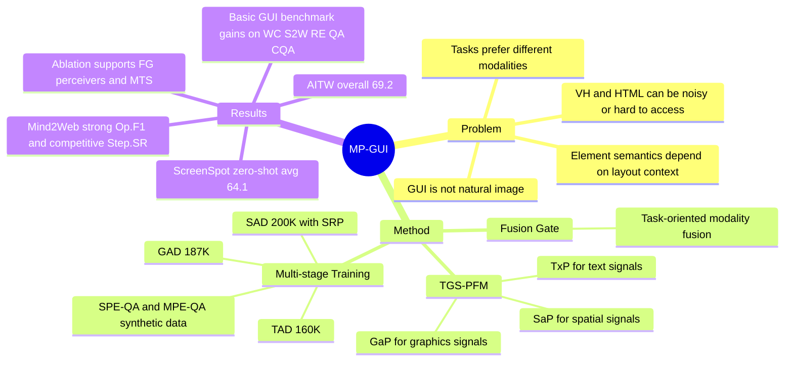

## Summary

MP-GUI 针对 GUI screenshot 中 text、graphics、spatial structure 混杂且不同任务偏好不同的问题，在 MLLM 上加入 Textual / Graphical / Spatial perceivers 和 Fusion Gate，生成 task-oriented GUI-tailored visual clues。作者用 0.68M GUI-specific training samples 和 multi-stage training，在 basic GUI understanding、screen grounding、screen navigation 等 benchmark 上验证了相对 InternVL2、InternVL2-P、SeeClick、ShowUI 等 baseline 的收益。

## Problem & Motivation

GUI 与自然图像的关键差异在于：界面元素是人工设计并按空间结构组织的，单个 icon / widget 的语义经常依赖相邻文字、层级关系和布局上下文。现有 GUI MLLM 多把 screenshot 当作普通图像处理，主要依赖 vision backbone 的 global visual clues 和 instruction tuning，因此在需要显式空间结构理解的任务上容易误解元素功能。作者还指出，直接使用 View Hierarchy 或 HTML 这类空间结构数据在实践中会遇到隐私、噪声以及与 screenshot 不一致的问题。MP-GUI 的问题 formulation 是：能否在 screen-only 输入下，把 textual、graphical、spatial 三类 GUI 信号显式抽取出来，并按任务语义动态融合。

## Method

MP-GUI 基于 InternVL2-8B 初始化，使用 InternViT-300M 作为 vision backbone、InternLM2.5-7B-chat 作为 LLM，并保留 Dynamic High-Resolution 图像切分。核心新增模块是 TGS-Perception Fusion Module，包括三个 MLP perceiver 和一个 Fusion Gate：

1. **Textual Perceiver (TxP)**：从 visual clues 中抽取文字相关信号，用 Text Aware Data 训练。
2. **Graphical Perceiver (GaP)**：抽取 icon / widget 等图形信号，用 Graphics Aware Data 训练，其中包含来自 AITW 的 small object grounding 样本，保留目标元素面积比例 `r <= 0.3%` 的样本。
3. **Spatial Perceiver (SaP)**：建模 GUI 元素之间的空间与语义关系，用 Spatial Relationship Prediction (SRP) 训练。
4. **Fusion Gate (FG)**：根据 question embedding 和 global visual signal 生成 gating signal，对 TxP / GaP / SaP 输出进行 task-oriented 融合，再与 global visual clues 和 question tokens 一起输入 LLM。

训练 recipe 是四阶段 Multi-stage Training Strategy。Step 1 用 160K TAD 样本训练 TxP，任务包括 `text2bbox` 和 `bbox2text`；Step 2 用 187K GAD 样本训练 GaP；Step 3 用 200K SAD 样本训练 SaP，SRP 任务要求判断 containment、sibling/common parent、contained-but-unrelated、unrelated 等关系；Step 4 混合 TAD / GAD / SAD / SPE-QA / MPE-QA / synthetic data 训练 TGS-PFM、LLM 和 vision backbone。合计训练样本为 680K。

数据构造上，SRP 来自 Semantic UI 的 View Hierarchy 文件；SPE-QA 和 MPE-QA 由 Qwen2-VL-72B 生成。MPE-QA 包括 Global Description 和 Local Description，后者用 fine-tuned YOLOv8 检测 graphics 并加框，再要求 MLLM 结合周围组件解释局部区域功能。论文明确说明 Qwen2-VL-72B 的 synthetic supervision 质量不及人工监督，但仍可用于训练 FG。

## Key Results

- **Basic GUI Understanding benchmark**：MP-GUI 在多任务 fine-tuning 后取得 WC 151.0 CIDEr、S2W 118.4 CIDEr、RE 83.0 Acc@IoU=0.1、TP 88.2 F1、WS 89.2 SQuAD F1、QA 88.6 ROUGE-L、QAS 90.5 SQuAD F1、CQA 84.3 SQuAD F1。相对 second-best，WC +5.7%、S2W +2.8%、RE +13.2%、QA +0.2%、CQA +2.3%，但 TP -0.2%、WS -0.6%、QAS -1.2%。
- **与 GUI-specific methods 对比**：在 single-task fine-tuning 下，MP-GUI 使用 0.68M GUI-related samples，达到 WC 156.5、S2W 121.4、RE 84.7、TP 88.7、WS 90.1、QA 88.7、QAS 92.7、CQA 87.7。ScreenAI 使用 383.5M samples，在 RE 86.3、QA 91.9、QAS 94.6 上仍高于 MP-GUI；MP-GUI 在 WC、S2W、TP、WS 和 CQA 上更强或可比。
- **ScreenSpot zero-shot grounding**：MP-GUI 平均 64.1%，高于 InternVL2-P 55.1%、SeeClick 53.4%、InternVL2 41.9%。分项为 mobile text/icon 86.8%/65.9%，desktop text/icon 70.8%/56.4%，web text/icon 58.3%/46.6%。
- **RefExp grounding**：MP-GUI 在 Acc@IoU=0.1/0.3/0.5/0.7 和 Acc@CP 上分别为 83.0/74.3/60.0/41.2/87.4。它在 IoU=0.1、0.3、0.5、Acc@CP 上最高，但 IoU=0.7 低于 CogAgent 的 46.2。
- **Screen Navigation**：AITW overall 为 69.2，高于 ShowUI 68.3、InternVL2-P 66.6、InternVL2 62.0；各子集为 General 63.7、Install 74.3、G.Apps 65.3、Single 75.4、WebShop 67.2。Mind2Web 上 MP-GUI 的 Cross-Task / Cross-Website / Cross-Domain Step.SR 为 38.1 / 32.9 / 33.7，Op.F1 为 89.0 / 87.1 / 87.4，Ele.Acc 为 42.1 / 39.4 / 37.6；它相对 InternVL2 有显著提升，但不是所有 Mind2Web 子指标都超过 ShowUI。
- **Ablation**：不预训练 FG 时，WC -6.3%、RE -8.1%、CQA -4.5%；移除 FG 改用三 perceiver mean fusion 时，WC -5.3%、RE -7.1%、CQA -2.1%。移除 SaP 会让 WC -6.4%、RE -5.9%、CQA -5.0%；移除 GaP 让 CQA -5.0%；移除 TxP 主要影响 S2W -2.8%、QA -1.3%、QAS -1.2%。不用 multi-stage training、改为端到端混合训练时，所有 basic benchmark 指标均下降，最大降幅出现在 WS -2.6% 和 QAS -2.4%。

## Strengths & Weaknesses

**已知亮点**：

- 方法把 GUI perception 拆成 text、graphics、spatial 三类信号，再用 task semantics 动态融合；ablation 表明 FG、SaP、GaP、TxP 和 MTS 都有可观贡献。
- 相比只做 domain-specific instruction tuning 的 InternVL2-P，MP-GUI 在 basic understanding、ScreenSpot、AITW、Mind2Web 上都有更稳定收益，说明 architecture-level GUI-tailored visual clues 不只是数据增益。
- 数据效率较强：论文用 0.68M GUI-related samples 与使用 80M samples 的 Pix2Struct、383.5M samples 的 ScreenAI 等 GUI-specific methods 对比，仍在多个任务上达到更高或接近的结果。
- 评测覆盖 basic GUI understanding、grounding、navigation 三类任务；ScreenSpot 结果还覆盖 mobile、desktop、web 三种分辨率场景。

**已知局限 / 边界**：

- MP-GUI 不是所有指标最优：basic benchmark 中 TP、WS、QAS 低于对应 second-best；single-task setting 中 RE、QA、QAS 低于 ScreenAI；RefExp 的 Acc@IoU=0.7 低于 CogAgent；Mind2Web 部分 Ele.Acc / Step.SR 子项低于 ShowUI。
- 虽然论文动机强调 View Hierarchy / HTML 在实践中 noisy 且难获取，SaP 的 SRP 训练仍使用 Semantic UI 的 VH json 文件构造监督；因此它不是完全不依赖结构化 UI 数据的训练方案。
- Synthetic data pipeline 依赖 Qwen2-VL-72B；论文 footnote 承认其 graphics perception 质量不及人工监督。Local Description 还依赖用约 9K in-house labeled data fine-tune 的 YOLOv8。
- 论文没有单独的 limitations section，也没有系统展示 MP-GUI 自身失败案例；qualitative analysis 主要展示 MP-GUI 相对其他 MLLM 更正确的案例。

**推测**：

- MP-GUI 更适合作为 GUI agent 的 perception / grounding backbone，而不是完整 agent policy。论文的 navigation 评测把 AITW 和 Mind2Web 作为 purely visual problem，并沿用既有 prompt、action space 和 split；它没有直接处理 long-horizon memory、online RL、tool-use safety 等 agentic 问题。
- ScreenSpot 上只用 mobile-resolution training data 却能泛化到 desktop / web，支持作者关于 generic GUI patterns 的说法；但这种证据仍是 benchmark-level，真实跨平台应用中的动态界面、个性化布局和动画变化还未被充分验证。

**不知道**：

- 论文说 code 和 datasets 会公开，但正文没有说明 9K in-house YOLO labeling data 是否一并发布。
- 论文给出了训练硬件和配置，但没有报告推理 latency、token/feature 长度开销或部署成本。
- 论文指出 VH / HTML 可能 noisy，但没有量化 SaP 对 noisy structure supervision 的鲁棒性。

## Mind Map

## Notes

- 与 [[2312-CogAgent]]、[[2400-SeeclickHarnessingGuiGrounding]]、[[2506-ShowuiOneVisionLanguage]] 放在一起看：MP-GUI 的主要贡献不是新的 action policy，而是把 GUI-tailored perception signal 显式接入 MLLM。
- SRP 可以理解为把 VH / layout supervision 蒸馏进 screenshot-only model 的一种方式；这对 GUI agent 的 scale-invariant grounding 和 element-function understanding 都有启发。
- 需要后续关注 release 后的数据细节，尤其是 SRP 样本、synthetic QA prompt、YOLO-based local description 是否足以复现论文中的 gains。
