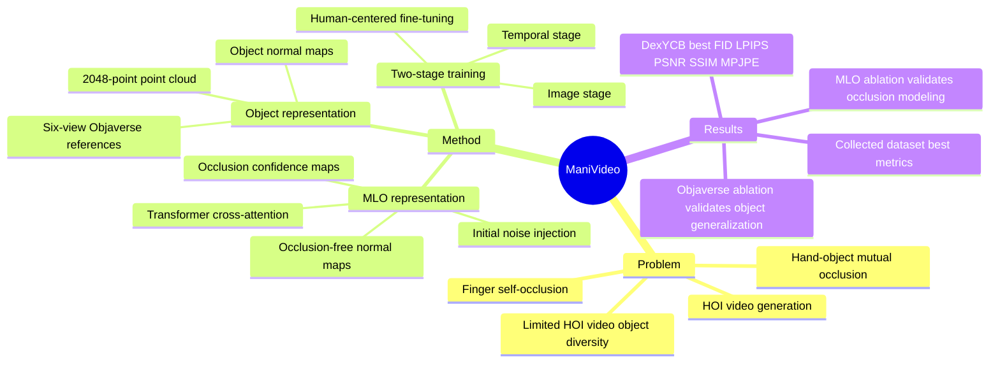

## Summary
ManiVideo 解决的是给定 hand/object motion signals 时生成双手-物体操作视频的问题，核心是用 multi-layer occlusion (MLO) representation 显式建模手指自遮挡和手-物相互遮挡。它把 Objaverse 的 object-only 3D 数据与有限 HOI video 数据联合训练，提升 unseen object 的外观/几何一致性；对 embodied manipulation / HOI video generation 有参考价值，但还不是机器人 policy 或可交互 world model。

## Problem & Motivation
论文关注 bimanual hand-object manipulation video generation：输入是 MANO hand motion sequence 和 object 3D model / motion signal，输出要同时满足真实外观、手指细节、手-物接触关系和 temporal consistency。作者指出现有 HOI image generation 多依赖 depth map、normal map、hand mask、bounding box 等 2D condition，这些信号能对齐可见区域，但难以表达 occluded fingers、finger self-occlusion 和 hand-object mutual occlusion。

第二个动机是 object generalization。现有 HOI video data 的 object diversity 有限，论文提到多数相关数据集只有十几个 object categories；直接训练容易过拟合训练物体的动态纹理或外观。作者因此把 Objaverse 作为大规模 object prior，用 object-only synthetic data 补足 HOI video 数据稀缺的问题。

这个问题对 embodied research 的价值在于：如果要用生成模型构造 manipulation video、human-centered HOI demo 或仿真视觉数据，遮挡关系和 unseen object consistency 是核心 failure source。它对 GUI-agent 的直接相关性较弱，但对物理交互场景中的 3D-aware video generation 有明确参考价值。

## Method
### Multi-layer Occlusion Representation

ManiVideo 的输入包括每帧 MANO parameters `M=(theta,beta)` 和 object 3D model `N`。MLO representation 由两部分组成：

1. **Occlusion-free normal maps `H`**：把 object、palm、thumb、index finger、middle finger、ring finger、little finger 分层独立渲染，使模型能看到被遮挡的完整 hand-object structure，而不只依赖最终相机视角下的可见区域。
2. **Occlusion confidence maps `D`**：用 depth maps 表示各区域的遮挡程度；论文图示中 darker region 对应更严重的 occlusion，用来提示模型哪些 hidden regions 需要重点 refinement。

MLO 被以两种方式嵌入 denoising UNet。第一，`H` 经过 lightweight pose guider 后加到 initial noisy latent `z_t`，提供 coarse spatial alignment。第二，`H` 与 `D` concat 后经 convolution + MLP 得到 embedding，并通过 added transformer blocks 的 cross-attention 注入 UNet，使模型学习更深层的 3D occlusion relationship。

### Object Representation

为提升 object consistency，论文把 Objaverse 纳入训练。每个 object 渲染 front/back/left/right/top/bottom 六个 viewpoint 的 reference appearance images `O_I`，再配合 human/background reference image `O_B` 通过 AppearanceNet `R` 注入 UNet。几何侧，作者为每个 object 随机生成 quaternion rotation sequence `Q` 和 translation sequence `L`，渲染 object normal maps `H_o`，并从 mesh surface uniform sampling 得到 `P in R^{2048 x 3}` point cloud；`H_o` 和 `P` 的 geometry embedding 也通过 cross-attention 注入 transformer blocks。

### Training Strategy

训练分为 image stage 和 temporal stage。Image stage 同时使用 HOI video data 和 Objaverse object-only data；对 Objaverse，hand-related MLO layers 置零，只学习 object appearance / geometry consistency。Temporal stage 冻结 image-stage parameters，并加入类似 Animate Anyone 的 temporal layers 训练 temporal coherence。

数据上，作者使用 Objaverse 作为 object data，Human4DiT 作为 human data，DexYCB 作为公开 HOI video data，并额外收集 722 个第三人称 bimanual manipulation videos，共 376k frames、15 objects、10 views、8 participants。训练实现为两阶段：non-temporal layers 约 20,000 iterations，temporal layers 约 30,000 iterations；第二阶段使用 24-frame video sequences。

## Key Results
### Baseline Comparison

**DexYCB benchmark.** Table 1 中 ManiVideo 在 hand-object area 上优于 HOGAN、ADiff 和 CDiff：FID **49.96** 低于 HOGAN **64.74**、ADiff **53.95**、CDiff **84.74**；LPIPS **0.079** 低于 **0.102 / 0.093 / 0.127**；PSNR **30.10** 高于 **29.50 / 29.96 / 28.27**；SSIM **0.913** 高于 **0.896 / 0.903 / 0.835**；MPJPE **57.30** 低于 **60.95 / 59.12 / 68.01**。

**Authors' collected HOI dataset.** 由于 HOGAN 只处理 single-hand interaction，论文在该数据集上只比较 ADiff 和 CDiff。ManiVideo 的 FID **37.70** 低于 ADiff **39.91** 和 CDiff **45.50**；LPIPS **0.113** 低于 **0.127 / 0.133**；PSNR **29.59** 高于 **29.17 / 28.33**；SSIM **0.905** 高于 **0.898 / 0.883**；MPJPE **32.89** 低于 **37.45 / 42.89**。

### Ablation

**MLO representation.** Table 2 显示完整 ManiVideo 在 collected dataset 上 FID **37.70**、LPIPS **0.113**、PSNR **29.59**、SSIM **0.905**、MPJPE **32.89**。去掉 MLO、只注入 depth maps 的 `w/o MLO` 退化到 FID **46.67**、LPIPS **0.115**、PSNR **28.26**、SSIM **0.869**、MPJPE **39.41**；只把 MLO 注入 initial noise 的 `w/o MLO*` 为 FID **40.60**、LPIPS **0.117**、PSNR **28.30**、SSIM **0.881**、MPJPE **34.02**。这支持作者关于“完整 embedding 才能利用 MLO 的遮挡信息”的主张。

**Objaverse embedding.** `w/o Obja` 的 FID **61.60**、LPIPS **0.121**、PSNR **27.99**、SSIM **0.895**、MPJPE **37.33**，明显差于完整模型。论文定性图也指出，不用 Objaverse 时模型即使能对齐 object structure，也容易过拟合训练数据中的 dynamic texture details，导致 object reference images 的约束变弱。

### Application

Human-based HOI video generation 只给出 qualitative results：给定 human-centered reference image，并把 Human4DiT 纳入训练后，ManiVideo 可以生成包含 human body、hands 和 objects 的操作视频。论文没有为该 application 提供独立的 quantitative benchmark 或 human preference study。

## Strengths & Weaknesses
**已知 Strengths.** 论文的问题拆解比较直接：2D condition 难以表达 hidden hand-object structure，object diversity 不足导致泛化弱；MLO 和 Objaverse training 分别对应这两个瓶颈。MLO 把 hand parts 和 object 分层渲染，并用 confidence maps 标示 occlusion severity，比只用最终可见 normal/depth map 更适合处理 finger self-occlusion 和 mutual occlusion。

**已知 Strengths.** 实验包含 DexYCB、作者自建 HOI dataset、HOGAN / ADiff / CDiff baselines，以及 `w/o MLO`、`w/o MLO*`、`w/o Obja` ablations。关键指标 FID / LPIPS / PSNR / SSIM / MPJPE 都给出具体数值，且 ablation 和 qualitative analysis 对应关系清楚。

**已知 Weaknesses / boundaries.** 论文自己的 limitation 明确指出 ManiVideo 受 driving signals accuracy 限制；如果 MANO / object pose 或 motion signal 不准，视频生成也会受影响。作者还指出 complex object texture 的泛化仍受 synthetic-to-real domain gap 限制，未来可能需要更细致的 4D representation 来绑定 object appearance、viewpoint 和 time。

**已知 Weaknesses / evaluation caveats.** 主结果只在 hand-object area 上计算，因为不同方法处理 background 的方式不同；这对评估手-物区域合理，但不能证明整体视频场景质量全面最优。Human-centered generation 只展示定性结果，没有量化指标；HOGAN 因方法限制只在 DexYCB single-hand setting 参与比较。

**推测.** 这篇对 embodied world model / manipulation video data generation 的启发在于：要让视频生成服务物理交互，核心可能不是更大的 text prompt model，而是把 occluded 3D structure 作为显式 condition 注入。它也可能作为 HOI data augmentation 或 human demonstration visualization 的组件，但因为输入已经包含 hand/object motion sequence，所以不能把它解读为解决 planning、control 或 action generation。

**不知道 / 不应推断.** 论文没有给出 code URL、DOI、推理速度、训练总成本、human preference study，也没有报告 MLO 在严重 tracking error 下的 robustness。Objaverse unseen object 的评估主要通过定性图和 aggregate ablation 支撑，尚不知道在更大规模 unseen categories、透明/反光/细纹理 objects 上的失败率。

## Mind Map

## Notes
这篇的 mental model update 是：HOI video generation 的关键难点不是“给 diffusion model 更多 2D control”，而是让模型看到被遮挡但物理上存在的 hand-object layers。MLO 是一个简单但有效的结构化 inductive bias，尤其适合 bimanual grasping 这类局部遮挡密集的问题。

需要谨慎的是，ManiVideo 生成的是由已有 motion signals 驱动的视频，不是从语言或目标自动产生可执行 manipulation motion。对 embodied agent 来说，它更像 perceptual rendering / data synthesis 模块，而不是 policy learning 本身。
