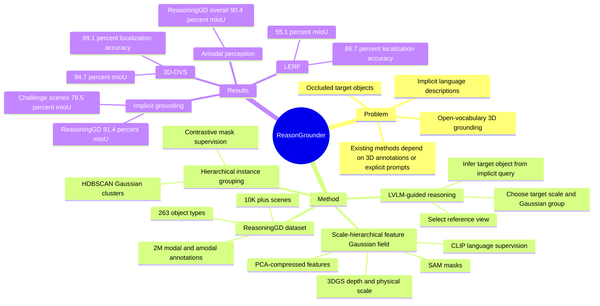

## Summary

ReasonGrounder 面向 open-vocabulary 3D visual grounding and reasoning：给定隐式语言描述和有遮挡的 3D 场景，系统需要推断目标物体并定位其完整区域。方法把 LVLM 的 implicit instruction understanding 与 scale-hierarchical 3D feature Gaussian field 结合，用 SAM masks、CLIP features、3DGS depth 和 HDBSCAN grouping 做 scale-aware Gaussian grouping，并提出 ReasoningGD 数据集用于评估 implicit query 与 amodal perception。

## Problem & Motivation

论文要解决的是比传统 3D visual grounding 更难的一类任务：query 不一定直接说出物体名，目标物体还可能在当前视角中部分或完全被遮挡。例如用户问 “red, round, sweet fruit on the table that is partially occluded by the toy sheep”，系统既要用常识推断目标是 apple，又要在 3D 场景里定位完整物体。

作者指出已有 3DVG 方法通常依赖 3D annotations、mask proposals 或 closed-vocabulary training，泛化到动态、长尾、隐式语义场景时受限。LERF / LangSplat 这类 3D language field 方法可以做 open-vocabulary 查询，但主要处理 explicit prompt，对 occlusion 和 implicit instruction reasoning 不充分。

这个问题对 embodied AI / VLM 研究的意义在于：机器人导航、AR 和物理场景交互常常面对 incomplete observation 与间接语言指令；如果 3D 表示只能对显式类别词做检索，就很难支撑更自然的人机指令和遮挡下的目标定位。

## Method

ReasonGrounder 先训练标准 3D Gaussian Splatting scene，然后把 latent feature 附加到每个 Gaussian 上，并通过两个 shallow MLP 映射成 scale-hierarchical language features 与 instance features。训练监督来自 2D foundation models：SAM 自动生成 training views 的 object masks；3DGS 渲染出的 depth 用于把 mask pixels deproject 到 3D points，并用点的标准差估计每个 mask 的 physical scale；OpenCLIP ViT-B/16 提取每个 segmented region 的 language embedding。由于 CLIP feature 原始维度为 512，supplementary 中说明作者用 PCA 压缩到 64 维以降低计算负担。

**Hierarchical language feature.** 对每个 mask triplet `{mask, CLIP embedding, physical scale}`，language mapper `F_l(scale, latent_feature)` 学习把 Gaussian latent feature 映射到对应 scale 下的 language feature。训练损失是 Huber loss，使 rendered language feature 对齐压缩后的 CLIP embedding。这个设计的假设是：同一个 3D Gaussian 在不同 physical scale 下应呈现不同层级的语义粒度。

**Hierarchical instance feature.** instance mapper `F_g(scale, latent_feature)` 学习用于 grouping 的 instance embedding。作者沿用 GARField 风格的 contrastive supervision：同一 mask 内采样的 rays 应有相近 instance features，不同 mask 的 rays 至少保持 margin。这样得到的 instance space 可以在 query 所需 scale 上把 Gaussians 聚成物体级 group。

**LVLM-guided reasoning and grouping.** 对 implicit query，ReasonGrounder 把 top-down view 和 query 输入 LVLM，推断目标物体 `O_t` 与解释 `E`；实现中使用 LLaVA 1.5，supplementary 进一步写明为 LLaVA-v1.5-7B。随后用 CLIP image-text similarity 从 training views 中选择与目标物体最相关的 reference view，再在该视图里根据 target object embedding 与 canonical phrases 计算 relevancy score。系统用最相关的 mask scale 选择对应 hierarchical Gaussian field，并用 HDBSCAN 聚类得到 Gaussian groups，最后选出与 reference feature 最相近的 group 作为目标物体；对 novel view 可渲染该 Gaussian group，从而做 amodal perception。

**ReasoningGD dataset.** 论文贡献了一个合成数据集 ReasoningGD：超过 10K scenes、263 object types、约 2M annotations；每个 scene 由 Blenderproc 生成，包含 point clouds、100 RGB-D images、object labels、camera poses、2D modal masks 和 amodal masks。supplementary 还说明每个 scene 含 10 到 15 个 objects，并为 LERF / 3D-OVS 额外补充 implicit query annotations，用于测试不显式提物体名的定位能力。

## Key Results

- **LERF open-vocabulary 3D grounding.** 在 explicit query 设定下，ReasonGrounder 的 Localization Accuracy overall 为 **86.7%**，高于 LSeg **21.1%**、LERF **73.6%**、LangSplat **84.3%**；Mean IoU overall 为 **55.1%**，高于 LSeg **16.6%**、LERF **37.4%**、LangSplat **51.4%**。
- **3D-OVS open-vocabulary 3D grounding.** Mean IoU overall 为 **94.7%**，高于 2D 方法 OV-Seg **77.5%**，也高于 3D methods FFD **26.9%**、LERF **54.8%**、3D-OVS **86.8%**、LangSplat **93.4%**。supplementary Table 11 还报告 3D-OVS Localization Accuracy overall **99.1%**，略高于 LangSplat **98.9%** 与 3D-OVS **96.2%**。
- **Implicit instruction grounding.** Table 4 中 ReasonGrounder 在 implicit query 下的 Mean IoU overall 分别为 LERF **55.2%**、3D-OVS **93.8%**、ReasoningGD **91.4%**。在包含小目标、多层级结构和相似物体的 challenge scenes 上，ReasonGrounder Mean IoU overall 为 **78.5%**，高于 LSeg **10.6%**、LERF **48.1%**、3D-OVS **56.4%**、LangSplat **58.9%**。
- **Amodal perception.** ReasoningGD 提供 occluded objects 的 complete masks 作为 ground truth；Table 6 中 ReasonGrounder 在 5 个 ReasoningGD scenes 上的 amodal perception Mean IoU 为 **90.7 / 88.2 / 91.5 / 89.4 / 92.3**，overall **90.4%**。论文没有在这个表里给出其他 baseline 的 amodal perception 数字。
- **Ablation.** Figurines scene 中，NeRF-based O-3DVG 为 **47.2% IoU / 0.924s per view**；替换为 3DGS 后为 **49.8% / 0.025s**；加入 LVLM 支持 implicit grounding 后 I-3DVG 为 **48.9% / 0.061s**；完整 ReasonGrounder 为 O-3DVG **53.4% / 0.053s**、I-3DVG **53.8% / 0.082s**。ReasoningGD 001 scene 中，完整模型达到 O-3DVG **91.6% / 0.061s**、I-3DVG **91.8% / 0.085s**、AP **90.7% / 0.091s**。

## Strengths & Weaknesses

**已知 Strengths.** 论文的贡献不是单纯把 CLIP feature splat 到 3DGS 上，而是把 scale 作为显式条件引入 Gaussian feature field：同一场景可以按目标物体 physical scale 做 adaptive grouping，这对小物体、组合物体和遮挡物体的定位都有直接关系。主实验覆盖 LERF、3D-OVS、ReasoningGD，且有 explicit grounding、implicit grounding、amodal perception 和 ablation，证据链相对完整。

**已知 Strengths.** ReasoningGD 的价值在于补上现有 LERF / 3D-OVS 缺少 implicit query 与 amodal mask ground truth 的缺口。对于研究 embodied reasoning，这比只报告 open-vocabulary explicit label retrieval 更接近真实语言交互：用户常用功能、属性和常识描述目标，而不是说类别名。

**已知 Weaknesses / boundaries.** ReasoningGD 是 Blenderproc 生成的 synthetic dataset，论文没有报告真实机器人闭环导航或操作实验，也没有系统分析 synthetic-to-real gap。LERF / 3D-OVS 虽是真实场景或长尾物体数据，但 implicit query annotations 是作者补充的，规模从 supplementary 看每个选定场景约 10 个 implicit queries，仍然偏 benchmark-specific。

**已知 Weaknesses / evaluation caveats.** Amodal perception 的 quantitative table 只报告 ReasonGrounder 自身，没有与可适配 baseline 的完整对比；因此只能说明方法在 ReasoningGD ground truth 上可达到 **90.4%** overall mIoU，不能断言相对所有替代方案都最优。Ablation 表明 3DGS 明显提升速度，但完整模型加入 LVLM 和 SHF 后 runtime 相比纯 3DGS 变慢；论文没有给出端到端 query latency、LVLM 调用成本或大场景扩展性分析。

**推测.** 这条路线对 embodied agent 的启发是：把 LVLM 用于 high-level intent disambiguation，把 3DGS feature field 用于 geometry-consistent localization，可能比让单个 VLM 直接在单视角图像上“猜”遮挡目标更稳。但这种推测需要真实机器人任务验证；论文当前只证明了 perception/grounding 层面的能力。

**不知道 / 未报告.** 论文正文只给出 Project Page `ZhenyangLiu.github.io/ReasonGrounder`，没有明确 GitHub code repository 或 DOI；也没有报告 LVLM 出错时的 failure cases、HDBSCAN 参数敏感性、大规模真实室内场景内存占用、以及在透明/反光/严重动态物体上的表现。

## Mind Map

## Notes

对当前研究方向的直接启发：ReasonGrounder 把 “reasoning” 限定在目标物体推断与 reference view selection，而不是完整 task planning；这使系统边界比较清楚，也避免把 LVLM 的常识推断和 3D 几何定位混成一个黑盒。对 GUI-agent 的类比是：complex instruction grounding 可能需要先把隐式目标转成 explicit target，再调用结构化 grounding backend；但本文证据只覆盖物理 3D 场景，不能直接外推到 GUI。

值得继续追问的问题：scale-hierarchical grouping 的失败模式是什么？如果 LVLM 把 implicit query 解析成错误 object，后续 3D field 是否还有纠错机制？ReasoningGD 的 amodal masks 让评测更完整，但 synthetic occlusion distribution 是否足以代表真实家庭/办公场景，还需要额外证据。
