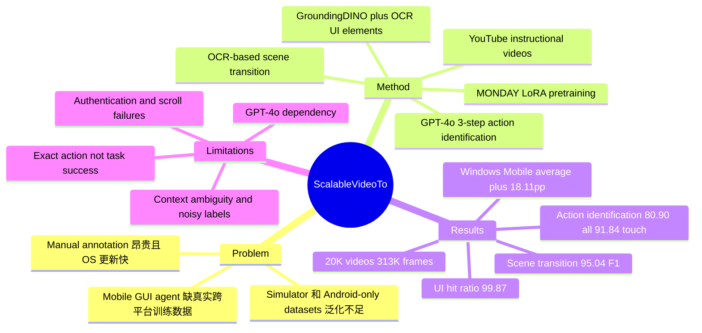

## Summary

MONDAY 把公开 YouTube mobile OS instructional videos 自动转成 mobile navigation dataset，得到 20K videos / 313K annotated frames，覆盖 iOS 和 Android。核心方法是 OCR-based scene transition detection、mobile-specific UI element detection 和 GPT-4o 驱动的 3-step action identification；用 MONDAY 预训练后的 SeeClick / Llama-3.2 variants 在 unseen Windows Mobile 上平均提升约 18.11%p。

## Problem & Motivation

Mobile GUI agent 要在真实设备上跨 OS、跨 UI layout、跨用户配置执行自然语言任务，但训练数据很难规模化。已有 mobile OS datasets 多依赖 manual annotation、emulator/system logs 或单一 Android 环境，难以覆盖 iOS、真实录屏、深色模式、accessibility settings、第三方 app layout 以及快速变化的 OS 版本。

论文的关键动机不是再做一个小规模 benchmark，而是验证一个更可持续的数据生成路径：从用户已经在 YouTube 上发布的 instructional videos 中自动挖掘 task trajectories。挑战在于视频没有直接 action log，需要同时解决 phone-screen isolation、scene transition detection、UI element localization、narration-grounded action inference 和跨平台 action space 对齐。

## Method

**1. Video-to-dataset pipeline**

作者先从 C4 / Dolma 的 CommonCrawl web posts 中筛出 mobile OS task discussion，用扩展版 AndroidHowTo domain whitelist 加 iOS 相关站点，并用 GPT-3.5 Turbo Instruct 抽取类似 “How to change wallpaper in Android?” 的 task names。随后搜索并下载 English narration transcripts 且短于 15 分钟的 YouTube videos：初始 129K videos 经 GroundingDINO phone-screen detection、MediaPipe hand occlusion filtering、GPT-4o OS/device filtering 等步骤后，得到约 20K mobile OS navigation videos。

**2. OCR-based scene transition detection**

框架先以 2 FPS 用 GroundingDINO 检测 phone screen，并对短暂漏检做线性插值；再以 4 FPS 用 Paddle OCR 提取 screen text。transition 判定基于相同位置文本的 Levenshtein distance：当 changed text proportion 超过 20% 时标记为 scene change，并结合 OCR confidence、屏幕顶部/底部过滤、0.4 秒内 transition merge、前后 2 秒 context 等规则减少动画和系统栏噪声。直觉是 mobile UI 的 text 比 luminance / pixel difference 更能稳定反映 page-level state change。

**3. UI element detection + SoM**

UI element detection 由 GroundingDINO icon detection、Paddle OCR text detection 和 mobile-specific heuristics 组成：低 box confidence threshold 保证 recall，再用 box area、IoU merge、aspect ratio、relative position、text color contrast 等规则过滤不可交互元素。检测到的元素被转成 Set-of-Marks representation，让 GPT-4o 用编号选择 UI element，最终坐标取对应 bounding box center。

**4. 3-step action identification**

action annotation 使用 GPT-4o 和 narration，分三步逐步收紧定位：先对无 mark 的当前 frame 做 scene summary；再结合当前 frame、前后各两个 frame summaries、SoM 和 narration 预测 action type 与候选 interaction area；最后对候选区域做 zoom-in / zone-based refinement，以缓解 VLM spatial localization 不精确的问题。动作空间覆盖 touch、long press、scroll、zoom、multi touch、typing，以及 home/back/volume/authentication 等 hardware actions。

**5. Model evaluation setup**

作者将 SeeClick 和 Llama-3.2-11B-Vision-Instruct 先用 MONDAY LoRA finetuning 得到 SeeClick-MONDAY / Llama-3.2-MONDAY，再分别在 AitW 或 AMEX 上 finetune，并在 AitW、AMEX、MONDAY 和 unseen Windows Mobile test set 上按 exact action matching 评估。touch / long press action 需要落在 ground-truth interaction region 内；为了跨 dataset 公平比较，评估限制在共同 action set 上。

## Key Results

**Dataset scale and coverage**

- MONDAY 含 20K videos / 313K annotated frames，Table 1 中规模超过 Video2Action 的 6K videos / 30K frames，并且是 iOS + Android cross-platform。
- 数据集平台分布约 iOS 49.50% / Android 50.50%；action distribution 中 touch 79.83%、scroll 8.53%、hardware interactions 6.73%、typing 2.68%、long press 1.11%、multi touch 0.80%、zoom 0.32%。
- 附录报告 20,337 videos 覆盖 2,479 unique apps，OS-native / third-party apps 比例为 37.6% / 62.4%。
- 生成成本为 \$0.34 per video，而 expert manual annotation 在 100-video test set 上估计为 \$5.76 per video。

**Dataset collection method evaluation**

- 在 100 YouTube videos、1,202 frames、1,070 actions 的人工标注 evaluation set 上，OCR-based scene transition detection 达到 95.04% F1，明显高于 SceneDetect 82.27% 和 YUV-diff 70.86%。
- UI element detection 的 Hit Ratio 为 99.87%，高于 OmniParser 的 91.83%；论文指出 OmniParser 常漏检 home screen icons 和底部 UI elements。
- 3-step action identification 在 Table 4 上达到 All 80.90% / Touch 91.84%，高于 2-step 的 79.43% / 89.97%、1-step 的 70.63% / 74.67%、No narrations 的 78.20% / 87.64%、First-step w/ single-image 的 77.22% / 89.30%。
- Human evaluation 中，10 workers 对 100 sampled sequences 的 250 actions 判断有 80.40% accurate，8.60% not enough information；这与 automatic action identification 的 80.90% 接近，说明剩余噪声部分来自任务本身的 context ambiguity。

**Mobile navigation agent evaluation**

- 在 unseen Windows Mobile 上，SeeClick 经 AitW finetune 从 38.54 提升到 SeeClick-MONDAY 的 51.71；经 AMEX finetune 从 43.17 提升到 55.37。
- Llama-3.2 经 AitW finetune 从 26.83 提升到 Llama-3.2-MONDAY 的 50.24；经 AMEX finetune 从 28.29 提升到 51.46。论文摘要称 unseen mobile OS 平均提升为 18.11%p。
- 在 MONDAY test set 上，SeeClick-MONDAY 相对 SeeClick 的两个 setting 分别为 63.39 vs. 40.66、63.39 vs. 44.23；Llama-3.2-MONDAY 相对 Llama-3.2 分别为 57.99 vs. 39.80、58.35 vs. 40.17。
- AitW / AMEX 上结果是 “mostly outperform” 而非单调胜出：例如 AMEX-finetuned SeeClick-MONDAY 在 AMEX 上为 66.13，低于 SeeClick 的 68.19；但 Llama-3.2-MONDAY 在 AMEX 上从 61.30 提升到 72.36。

## Strengths & Weaknesses

**已知**

- 这篇的最大价值是把 mobile GUI agent 数据瓶颈从 “人工演示 / emulator log” 转成 “公开视频 + 自动 annotation”，并给出可量化的 pipeline quality：scene transition、UI element detection、action identification、model transfer 都有单独实验。
- OCR transition 的设计很朴素但有效，95.04% F1 相比 YUV-diff / SceneDetect 的提升说明 mobile UI state change 里 text signal 比像素差分更稳。
- ablation 支持 3-step action identification 的必要性：1-step touch accuracy 只有 74.67%，加 temporal context、narration 和 refinement 后到 91.84%。
- Windows Mobile evaluation 是重要证据，因为它不在 MONDAY 的 iOS / Android 训练分布内；这比只在 AitW / AMEX 上涨点更能说明 cross-platform generalization。

**推测**

- MONDAY 带来的泛化收益可能来自多因素叠加：真实录屏中的 UI variation、iOS/Android 跨平台分布、第三方 app coverage、narration-aligned procedural structure。论文没有完全隔离这些因素，所以不能把提升单独归因于某一个组件。
- 这个 video-to-dataset 思路可能迁移到 desktop/web GUI，但作者也承认更高分辨率和更复杂交互会引入新挑战；因此它不是直接可复用的通用 CUA data engine。

**不知道 / 局限**

- pipeline 仍依赖 GPT-4o 做 action identification 和 OS/device filtering；论文说未来可替换为 specialized models，但没有给开源替代模型的结果。
- action label quality 不是接近完美：automatic action identification All accuracy 80.90%，human evaluation 也有 8.60% “not enough information”，说明部分 video context 本身不足。
- failure cases 暴露了真实难点：Figure D 中 OCR transition 仍会 miss segment 或 over-segment；Figure F 有 nearby wrong UI element 和需要 ASR reasoning 的错误；Figure K 出现 wrong scrolling direction；Figure L 在 iOS authentication/passcode 场景中选择 cancel 而不是处理 passcode entry。
- 模型评估主要是 next-action exact matching，不是完整 task success rate；因此它证明了 action prediction 泛化，但还不能直接推出 end-to-end mobile agent success。
- AitW / AMEX 上不是所有 setting 都提升，尤其 SeeClick-MONDAY 在 AMEX-finetuned AMEX test 上低于 SeeClick，说明 MONDAY pretraining 也可能与特定 downstream distribution 有轻微 mismatch。

## Mind Map

## Notes

- 对当前 GUI Agent 方向的直接启发：数据 scaling 不一定要依赖可控环境或人工 demonstration，公开视频中的 tutorial distribution 可以作为真实 UI variation 的廉价来源。
- 但这篇更像 data engine + dataset paper，而不是 agent algorithm paper；对 RL-based GUI Agent 的价值主要在 pretraining / behavior cloning 数据供给，不直接解决 long-horizon recovery、verification 或 reward design。
- 后续如果使用 MONDAY，需要关注 train/test contamination 和 task title overlap 处理。论文附录提到在 sampling evaluation dataset 后用 video title 的 n-character overlap（n=30）移除 contaminated videos，这是重要但仍偏启发式的防泄漏措施。
