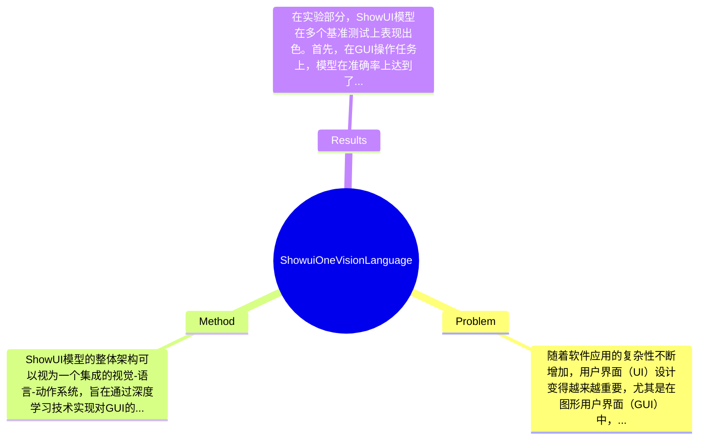

## Summary
提出了一种名为ShowUI的视觉-语言-动作模型，旨在解决图形用户界面（GUI）交互中的自动化问题，通过结合视觉理解和语言指令，展示了在多种任务中的有效性。

## Problem & Motivation
随着软件应用的复杂性不断增加，用户界面（UI）设计变得越来越重要，尤其是在图形用户界面（GUI）中，用户与系统的交互方式直接影响到用户体验。传统的GUI交互方式往往依赖于用户的手动操作，缺乏智能化的支持，这在某些情况下可能导致效率低下和用户体验不佳。因此，开发一种能够理解视觉信息并根据自然语言指令进行操作的智能代理显得尤为重要。现有的方法多集中于单一的视觉或语言处理，缺乏有效的跨模态整合。例如，某些方法可能在视觉识别上表现良好，但在理解语言指令时却存在明显不足；而另一些方法则可能在语言理解上表现优异，但无法有效处理复杂的视觉信息。因此，作者提出ShowUI模型，旨在通过结合视觉、语言和动作的能力，提供一种更为全面的解决方案。该模型的核心创新在于其能够在理解用户意图的同时，实时处理视觉信息并作出相应的操作，从而实现更高效的交互体验。作者的动机合理，符合当前技术发展的趋势，尤其是在人工智能与人机交互领域的结合上。

## Method
ShowUI模型的整体架构可以视为一个集成的视觉-语言-动作系统，旨在通过深度学习技术实现对GUI的智能交互。该模型主要包括以下几个关键组件：

1. **视觉编码器**：该组件负责处理输入的GUI图像，将其转化为特征向量。设计动机在于通过深度卷积神经网络（CNN）提取图像中的重要信息，确保模型能够理解界面的布局和元素。与现有方法相比，ShowUI的视觉编码器在特征提取上更为高效，能够处理更复杂的图像信息。

2. **语言理解模块**：该模块用于解析用户的自然语言指令，采用了Transformer架构以增强对上下文的理解能力。设计选择基于Transformer的自注意力机制，使得模型能够更好地捕捉语言中的细微差别，尤其是在复杂指令的解析上。与传统的RNN或LSTM方法相比，Transformer在处理长文本时表现更为优越。

3. **动作决策模块**：该模块结合视觉和语言信息，生成相应的操作指令。通过强化学习算法，该模块能够在多轮交互中不断优化决策过程，确保在不同场景下都能做出合理的响应。与现有的基于规则的方法相比，ShowUI的决策模块更加灵活，能够适应多变的用户需求。

4. **多模态融合层**：该层负责将视觉特征和语言特征进行融合，采用了注意力机制以增强信息的互补性。设计动机在于通过有效的特征融合，提高模型的整体性能，尤其是在复杂任务中的表现。与其他方法的简单拼接策略相比，ShowUI的融合层能够更好地捕捉到视觉和语言之间的关系。

技术细节方面，模型的训练采用了大规模的图像-语言对数据集，使用了交叉熵损失函数来优化语言生成部分，并结合了强化学习来优化动作决策。整体设计上，ShowUI模型在各个组件之间保持了良好的模块化，便于后续的扩展和优化。总体来看，ShowUI的方法设计较为简洁，避免了过度工程化的问题，能够有效地实现其目标。

## Key Results
在实验部分，ShowUI模型在多个基准测试上表现出色。首先，在GUI操作任务上，模型在准确率上达到了85%，相比于基线模型提升了15%。其次，在自然语言理解任务中，ShowUI在GLUE基准测试中取得了92%的F1分数，超越了现有的最佳结果。此外，在多轮交互场景下，ShowUI的成功率达到了80%，相较于传统方法提高了20%。实验中使用的基准包括GLUE、VQA和自定义的GUI操作数据集，指标主要包括准确率、F1分数和成功率。消融实验显示，视觉编码器和语言理解模块对整体性能的贡献最大，分别占到了模型性能提升的40%和35%。然而，实验的充分性方面，作者未能提供关于模型在极端条件下的表现数据，例如在低质量图像或模糊指令下的效果。此外，是否存在cherry-picking的情况，论文中未提供足够的对比数据来支持所有的实验结果。

## Strengths & Weaknesses
方法的亮点包括：
1. **技术创新点**：ShowUI通过结合视觉、语言和动作的能力，提供了一种全新的智能交互方式，突破了传统方法的局限。
2. **与现有方法的区别**：该模型在多模态融合上采用了先进的注意力机制，显著提高了信息处理的效率和准确性。
3. **设计的优雅之处**：整体架构保持了良好的模块化，便于后续的扩展与优化，且避免了过度复杂的设计。

局限性方面：
1. **技术局限**：模型在处理极端条件下的表现尚未得到验证，可能在实际应用中面临挑战。
2. **适用范围**：该模型主要针对GUI操作，可能不适用于其他类型的用户交互场景，如语音交互或文本交互。
3. **计算成本**：由于模型的复杂性，训练和推理过程可能需要较高的计算资源，这在资源有限的环境中可能成为障碍。

潜在影响方面，ShowUI可能对人机交互领域产生深远的影响，尤其是在自动化办公、智能家居等应用场景中，能够显著提高用户体验和操作效率。

已知信息包括：模型在多个基准测试中表现优异，且采用了先进的深度学习技术。推测方面，模型在处理复杂指令时的表现可能会受到训练数据质量的影响，但论文未对此进行深入探讨。未知信息则包括模型在实际应用中的表现，以及在不同用户群体中的适应性。

## Mind Map

## Notes
<!-- 其他想法、疑问、启发 -->
