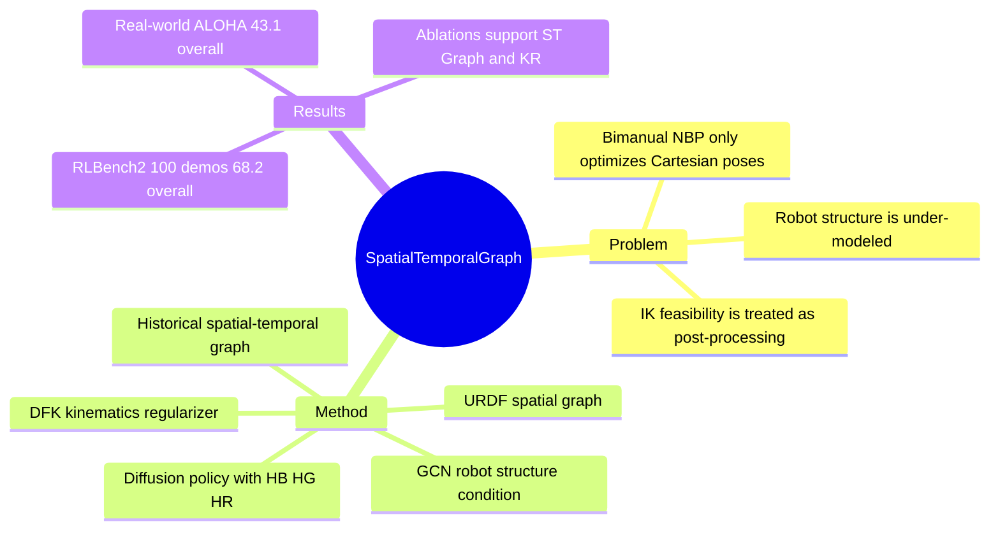

## Summary
KStar Diffuser 针对 bimanual imitation learning 中 next-best end-effector pose 只在 Cartesian space 优化、忽略 robot structure 与 kinematic feasibility 的问题，把 URDF-derived spatial-temporal robot graph 和 differentiable forward kinematics regularizer 加入 diffusion policy。论文在 RLBench2 和两个 real-world ALOHA tasks 上显示，显式建模双臂结构与 joint-space constraint 能显著提高 success rate，但方法仍保留 end-effector pose prediction + inverse kinematics 的核心控制逻辑。

## Problem & Motivation
现有 bimanual manipulation 方法常采用两阶段 pipeline：先预测 next-best end-effector pose，再用 inverse kinematics 计算 joint rotations。论文指出，这种做法把 pose prediction 与 robot physical structure / joint limits 分离，可能产生 self-collision、inter-arm interference、unreachable pose 或 joint configuration conflicts。

在双臂任务中，单个 end-effector pose 看似可行并不保证两个手臂同时执行时可行；例如 pick laptop 需要一只手先把平放的 notebook 推出桌面边缘，另一只手再抓取。作者的核心动机是：policy learning 不应只在 Cartesian space 拟合 task trajectory，而应在学习阶段就利用 robot kinematic chain、joint configuration 和 historical motion。

已知：论文明确把问题限定在 bimanual robotic manipulation 的 imitation learning / diffusion policy 场景。未知：论文没有证明同样设计可直接迁移到 mobile manipulation、dexterous hand 或 broader VLA foundation policy。

## Method
KStar Diffuser 的 backbone 输入 multiview RGB-D observations 和 language instruction。视觉分支使用从头训练的 Vision Transformer，语言分支使用 CLIP language encoder 提取 instruction feature；两者通过 FiLM layers 融合后，作为 diffusion head 的条件来生成 bimanual 6D end-effector poses。训练中作者设置 historical observations `n=2`、action prediction chunk `m=2`，以缓解 action multimodality。

核心结构约束来自 Spatial-Temporal Robot Graph。作者从 URDF 解析 robot joints、links、joint types、joint limits 和 link lengths，把 joint 作为 graph nodes、link 作为 spatial edges；node feature 包含 joint coordinate、joint distance 和 body label。随后把连续历史时刻的 spatial graph 合并成 spatial-temporal graph，并连接不同 timestep 中同一个 joint node；supplement 中具体使用 three consecutive timesteps，simulation graph 为 42 nodes / 36 edges，real-world graph 为 36 nodes / 28 edges。GCN encoder 输出 robot structure representation `HG`，用于 condition denoising process。

Kinematics Regularizer 用 differentiable forward kinematics 把 joint-space supervision 接入 NBP learning objective。具体做法是用 `[HB, HG]` 预测 joint configuration `a_hat_joint`，再经 DFK 得到 kinematics-aware reference end-effector pose `HR`；最终 diffusion policy 以 `HB, HG, HR` 为条件生成 end-effector pose，并用 `LEE` 与 `Ljoint` 的加权和训练，其中论文在扩展消融中报告 `lambda=0.9` 最优。

## Key Results
- **RLBench2 simulation, 20 demonstrations, 5 tasks, 100 evaluations per task**：KStar Diffuser overall success rate 为 **58.0 ± 1.4**，显著高于最强 baseline PerAct2 的 **24.9 ± 2.1**；在 Push Box / Lift Ball / Handover Item / Pick Laptop / Sweep Dustpan 上分别为 **79.3 ± 3.5 / 87.0 ± 2.7 / 23.7 ± 0.6 / 17.0 ± 2.0 / 83.0 ± 4.4**。
- **RLBench2 simulation, 100 demonstrations**：KStar Diffuser overall 为 **68.2 ± 2.1**，高于 DP-EE 的 **40.5 ± 1.2** 和 PerAct2 的 **33.9 ± 1.0**；其中 Lift Ball 达到 **98.7 ± 1.5**，Sweep Dustpan 达到 **89.0 ± 5.2**，Pick Laptop 为 **43.7 ± 4.5**。
- **Real-world ALOHA, 100 demonstrations, 15 tests per task**：KStar Diffuser 在 Lift Plate / Handover 上分别为 **66.7 ± 5.3 / 19.7 ± 5.3**，overall **43.1 ± 17.8**；最强 baseline PerAct2 为 **51.1 ± 6.3 / 8.8 ± 3.0**，overall **29.9 ± 10.2**。
- **Component ablation on Handover-S / Handover-R**：完整模型 overall **23.4 ± 5.2**；去掉 KR 但保留 ST Graph 降到 **16.8 ± 2.1**；同时去掉 ST Graph 和 KR 降到 **14.8 ± 2.1**。这支持两个组件都贡献有效，但 Handover 绝对成功率仍不高。
- **Extended ablations on RLBench2**：100 demos 优于 50 / 20 demos（overall **68.2 / 62.5 / 58.0**）；action chunking `2` 优于 `1` 和 `5`（overall **68.2 / 48.5 / 58.9**）；history length `2` 优于 `0` 和 `1`（overall **68.2 / 39.1 / 51.1**）；`lambda=0.9` 优于 `0.1` 和 `0.5`（overall **68.2 / 61.1 / 63.1**）。

## Strengths & Weaknesses
**Strengths.** 已知贡献比较清晰：论文不是单纯把 diffusion policy 套到双臂，而是把 robot physical configuration 显式编码进 policy condition，并用 DFK 把 joint-space feasibility 引入 end-effector pose learning。这个 formulation 对 embodied policy 很有参考价值，因为它把常见的 “semantic/visual policy 输出看起来合理，但 robot execution 不可行” 问题具体化为 structure gap 与 kinematics gap。

**Strengths.** 实验设计覆盖 transformer baselines、diffusion baselines、simulation 与 real-world，并且有 component / action chunking / history length / lambda 消融。qualitative failure cases 也有信息量：DP3 在 pick laptop 中 push 后右臂没有停下而阻碍左臂；PerAct2 在 real-world handover 中出现碰撞，并被作者指出存在 IK conflicts 和 unreachable positions。

**Weaknesses.** 已知局限是论文自己承认的：核心控制逻辑仍是 end-effector pose prediction + inverse kinematics，未来才考虑直接建模 joint movements。实验边界也比较窄：simulation 是 RLBench2 的 5 个任务，real-world 只有 Lift Plate 与 Handover 两个任务且每个 task 15 次测试；Handover 和 Pick Laptop 的绝对成功率仍低，例如 100-demo RLBench2 Handover Item 只有 **27.0 ± 1.7**，Pick Laptop **43.7 ± 4.5**，real-world Handover **19.7 ± 5.3**。

**推测.** 这类 structure-aware conditioning 可能最适合双臂几何关系和 IK feasibility 主导的任务；如果主要瓶颈来自 language grounding、object affordance recognition、contact dynamics 或 long-horizon planning，ST Graph + KR 是否仍是主因，论文没有直接证明。

## Mind Map

## Notes
已知：这篇和 [[2303-DiffusionPolicy]] 的连接在于都使用 diffusion-based action generation，但 KStar Diffuser 更强调 bimanual robot structure 与 kinematics-aware conditioning。它也可作为后续 bimanual benchmark 或 VLA policy 论文中的结构约束 baseline：如果新方法只报告 end-effector success，而不分析 collision / IK infeasibility，KStar 的 failure framing 可以作为审稿问题。

不知道：论文没有给出 KStar Diffuser 自身的 code release URL；supplement 只列出 ACT、RVT-LF、PerAct-LF、PerAct2、DP-J、DP3 的 code bases。也不知道该方法在更复杂 contact-rich manipulation、mobile base、cross-embodiment transfer 或 higher-frequency closed-loop control 中是否保持优势。
