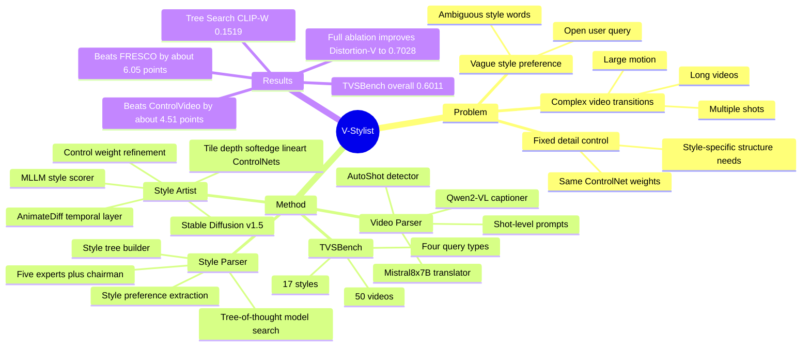

## Summary

V-Stylist 把 text-driven video stylization 拆成 Video Parser、Style Parser、Style Artist 三个 MLLM/LLM agent role，用 shot-level prompt、tree-of-thought style model search 和 multi-round self-reflection 来处理复杂转场、模糊风格偏好和固定 ControlNet 权重的问题。论文同时构建 TVSBench，在 50 个长视频、17 类风格和开放 user query 上评估 video-to-video stylization；整体上更像一个 agentic multimedia generation pipeline，而不是单一新 diffusion backbone。

## Problem & Motivation

论文要解决的是开放用户描述下的复杂视频风格化：用户可能只说“把 Japanese anime 变得像真人出演”，而不是给出可直接喂给 diffusion model 的精确 style tag。作者指出现有 video stylization / video editing 方法通常有三类问题：只能处理几秒短 clip，遇到多场景转场会退化；直接把用户 query 当 prompt 会被模糊风格描述误导；用固定 ControlNet 权重无法适配不同风格对结构、线条、颜色和深度的不同需求。

这个问题和 GUI-agent 不是直接同域，但和 VLM / agentic system 有关系：它把 MLLM 作为 pipeline 中的 parser、planner、evaluator 和 refiner，而不是只把 MLLM 当 captioner。值得关注的核心不是“视频风格化”本身，而是作者如何把 open-ended human preference 转成可执行的 model selection 和 control-parameter search。

## Method

V-Stylist 的系统由三个 role 组成：

1. **Video Parser: video-to-shot prompting**。先用 AutoShot 做 shot boundary detection，把输入长视频切成多个 shot；再用 Qwen2-VL 作为 Shot Captioner，为每个 shot 生成视觉内容描述；最后用 Mistral8x7B 作为 Shot Translator，把 caption 转成 Stable Diffusion prompt。这个设计的假设是：复杂长视频直接整体 stylize 很难，但 shot-level stylization 可以降低转场和大运动带来的难度。

2. **Style Parser: tree-of-thought searching**。先用 LLM 从开放 user query 中解析 Style Preference；再根据 Hugging Face / CivitAI style model metadata 构建 style tree；最后用 LLM 扮演 5 个专家和 1 个 chairman，在 style tree 上逐层选择最匹配的 style model。主文 implementation 写到 style tree 覆盖 17 styles、25 leaf nodes / models、depth 为 3；补充材料 Fig. 9 的统计写的是 Style Model Number 21，这里存在一个小的统计不一致。

3. **Style Artist: rendering with self-reflection**。用搜索到的 style model、Stable Diffusion v1.5、AnimateDiff 和 4 个 ControlNet（tile、depth、softedge、lineart）对每个 shot 渲染。初始 ControlNet weights 相同或随机设置在 0.1 到 0.3；随后 Qwen2-VL 作为 Style Scorer 给 stylized shot 打 0-100 分，若低于阈值 60，则作为 Control Refiner 重新分配各 ControlNet 权重，最多反思 3 轮；如果最大轮数后仍不满意，则选 style score 最高的一轮。

4. **TVSBench**。作者构建 Text-driven Video Stylization Benchmark，包含 50 个公开视频，平均 30 秒、30 FPS，另有 5 秒 highlight 版本用于 ablation。视频覆盖 large motion、occlusion and overlapping、small objects、similar foreground/background、multiple object interactions 等挑战；用户 query 分为 prompt-based、instruction-based、inspiration-based、hypothesis-based 四类。指标分为 Condition Alignment（CLIP-T、CLIP-W）、Temporal Consistency（Structure / SSIM、Semantics / CLIP）和 Video Quality（Aesthetic-I、Aesthetic-V、Distortion-I、Distortion-V）。

## Key Results

- **TVSBench 主结果 Table 1**：V-Stylist 的 Overall Average 为 **0.6011**，高于 ControlVideo **0.5560**、FRESCO **0.5405**、Control-A-Video **0.5187**、Rerender **0.5022**、FLATTEN **0.4870**；按论文表述，相比 FRESCO 和 ControlVideo 分别提升约 **6.05** 和 **4.51** 个百分点。
- **Condition Alignment / Temporal Consistency / Video Quality**：V-Stylist 在 CLIP-T **0.2669**、Structure **0.9020**、Semantics **0.9772**、Aesthetic-I **0.5906**、Aesthetic-V **0.5826**、Distortion-I **0.5924**、Distortion-V **0.7445** 上为表中最高；CLIP-W 为 **0.1528**，低于 ControlVideo **0.1570** 和 Rerender **0.1537**。
- **TVSBench-highlight 组件消融 Table 2**：无 VP/SP/SA 时 CLIP-T / CLIP-W / Structure / Aesthetic-V / Distortion-V 分别为 **0.2556 / 0.1248 / 0.8612 / 0.6294 / 0.6204**；加入 Video Parser 后为 **0.2627 / 0.1166 / 0.8988 / 0.6473 / 0.6364**；再加入 Style Parser 后为 **0.2655 / 0.1459 / 0.8849 / 0.6509 / 0.6630**；完整 V-Stylist 为 **0.2662 / 0.1519 / 0.9041 / 0.6887 / 0.7028**。
- **Video Parser 消融 Table 3**：Only Style Word 的 CLIP-T / Aesthetic-I / Aesthetic-V / Distortion-I / Distortion-V 为 **0.2556 / 0.5569 / 0.6294 / 0.5756 / 0.6204**；Caption + Style Word 提升到 **0.2592 / 0.5628 / 0.6383 / 0.5800 / 0.6284**；Prompts + Style Word 进一步到 **0.2627 / 0.5687 / 0.6473 / 0.5844 / 0.6364**。
- **Style Parser 消融 Table 4**：Base Model 的 CLIP-T / CLIP-W / Aesthetic-I / Aesthetic-V / Distortion-I / Distortion-V 为 **0.2627 / 0.1166 / 0.5687 / 0.6473 / 0.5844 / 0.6364**；Direct Search 为 **0.2655 / 0.1300 / 0.5780 / 0.6600 / 0.5900 / 0.6500**；Tree Search 为 **0.2662 / 0.1519 / 0.5950 / 0.6887 / 0.5895 / 0.7028**，说明逐层 style tree search 比一次性 LLM 选择更稳。

## Strengths & Weaknesses

**已知**：

- 论文的问题拆解清楚：complex video transitions、vague style preference、fixed detail control 分别对应 Video Parser、Style Parser、Style Artist，三个模块不是任意拼接，而是对准三个 failure source。
- TVSBench 补了一个现有 video generation / editing benchmark 不太覆盖的 setting：长视频、多转场、开放风格 query、video-to-video stylization。虽然规模不大，但 benchmark formulation 对后续工作有参考价值。
- Ablation 信息比较充分：Video Parser、Style Parser、Style Artist 都有数值贡献，补充材料还进一步拆了 prompt construction 和 tree search vs direct search。
- 作者在补充材料承认 CLIP-W 的问题：ControlVideo / Rerender-A-Video 在 Minecraft yacht 例子里把 wake 错渲成绿色方块地面，CLIP-W 反而可能给更高 style alignment；这说明 CLIP-style metric 对抽象或罕见风格的细粒度评价不一定可靠。

**推测**：

- 这篇对 agent 研究的启发主要在 “LLM/MLLM as structured workflow controller”：style preference parsing、model selection、rendering quality scoring、control refinement 都可视为把开放人类意图逐步约束到可执行参数空间。这个 pattern 可能迁移到 GUI agent 的 tool selection、visual grounding refinement 或 embodied policy parameter tuning。
- 主比较回答的是“完整 V-Stylist 系统 vs 现有 open-source video editing/stylization methods”，而不是严格隔离每个底层 generative model 的能力。补充材料写到 baselines 统一使用 Stable Diffusion v1.5 原版和各自默认 control setting，而 V-Stylist 会从 style model zoo 中搜索专门风格模型；因此一部分收益来自 agentic model selection 本身，而非单纯来自反思机制。
- Multi-round reflection 的 threshold 60 和最多 3 轮是工程超参，论文没有系统分析阈值、轮数、MLLM scorer 噪声对质量和成本的影响；在真实长视频上，MLLM 调用和多轮渲染可能是主要瓶颈。

**不知道 / 不应推断**：

- 论文没有给出 human preference study，只用自动指标和 qualitative examples 证明风格化质量；对于开放 user query，自动指标是否能代表真实用户偏好仍不确定。
- TVSBench 只有 50 个视频，query 中还包含 GPT-4 生成后人工 refined 的 40 条相似文本；这些 query 对真实非专业用户表达的覆盖度未知。
- 论文未报告系统性 failure case 分布，例如 style tree 选错模型、Style Scorer 误判、shot boundary 错切、跨 shot 角色一致性断裂等情况。
- 作者在 conclusion 中只明确说 future work 会优化 system efficiency 和扩展 video rendering models；没有给出推理延迟、每段视频平均渲染成本或开源模型 zoo 的完整可复现实验配置。

## Mind Map

## Notes

- 这篇不是 GUI-agent 论文，但可以作为“agentic workflow for multimodal generation”的案例：MLLM 不直接生成最终视频，而是承担 parsing、routing、evaluation、reflection，每步都把一个模糊问题变成更窄的决策。
- 对 notebook 里的 VLM / agent 方向，一个值得复用的问题是：当 agent 的输出质量依赖外部工具参数时，能否用 self-reflection 自动调参，同时避免 evaluator hallucination 或 metric hacking？
- 对这篇本身，我会把它定位为有参考价值但非必读：系统设计完整、benchmark 有用，但任务离 GUI-agent / embodied action 有距离，而且自动指标与真实用户偏好的 gap 仍然明显。
